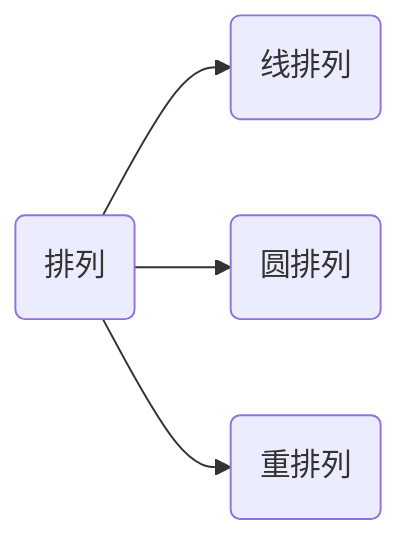

### 第一章 排列、组合及二项式定理

---

#### 加法规则和乘法规则

加法规则：假设$S$是一个有限集合，如果$S_i\subseteq S$, $S=\bigcup_{i=1}^m S_i$且当$i\neq j$时，$S_i\cap S_j=\empty$. 则有：$|S|=|\bigcup_{i=1}^m S_i|=\sum_{i=1}^{m}|S_i|$.

乘法规则：如果$S_i,i\in \{1,2,\cdots,m\}$为有限集，且$S=S_1\times S_2\times \cdots \times S_m=\{(a_1,a_2,\cdots, a_m)| a_i \in S_i, i\in 1,2,\cdots,m\}$, 则有$|S|=|S_1\times S_2\times \cdots\times S_m|=\prod_{i=1}^{m}|S_i|$.（各个分量之间相互独立）

大量的计数问题分为两个大类：

1. 计算事物的有序安排或有序选择数（a. 不允许任何事物重复；b. 允许事物重复）称为排列。
2. 计算事物的有序安排或有序选择数（a. 不允许任何事物重复；b. 允许事物重复）称为组合。

集合：$A=\{a,b,c,d\}$.

重集：$B=\{k_1\cdot a_i,k_2\cdot b_2,\cdots,k_n\cdot b_n\}$.

#### 排列问题

##### 线排列

将一些元素排成一条直线。

$A=\{a_1,a_2,\cdots,a_n\}$.

$r$是整数，从这$n$个不同的元素中取出$r$个按照一定次序排列起来$(r\leq n)$，称为集合$A$的$r-$排列，记为$P(n,r)$.

$A$的$r-$排列为$A$的$r$有序子集。

**定理1.1** 对于正整数$n,r,r\leq n$, 有$P(n,r)=n!/(n-r)!$ .

*推论1：*当$2\leq r \leq n$时，有$P(n,r)=nP(n-1,r-1)$.

公式证明直接展开即可，组合分析证明：首先第一个位置上可以从$n$个元素中选择一个放置，然后剩下的在$n-1$个元素中再挑选$r-1$个元素。

*推论2：*当$2\leq r \leq n$时，有$P(n,r)=rP(n-1,r-1) + P(n-1,r)$.

公式证明可以利用推论1得到，组合分析证明大致思路：将$r$分为两类，一类是必须要包含其中一个元素的情况，另一种情况是一定不包含这个元素的情况。第一种情况下我们首先在$A\backslash \{a_1\}$的情况下选取$r-1$个元素进行排列，对于上述的所有排列都可以将$a_1$放入从而得到所有一定包含$a_1$的情况，也就是$r\cdot P(n-1,r-1)$. 第二种情况就是一定不包含$a_1$的情况，直接在$n-1$个元素中进行$r$-排列即可：$P(n-1,r)$. 证毕。

**例题：**9个字母单词FRANGMENTS进行排列，要求字母A总是紧跟在R的右边，则共有多少排法？

一种简单的思路是将A,R看作一个元素，则可以得到：$P(8,8)$. 另外一种思路：假设不考虑存在的A,R的约束，则我们可以直接得到$P(9,9)$, 而考虑这个约束，$8*P(8,8)$同样可以得到结果。

##### 圆排列

一些元素排成一个圆圈的排列

从集合$A=\{a_1,a_2,\cdots,a_n\}$的$n$个元素中取出$r$个元素按照某一种顺序排成一个圆圈，称这样的排列为圆排列（循环排列）。

注意：将一个圆排列旋转得到的另一个圆排列视为相同的圆排列。

圆排列的个数为：$P(n,r)/r=n!/(r(n-r)!)$

**例题：**8个人围成圆桌就餐，请问一共有多少种就坐方式？如果有两个人不愿意坐在一起又存在多少种就坐方式？

第一个问题是一个简单的圆排列：$P(8,8)$.

第二个问题两种思路：第一种先将无关的6个人和另外2个人中的一个人拿出来，这7个人可以无约束的直接进行圆排列$P(7,7)$，然后我们就需要考虑，还有一个人，他在坐的时候选择的空间要去掉其中一个人的左右两边的位置，因此对于那个人来说每一次都只有5个位置供他选择，所以写为：$P(7,7)/7 * 5$. 第二种思路为先不考虑约束，然后去掉不满足约束的情况：去掉不满足约束的情况可以考虑为先将那两个人绑定，去掉那部分情况即可：$P(8,8)/8 - 2 * P(7,7)/7$.

**例题：**四男四女圆桌交替就坐方式？

思路：首先明确是一个圆排列问题，其次考虑先将男生安排了，也就是$P(4,4)/4$，然后如何将女生插入到其他位置上，第一个女生插入圆桌位置是有4个选择，第二个则有3个选择依次类推，最终得到：$P(4,4)/4 * 4 * 3*2*1$.

##### 重排列

前面的线排列和圆排列都是在一个集合$A$中选出$r$个元素进行排列，在每一种排列中每一个元素至多出现一次。现在考虑元素允许出现重复的情况，即考虑重集的情况下：$B=\{k_1\cdot a_1,k_2\cdot a_2,\cdots k_n\cdot a_n\}$中选择$r$个元素进行排列。

重集$B=\{\infty\cdot b_1,\infty\cdot b_2,\cdots ,\infty\cdot b_n\}$的$r$排列的个数为$n^r$. 

**例题：**由1,2,3,4,5,6这六个数字能够组成多少个五位数？又能组成多少个大于34500的五位数？

简单思考组成多少个五位数的问题：$6^5$ 

第二个问题带约束的情况：第一种正向的思路：最高位要大于3，选法只有3种，其他位次随便选：$3*6^4$；最高位等于3，次高位大于4的情况：$2*6^3$；最高位等于3，次高位等于4，次次高位大于5的情况：$1*6^2$；最后一种情况，高位的前三位分别为3，4，5，之后的两位随便选$6^2$. 然后根据加法规则求和。第二种思路，使用减的方法，无约束条件下的总数为$6^5$，不满足约束的情况有：最高位小于3；最高位等于3，次高位小于4；最高位等于3，次高位等于4，次次高位小于5的情况。同样可以得到结果。

**定理：**重集$B=\{n_1\cdot b_1,n_2\cdot b_2,\cdots, n_k\cdot b_k\}$的全排列个数为：$n!/n_1!\cdot n_2! \cdots n_k!$.

*Proof.* 首先将重集中的$n_i$个$b_i$分别赋予上标$1,2,\cdots,n_i$，即$b_i^1,b_i^2,\cdots,b_i^{n_i}(i=1,2,\cdots,k)$. 将重集$B$改写为集合$A$，其中元素个数为$n=n_1+n_2+\cdots+n_k$. 显然集合$A$的全排列为$n!$. 而对于任意一个$b_i$，其内部又会有$n_i!$种排列，类似地可以得到所有的情况。证毕。

**例题：**使用字母A,B,C组成五个字母的符号，要求在每一个符号中，A至多出现2次，B至多出现1次，C至多出现3次，求此类符号的个数。

分析这个问题也是一个重排列问题，思考首先在符号中可能出现的情况，$\{2\cdot A,1\cdot B,2\cdot C\}$；$\{2\cdot A, 0\cdot B, 3\cdot C\}$；$\{1\cdot A,1\cdot B,3\cdot C\}$. 可能出现的情况只有这三种，分别计算之后使用加法规则即可。

#### 组合

**定义：**假设$A=\{a_1,a_2,\cdots ,a_n\}$是具有$n$个元素的集合，$r$是一个非负整数，从这$n$个不同的元素中取$r$个不考虑次序组合起来$r \leq n$, 称为集合$A$的$r$组合，记为$C(n,r)$.

A的r-组合是A的r-无序子集。

**定理：**对于$r\leq n$有$C(n,r)=P(n,r)/r!=n!/(n-r)!r!$.

一个r-组合是r!个r-排列；$C(n,r)$个r-组合就是$r!C(n,r)$个r-排序。

**推论1：**$C(n,r)=C(n,n-r)$.

**推论2：**$C(n,r)=C(n-1,r)+C(n-1,r-1)$. 这也是Pascal公式。

对比一下：$P(n,r)=P(n-1,r)+r\cdot P(n-1,r-1)$

公式推导的方式可以进行直接推导，不多赘述；思考组合分析的方法，这个证明的方法与在证明排列的推论2的情况是类似的，考虑固定一个集合A中的元素，情况变为$r$个元素中包含$a_1$，另一种情况一定不包含$a_1$. 

**推论3：**$C(n,r)=C(n-1,r-1)+C(n-2,r-1)+\cdots +C(r-1,r-1)$.

推论3可以通过反复使用推论2得到。

**例题：**请问数字510510可以被多少不同的奇数整除？

首先$510510=2*3*5*7*11*13*17$，除2之外共计有6个奇数，因此需要整除510510一定是除2之外的奇素数的积，且每一个积中一个奇数至多出现一次。那么我们可以得到：$C(6,1)+C(6,2)+C(6,3)+C(6,4)+C(6,5)+C(6,6)+1=2^6$.

**例题：**从1,2,...,1000中选出三个整数，有多少种选法使得所选的三个整数的和能够被3整除？

这个问题的思路比较巧妙：因为是找的三个数字的和能够被3整除，因此要通过考虑余数的情况来考虑存在的所有可能的情况。因此将所有的数分为三类，$A=\{1,4,7,\cdots,1000\}$, 共有334个元素；$B=\{2,5,8,\cdots,998\}$，共有333个元素；$C=\{3,6,9,\cdots,999\}$，共有333个元素。这三类分别是余数为1，2，0的数字的分类。要使得找三个数能够被3整除那么可能的情况就是（1）三个数来自于同一个集合；（2）三个数分别来自三个集合。分析之后发现只有这两种情形。第一种选法：$C(334,3)+2\cdot C(333,3)$；第二种选法：$C(334,1)\cdot C(333,1)\cdot C(333,1)$，然后根据加法公式得到结果。

##### 重复组合问题

从重集$B=\{k_1\cdot b_1,k_2\cdot b_2,\cdots ,k_n\cdot b_n\}$中选取$r$个元素不考虑次序组合起来，称为从B中取出$r$个元素的重复组合。我们记为$F(n,r)$.

**定理：**$B=\{\infty\cdot b_1,\infty\cdot b_2,\cdots,\infty\cdot b_n\}$的r-组合数为$F(n,r)=C(n+r-1,r)$.

*Proof.* 假设$n$个元素$b_1,b_2,\cdots,b_n$和自然数$1,2,\cdots,n$之间是1-1对应的。于是考虑的任何组合都可以看为一个r个数的组合$\{c_1,c_2,\cdots,c_r\}$.  我们可以认为各个$c_i$是按照大小次序排列的，相同的$c_i$连续地排在一起：$c_1\leq \cdots\leq c_r$排列。令$d_i=c_i+i-1,(i=1,2,\cdots,r)$，即：$d_1=c_1,d_2=c_2+1,\cdots,d_r=c_r+r-1$. 而我们又知道$c_i$可以取得的最大值为$n$，因此$d_i$可以取得的最大值为$n+r-1$，这样就可以得到集合$\{1,2,\cdots,n+r-1\}$的一个r-组合：$d_1d_2\cdots d_r,(d_1<d_2<\cdots <d_r)$，显然我们会发现对于一种$\{c_1,c_2,\cdots,c_r\}$的取法便对应一种$\{d_1,d_2,\cdots,d_r\}$的取法且一定是1-1对应的。这样看来我们就会发现，对于允许重复地从$n$个不同元素中取$r$个元素的组合数和不允许重复地从$(n+r-1)$个不同元素中取$r$个元素的组合数是相同的。
$$
F(n,r)=C(n+r-1,r)
$$
**例题：**某一个餐厅有7种不同的菜，为了招待朋友一个顾客需要买14个菜，请问共有多少种买法？

简单分析这就是一个重复组合问题，$F(7,14)=C(20,14)$种买菜的方法。注意不要想象为排列问题，对于买菜这个事情是没有顺序的说法的。

**例题：**求$n$个无区别的球放入$r$个有标志的盒子中$(n\geq r)$而无一空盒的放法。

首先考虑不能为空的问题，因此每个盒子中必须首先放入一个球，下面我们考虑还有剩余的$n-r$个球应该如何放置的问题。这时候需要进行分析，因为我们知道因为每一个盒子中再去放入多少个球是没有限制的，因此我们就应该考虑为盒子的集合为重集，球数量为取的元素的数量，也就是$F(r,n-r)$. 

**例题：**在由数字0,1,2,...,9组成的$r$位整数所组成的集合中，如果将一个整数重新排列得到另一个整数，则称这两个整数是等价的。请问：

(1) 有多少个不等价的整数。

(2) 如果数字0,9最多只能出现一次，那么有多少个不等价的整数。

首先第一个问题很简单，$F(10,r)$.

第二个问题从两个角度来思考：首先是考虑0和9都不出现的情况，因此重集变为$\{\infty \cdot 1,\infty \cdot 2,\cdots,\infty \cdot 8\}$, 就是8个数的重集的重复组合问题，结果可以写为：$F(8,r)$; 第二种情况是0出现一次或者9出现一次的情况，这两种情况可以看作是等价的，先在9个数的重集中重复组合$r-1$个值，然后将0或者9添加进去，结果都表示为：$F(9,r-1)$. 最后还有一种情况就是0和9均出现了一次，也就是$F(8,r-2)$，然后将0，9添加进去，最终使用加法规则可以得到结果为：$F(8,r)+2\cdot F(9,r-1)+F(8,r-2)$. 另外还存在一种思路是，无约束的条件下减去不满足条件的情况，也就是：$F(10,r)$，不满足条件的情况分为0大于2次，9大于2次，但是这种情况下我们需要加上一部分，即

