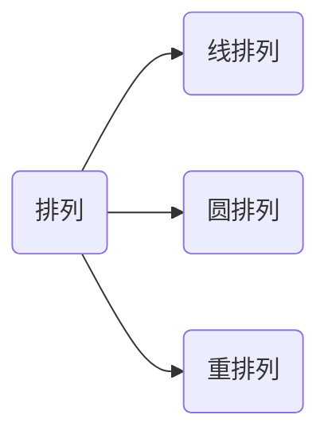

### 第一章 排列、组合及二项式定理

---

#### 加法规则和乘法规则

加法规则：假设$S$是一个有限集合，如果$S_i\subseteq S$, $S=\bigcup_{i=1}^m S_i$且当$i\neq j$时，$S_i\cap S_j=\empty$. 则有：$|S|=|\bigcup_{i=1}^m S_i|=\sum_{i=1}^{m}|S_i|$.

乘法规则：如果$S_i,i\in \{1,2,\cdots,m\}$为有限集，且$S=S_1\times S_2\times \cdots \times S_m=\{(a_1,a_2,\cdots, a_m)| a_i \in S_i, i\in 1,2,\cdots,m\}$, 则有$|S|=|S_1\times S_2\times \cdots\times S_m|=\prod_{i=1}^{m}|S_i|$.（各个分量之间相互独立）

大量的计数问题分为两个大类：

1. 计算事物的有序安排或有序选择数（a. 不允许任何事物重复；b. 允许事物重复）称为排列。
2. 计算事物的有序安排或有序选择数（a. 不允许任何事物重复；b. 允许事物重复）称为组合。

集合：$A=\{a,b,c,d\}$.

重集：$B=\{k_1\cdot a_i,k_2\cdot b_2,\cdots,k_n\cdot b_n\}$.

#### 排列问题

##### 线排列

将一些元素排成一条直线。

$A=\{a_1,a_2,\cdots,a_n\}$.

$r$是整数，从这$n$个不同的元素中取出$r$个按照一定次序排列起来$(r\leq n)$，称为集合$A$的$r-$排列，记为$P(n,r)$.

$A$的$r-$排列为$A$的$r$有序子集。

**定理1.1** 对于正整数$n,r,r\leq n$, 有$P(n,r)=n!/(n-r)!$ .

*推论1：*当$2\leq r \leq n$时，有$P(n,r)=nP(n-1,r-1)$.

公式证明直接展开即可，组合分析证明：首先第一个位置上可以从$n$个元素中选择一个放置，然后剩下的在$n-1$个元素中再挑选$r-1$个元素。

*推论2：*当$2\leq r \leq n$时，有$P(n,r)=rP(n-1,r-1) + P(n-1,r)$.

公式证明可以利用推论1得到，组合分析证明大致思路：假设存在一个元素必须选择，那么求解的排列就是$rP(n-1,r-1)$，而其与全排列相比少了一部分是这个元素一定不存在的情况，也就是$P(n-1,r)$.

例题：9个字母单词FRANGMENTS进行排列，要求字母A总是紧跟在R的右边，则共有多少排法？

一种简单的思路是将A,R看作一个元素，则可以得到：$P(8,8)$. 另外一种思路：假设不考虑存在的A,R的约束，则我们可以直接得到$P(9,9)$, 而考虑这个约束，$8*P(8,8)$同样可以得到结果。

##### 圆排列

一些元素排成一个圆圈的排列

从集合$A=\{a_1,a_2,\cdots,a_n\}$的$n$个元素中取出$r$个元素按照某一种顺序排成一个圆圈，称这样的排列为圆排列（循环排列）。

注意：将一个圆排列旋转得到的另一个圆排列视为相同的圆排列。

圆排列的个数为：$P(n,r)/r=n!/(r(n-r)!)$

例题：8个人围成圆桌就餐，请问一共有多少种就坐方式？如果有两个人不愿意坐在一起又存在多少种就坐方式？

第一个问题是一个简单的圆排列：$P(8,8)$.

第二个问题两种思路：第一种先将无关的6个人和另外2个人中的一个人拿出来，这7个人可以无约束的直接进行圆排列$P(7,7)$，然后我们就需要考虑，还有一个人，他在坐的时候选择的空间要去掉其中一个人的左右两边的位置，因此对于那个人来说每一次都只有5个位置供他选择，所以写为：$P(7,7)/7 * 5$. 第二种思路为先不考虑约束，然后去掉不满足约束的情况：去掉不满足约束的情况可以考虑为先将那两个人绑定，去掉那部分情况即可：$P(8,8)/8 - 2 * P(7,7)/7$.

例题：四男四女圆桌交替就坐方式？

思路：首先明确是一个圆排列问题，其次考虑先将男生安排了，也就是$P(4,4)/4$，然后如何将女生插入到其他位置上，第一个女生插入圆桌位置是有4个选择，第二个则有3个选择依次类推，最终得到：$P(4,4)/4 * 4 * 3*2*1$.

##### 重排列

