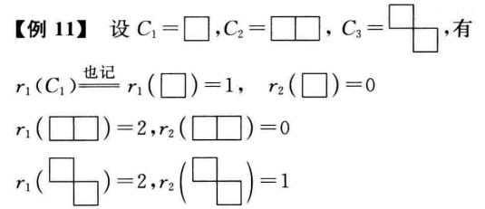
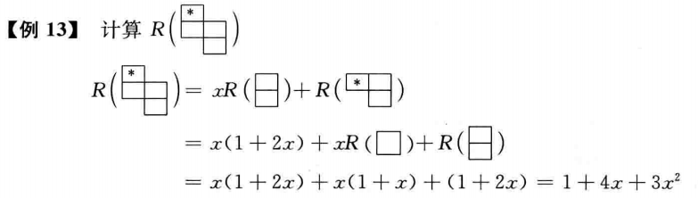
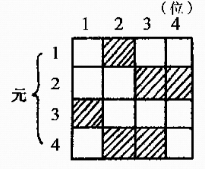
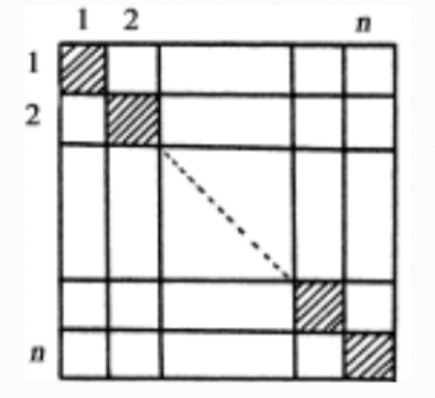

###  第二章 容斥原理

---

#### 2.1 容斥原理

容斥原理又称为包含排斥原理。

假设有限集$S$为全集，$A$是一个集合，则计算$A$中的元素个数等于$S$中元素的个数再减去$A$的补集$\bar{A}$中的元素的个数：$|A|=|S|-|\bar{A}|$.

将上面的结果推广到两个子集的情况下我们会发现：
$$
|A_1\cup A_2|=|A_1|+|A_2|-|\bar{A_1}\cap \bar{A_2}|\\
|\bar{A_1}\cap \bar{A_2}|=|S|-|A_1|-|A_2|-|A_1\cap A_2|
$$
更具有一般性地，我们令$A_i(i=1,2,\cdots,m)\subseteq S$，且$A_i$是$S$中具有性质$p_i$的元素所组成的子集合。则$\bigcap_{i=1}^m A_i$是$S$中同时具有性质$p_1,p_2,\cdots,p_m$的元素子集合，$\bigcap_{i=1}^{m} \bar{A}_i$表示的是$S$中既不具有$p_1$, 又不具有$p_2,\cdots,p_m$性质的元素的集合。于是有了下面的容斥原理：
$$
|\bar{A}_1\cap \bar{A}_2\cap \cdots \cap \bar{A}_m|=|S|-\sum_{i=1}^m |A_i|+\sum_{i\neq j}|A_i\cap A_j|-\sum_{i\neq j\neq k}|A_i\cap A_j\cap A_k|+\cdots+(-1)^m|A_1\cap A_2\cap\cdots\cap A_m|
$$
*Proof.* 首先上面的式子中，左边是计算$S$中不具有$m$个性质$p_1,p_2,\cdots,p_m$中任何一个性质的元素的个数。如果能够得到右边不具有$m$个性质$p_1,p_2,\cdots,p_m$个性质中任意一个元素被计算的次数的净值为1，同时具有这$m$个性质之一的元素被计算的次数为0，就能够成功证明了。

首先考虑$S$中一个不具有这$m$个性质的任意一个性质的元素$x$，它在$S$中但是不在$A_i(i=1,2,\cdots,m)$中，那么它在右边被计算的次数就为$1-0+0-\cdots+0=1$. （这个很显然可以得到）其次考虑这$m$个性质中的恰好具有其中$n$个性质的一个元素$y$，首先在$S$中计算了一次，其次在$\sum_{i=1}^{m}|A_i|$中计算了$n$次，而在$\sum_{i\neq j\neq k}|A_i\cap A_j\cap A_k|$中被计算的次数可以写为：$\binom{n}{2}$. 同理接下来的每一项都可以写为：$\binom{n}{k}$.

总结下来看：$\binom{n}{0}-\binom{n}{1}-\binom{n}{2}+\binom{n}{3}-\cdots+(-1)^m\binom{n}{m}$, 而我们知道$n<m$的，因此最终这个结果为0.

综上所述等式得证。

**推论1：**在集合$S$中，至少具有性质$p_1,p_2,\cdots,p_m$中的一个性质的元素个数为：
$$
|A_1\cup A_2\cup \cdots \cup A_m|=\sum{|A_i|}-\sum|A_i\cap A_j|+\sum|A_i\cap A_j\cap A_k|+\cdots +(-1)^{m+1}|A_1\cap A_2\cap\cdots\cap A_m|
$$
**例题：** 求欧拉函数$\phi(n)$之值。

欧拉函数的定义为小于$n$同时和$n$互素的正整数的个数。

【解】首先对于任意一个大于1的正整数$n$我们都可以唯一地分解为：
$$
n=p_1^{a_1}\cdot p_2^{a_2}\cdots  p_m^{a_m}
$$

其中$p_1,p_2,\cdots,p_m$都是不超过$n$的素数同时$a_1,a_2,\cdots,a_m$都是正整数。

在使用容斥原理的时候我们的基本思路是首先找到全集$S$，也就是$\{1,2,\cdots,n\}$, 令$Q_i$表示$S$中能够被$p_i$整除的整数这一性质，同时令$A_i$为$S$中具有性质$Q_i$的那些整数所组成的集合。则$\bar{A}_i$为$S$中不能被$p_i$整除的整数所组成的集合。那么自然我们就知道$|\bar{A}_1\cap\bar{A}_2\cap\cdots \cap \bar{A}_m|$就是$S$中不能被$p_1,p_2,\cdots,p_m$整除的整数的个数，由容斥原理可以写出：
$$
\begin{split}
\phi(n)&=|\bar{A}_1\cap\bar{A}_2\cap\cdots \cap \bar{A}_m|\\
&=|S|-\sum|A_i|+\sum|A_i\cap A_j|+\cdots +(-1)^m\sum|A_i\cap A_j\cap \cdots \cap A_m| \\
\end{split}
$$
而我们又知道：
$$
|S|=n, \quad |A_i|=\frac{n}{p_i}(i=1,2,\cdots,m)\\
|A_i\cap A_j|=\frac{n}{p_ip_j}(i\neq j,i,j=1,2,\cdots,m)\\
\vdots\\
|A_i\cap A_j\cap\cdots \cap A_m|=\frac{n}{p_ip_j\cdots p_m}\\
$$
直接带入上式可以得到：
$$
\begin{split}
\phi(n)&=|\bar{A}_1\cap\bar{A}_2\cap\cdots \cap \bar{A}_m|\\
&=n-(\frac{n}{p_1}+\frac{n}{p_2}+\cdots +\frac{n}{p_m})+(\frac{n}{p_1p_2}+\frac{n}{p_1p_3}+\cdots+\frac{n}{p_{m-1}p_m})+\cdots +(-1)^m\frac{n}{p_1p_2\cdots p_m}\\
&=n(1-\frac{1}{p_1})(1-\frac{1}{p_2})\cdots(1-\frac{1}{p_m})\\

\end{split}
$$
最终的结果就可以表示为：
$$
\phi(n)=n(1-\frac{1}{p_1})(1-\frac{1}{p_2})\cdots(1-\frac{1}{p_m})
$$
举个实例：假设$n=30$的情况下：
$$
\phi(n)=30(1-\frac{1}{2})(1-\frac{1}{3})(1-\frac{1}{5})=8
$$
**例题：**在由a,b,c,d四个字符构成的$n$位符号串中，求a,b,c至少出现一次的符号串的数目。

【解】利用容斥原理：考虑a,b,c一次都不出现的情况。首先定义全集$S$为由a,b,c,d构成的所有的$n$位符号串的集合，同时令$A_1,A_2,A_3$分别表示$n$位字符串不出现a,b,c的字符串集合，那么我们很容易发现$|\bar{A}_1\cap \bar{A}_2\cap\bar{A}_3|$表示的是a,b,c至少出现一次的符号串的集合中元素的个数。

很容易的：$|S|=4^n$，$|A_1|=|A_2|=|A_3|=3^n$，$|A_1\cap A_2|=|A_1\cap A_3|=|A_2\cap A_3|=2^n$，最后$|A_1\cap A_2\cap A_3|=1$.

从而最终的答案表示为：$4^n-3\times 3^n+3\times 2^n -1$.

**例题：**将$n$本不同的书放入$m$个有编号的箱子中$(n\geq m)$，使得没有一个箱子为空，请问一共有多少种放法。

【解】使用容斥原理，首先定义全集$S$表示将这$n$本书随意放入这$m$个箱子中，$|S|=m^n$，其次定义$n$本书放入后第一箱子为空的情况为$A_1$, 依次定义$A_2,\cdots,A_m$. 即$A_i$表示进行放置后第$i$个箱子为空的情况的放法的集合。不难发现$|A_i|=(m-1)^n$；然后我们再定义$|A_i\cap A_j|$表示为第$i$和第$j$个箱子同时为空的情况，$|A_i\cap A_j|=(m-2)^n$，一般地对于其中$k$个箱子为空的情况我们就写为：$|A_i\cap A_2\cap \cdots \cap A_k|=(m-k)^n$.

从而使得没有一个箱子为空的所有情况的集合可以表示为：
$$
\begin{split}
&|\bar{A}_1\cap \bar{A}_2\cap\cdots \cap \bar{A}_m|\\
=& m^n-\binom{m}{1}(m-1)^n + \binom{m}{2}(m-2)^n -\cdots +(-1)^m\binom{m}{m}(m-m)^n\\
=& \sum_{i=0}^m(-1)^i \binom{n}{i}(m-i)^n
\end{split}
$$
**例题：**求不超过120的素数的个数。

【解】分析首先$11^2=121>120$. 因此不超过120的合数必然是$2,3,5,7$的倍数，假设$A_i$表示的是不超过120的数$i$的倍数集，$i=2,3,5,7$. 那么就可以计算$|A_2|=\lfloor \frac{120}{2}\rfloor=60,|A_3|=\lfloor\frac{120}{3}\rfloor=40,|A_5|=\lfloor\frac{120}{5}\rfloor=24,|A_7|=\lfloor\frac{120}{7}\rfloor=17$. $|A_2\cap A_3|=\lfloor\frac{120}{2\times 3}\rfloor=20$，$|A_2\cap A_5|=\lfloor \frac{120}{10}\rfloor=12$. $|A_3\cap A_5|=\lfloor \frac{120}{15}\rfloor=8$. $\cdots$

还有很多简单计算这里省略，直接给出最后的答案：
$$
120-(60+40+24+17)+(20+12+8+5+3)-(4+2+1+1)=27
$$
注意这里是没有算上2，3，5，7这四个数字的同时我们还多计算了1这个非素数，因此最终的答案应该为$27+4-1=30$.

#### 2.2 重集的$r$-组合

在刚刚涉及重集概念的时候，我们曾经提到$B=\{n_1\times b_1,n_2\times b_2,\cdots,n_k\times b_k\}$.  在重复数$k_i=\infty(i=1,2,\cdots,n)$时与在重复数$k_i\geq r(i=1,2,\cdots,n)$时的r-组合数时相同的。

**例题：**求重集$B=\{3\cdot a_1,7\cdot a_2,2\cdot a_3,15\cdot a_4\}$的r-组合数，其中$r=12$.

【解】首先构造集合$B'=\{\infty\cdot a_1,\infty\cdot a_2,\infty\cdot a_3,\infty\cdot a_4\}$. 令集合$B'$的所有12-组合构成的集合为$S$. 
$$
|S|=F(4,12)=\binom{4+12-1}{12}=455
$$
下面再定义：

$p_1$表示$S$中的元素至少包含4个$a_1$这一性质。

$p_2$表示$S$中的元素至少包含8个$a_2$这一性质。

$p_3$表示$S$中的元素至少包含3个$a_3$这一性质。

$p_4$表示$S$中的元素至少包含16个$a_4$这一性质。

并令$A_i(i=1,2,3,4)$表示$S$中具有性质$p_i(i=1,2,3,4)$的元素构成的集合，于是$B$的12-组合就是$S$中不包含性质$p_1,p_2,p_3,p_4$的元素个数。

$|A_1|=F(4,8)=\binom{4+8-1}{8}=165$

$|A_2|=F(4,4),|A_3=F(4,9)|,|A_4|=0$

$|A_1\cap A_2|=F(4,0)=1,|A_1\cap A_3|=F(4,5)=56,|A_2\cap A_3|=F(4,1)=4,|A_3\cap A_4|=0$

$|A_2\cap A_4|=0,|A_1\cap A_2\cap A_3|=0\cdots$

最终的答案可以写为：
$$
|\bar{A}_1\cap \bar{A}_2\cap\bar{A}_3\cap\bar{A}_4|=455-(165+35+220+0)+(1+56+4+0+0+0)-0+0=96
$$

**例题：**重集$B=\{2\cdot a_1,5\cdot a_2,4\cdot a_3,7\cdot a_4\}$的10组合数为多少？

【解】定义全集表示为重集$B'=\{\infty\cdot a_1,\infty\cdot a_2,\infty\cdot a_3,\infty\cdot a_4\}$的10组合数的结果：$F(4,10)$，同时定义：

$p_1$表示$S$中至少含有3个$a_1$这一性质。

$p_2$表示$S$中至少含有6个$a_2$这一性质。

$p_3$表示$S$中至少含有5个$a_3$这一性质。

$p_4$表示$S$中至少含有8个$a_4$这一性质。

下面分别计算：$|A_i|$，$|A_1|=F(4,7),|A_2|=F(4,4),|A_3|=F(4,5),|A_4|=F(4,2)$

另外：$|A_1\cap A_2|=F(4,1),|A_1\cap A_3|=F(4,2),|A_1\cap A_4|=0,|A_2\cap A_3|=0,|A_2\cap A_4|=0,|A_3\cap A_4|=0\cdots$

从而我们可以得到最终结果表示为：
$$
\begin{split}
&|\bar{A}_1\cap \bar{A}_2\cap \bar{A}_3\cap \bar{A}_4|\\
=&F(4,10)-F(4,7)-F(4,4)-F(4,5)-F(4,2)+F(4,1)+F(4,2)+0+0+0-0-0+0\\
=& 286-(120+35+70+10)+(4+10)\\
=& 65
\end{split}
$$

#### 2.3 错排问题

考虑一个问题，在一个宴会中有$n$个人将他们的帽子放在衣帽间中，请问有多少张交还帽子的方式使得没有一个人得到他自己原来的帽子。（错排问题）

定义客人表示为：$\{1,2,\cdots,n\}$同时一种帽子的分配方式为：$\{a_1,a_2,\cdots,a_n\}$. 我们的目标为$a_i\neq i$. 从而问题就变为要求有多少个$\{1,2,\cdots,n\}$的全排列使得对于所有的$i$都有$a_i\neq i$. 这个我们称之为$n$的错排。使用$D_n$来表示。

当$n\geq 1$时，有：
$$
D_n=n!\left[1-\frac{1}{1!}+\frac{1}{2!}-\frac{1}{3!}+\cdots + (-1)^n \frac{1}{n!}\right]
$$
*Proof.* 使用容斥原理来证明，首先在不受约束的情况下的全排列结果表示为：$n!$. 然后我们定义性质$p_i$表示为$a_i=i$, 也就是在所有人中有一个人拿到了原来的帽子。同时令$A_i$表示$S$中具有性质$p_i$的排列所组成的子集合。又因为$\{1,2,\cdots,n\}$的一个错排就是一个排列，并且这个排列不具有性质$p_1,p_2,\cdots,p_n$. 从而我们知道$|\bar{A}_1\cap \bar{A}_2\cap \cdots \cap \bar{A}_n|$就是$\{1,2,\cdots,n\}$的所有错排组成的集合的个数，因而有：
$$
D_n=|\bar{A}_1\cap \bar{A}_2\cap \cdots \cap \bar{A}_n|
$$
 根据容斥原理我们可以得到：
$$
\begin{split}
D_n&=n!-\binom{n}{1}(n-1)! + \binom{n}{2}(n-2)! -\cdots + (-1)^n\binom{n}{n}(n-n)!\\
&=n! - \frac{n!}{1!} + \frac{n!}{2!}-\cdots +(-1)^n\frac{1!}{n!}\\
&= n!\left[1-\frac{1}{1!}+\frac{1}{2!}-\frac{1}{3!} +\cdots +(-1)^n\frac{1}{n!}\right]
\end{split}
$$
由于$e^{-1}$可以表示为下面的无穷级数：
$$
e^{-1}=1-\frac{1}{1!}+\frac{1}{2!}-\frac{1}{3!} +\cdots + (-1)^n \frac{1}{n!}+\cdots
$$
从而我们可以得到：
$$
\lim_{n\to \infty}\frac{D_n}{n!}=e^{-1}
$$
**定理：**$D_n=(n-1)(D_{n-1} + D_{n-2})$

#### 2.4 相对位置上有限制的排列问题

抽象成一个一般的数学问题，对于给定的正整数$n$，计算集合$\{1,2,\cdots,n\}$的且不允许出现12, 23,34,...,(n-1)n的全排列的个数$Q_n$. 

**定理：**
$$
Q_n=n!-\binom{n-1}{1}(n-1)!+\binom{n-1}{2}(n-2)!-\cdots +(-1)^{n-1}\binom{n-1}{n-1}\times 1!
$$
当$n\geq 2$时，有：
$$
Q_n=D_n+D_{n-1}
$$
**例题：**有$n$名儿童围坐在一个旋转木马上，问有多少方式改变他们的座位使得每个儿童有一个不同的儿童坐在他们的前面？

【解】这个问题实际上是求集合$\{1,2,\cdots,n\}$的圆排列中不出现12,23,34,...,(n-1)n的情况的圆排列的个数。

定义$A_i(i=1,2,\cdots,n)$表示$S$中具有性质$p_i$的元素组成的集合。则$\bar{A}_1\cap \bar{A}_2\cap \cdots \cap \bar{A}_n$表示$S$中不具有性质$p_1,p_2,\cdots,p_n$的元素组成的集合。

$A_1$表示的所有圆排列中出现12的圆排列的集合，所有$A_1$的一个圆排列可以看成是具有$n-1$个元素的集合：$\{12,3,\cdots,n\}$的一个圆排列，因此有：$|A_1|=(n-2)!$. 同理可以得到所有人的$|A_i|=(n-2)!$.

对于一般的$1\leq k \leq n-1$我们可以有：
$$
|A_{i_1}\cap A_{i_2}\cap \cdots A_{i_k}|=(n-k-1)!
$$
故所求方法数量为：
$$
|\bar{A}_1\cap \bar{A}_2\cap \cdots \cap \bar{A}_n|\\
=(n-1)!-\binom{n}{1}\cdot (n-2)!+\binom{n}{2}\cdot (n-3)!-\cdots + (-1)^{n-1}\binom{n}{n-1}\cdot 0!+(-1)^n\binom{n}{n}\cdot 1
$$

#### 2.5 一般有限制的排列

错排问题实际上是一类有禁位的排列，即$i$不排在$i$位置上的排列。更一般地如果$i$不排在某些位置的$1,2,\cdots,n$的全排列，其排列计数的计算此类问题的解法之一就是利用所谓的“棋盘多项式”。

在给定一个棋盘$C$中放入$k$个无区别的棋子，要求每个棋子只能够放一格，且每个棋子不同行不同列，记不同的放法数为$r_k(C)$，问$r_k(C)$的值是多少？此问题称为棋子问题。

对于例11中给出的棋盘$C_1,C_2,C_3$可以分别给出他们的棋盘多项式。
$$
R(C_1)=1+x\\
R(C_2)=1+2x\\
R(C_3)=1+2x+x^2
$$
棋盘多项式表示为：
$$
R(C)=\sum_{k=0}^n r_k(C)x^k
$$
**定理：**给定棋盘$C$，指定$C$中某格$A$，令$C_i$为$C$中删除指定格$A$所在的行和列后所剩下的棋盘，$C_e$为$C$中删除指定格$A$后剩下的棋盘，则有：
$$
R(C)=xR(C_i)+R(C_e)
$$
证明略。

**例题：**

如果两个棋盘$C_1,C_2$，如果$C_1$的所有格与$C_2$中的所有格都不同行同列，则我们称这两个棋盘是独立的。

如果一个棋盘可以分解为两个独立的棋盘$C_1$和$C_2$，那么我们可以得到：
$$
R(C)=R(C_1)R(C_2)
$$
重要求解思路：

考虑集合$\{1,2,\cdots,n\}$的一个全排列且满足$i(i=1,2,\cdots,n)$不排列在某个已知位置，求不同的排列方式的数量。此问题称为$n$云有禁位的排列问题。可以通过棋子多项式求解。首先我们建立一个$n\times n$的棋盘$C$，然后再对每一个元$i$，如果$i$不排列在$j$位置，则将$C(i,j)$位置画上阴影表示禁位。最后求出禁位棋盘的棋子多项式，带入前面的公式中即可求得排列数。

如这个图所示，要求1不能排列在2号位置，要求2不能排列在3，4位置，要求3不能排列在1号位置，要求4不能排列在2，3号位置。

**定理：**

n元有禁位的排列数为：
$$
n!-r_1(n-1)!+r_2(n-2)!-\cdots+(-1)^nr_n
$$
其中$r_i$表示的是将$i$个棋子放入禁区棋盘的方式数。

**例题：**尝试求解错排问题。

首先我们可以构建如下的棋盘：

对于放入禁区棋盘中的结果：
$$
\begin{split}
R(C)&=[R(\Box)]^n\\
&=(1+x)^n\\
&=1+\binom{n}{1}x+\binom{n}{2}x^2+\cdots+\binom{n}{n}x^n
\end{split}
$$
因此我们可以得到：
$$
r_1=C(n,1),r_2=C(n,2),\cdots,r_n=C(n,n)
$$
从而错排的总排列数为：
$$
\begin{split}
D_n&=n!-C(n,1)(n-1)!+C(n,2)(n-2)!-\cdots+(-1)^nC(n,n)0!\\
&= n!-\frac{n!}{1!}+\frac{n!}{2!}-\cdots+(-1)^n\frac{n!}{n!}\\
&=n!(1-\frac{1}{1!}+\frac{1}{2!}-\cdots+(-1)^n\frac{1}{n!})
\end{split}
$$

---

#### 作业：

1，2，3，4，7，8，9，10，11，13，14，16，20