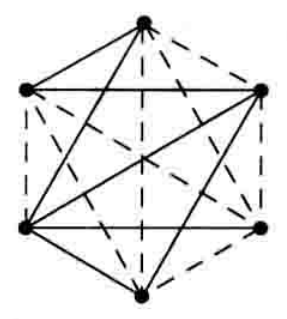

### 第三章 鸽笼原理与Ramsey原理

---

#### 5.1 鸽笼原理的简单形式

原理的基本内容：“有n个鸽子飞进m(n>m)个鸽笼中时，至少有一个鸽笼内有两个以上的鸽子”。

**定理：**如果把$n+1$个物品放到$n$个盒子中去，则至少有一个盒子中放有两个或者更多的物品。

例题：设$a_1,a_2,a_3$为三个任意的整数，为$b_1,b_2,b_3$的任一排列，则$a_1-b_1,a_2-b_2,a_3-b_3$中至少有一个是偶数。

【解】由鸽笼原理我们可以知道$a_1,a_2,a_3$三个整数中必定有两个数的奇偶性相同，而他们又是关于$b_1,b_2,b_3$的任意排列，因此这6个数中我们知道一定有4个数的奇偶性是相同的，因此再次使用鸽笼原理可以得到结果这4个数放入三个不同的盒子中一定有两个数为同一个奇偶性，从而根据同奇偶性的数之间做差一定为偶数的特点我们可以知道$a_1-b_1,a_2-b_2,a_3-b_3$中这三个数中一定有一个偶数。

**例题：**在给定的$n$个整数$a_1,a_2,\cdots,a_n$中，存在$k$和$l(0\leq k\leq l\leq n)$，使得$a_{k+1}+\cdots+a_l$能够被$n$整除。

【解】我们考虑$n$个和：$a_1,a_1+a_2,\cdots,a_1+a_2+\cdots +a_n$. 分为两个情况去考虑：

（1）如果这$n$个和中有一个能被$n$整除则结论成立。

（2）如果这$n$个和中没有能够被$n$整除，则这些和被$n$整除时必有$1,2,\cdots,n-1$这样的余数。因为只有$n$个和，那么也就意味这只有$n-1$个余数的情况，此时构造$n-1$个盒子，第$i$个盒子装被$n$除余数为$i$的数$(i=1,2,\cdots,n-1)$. 由鸽笼原理可以知道用$n$去除各个数时一定会出现两个和的余数相同，也就是：
$$
a_1+a_2+\cdots+a_k=bn+r\\
a_1+a_2+\cdots+a_l=cn+r
$$
两式相减我们就可以得到：
$$
a_{k+1}+a_{k+2}+\cdots+a_l=(c-b)n
$$
由上式可知，$a_{k+1}+a_{k+2}+\cdots+a_l$能够被$n$整除。

**例题：**从$1,2,\cdots,2n$中任意选出$n+1$个数，这$n+1$个数中一定存在两个数，其中一个整数能整除另外一个整数。

【解】*Proof.* 任意一个整数都可以写成：$2^k\cdot l$的形式，其中$k$是非负整数，$l$是正的奇数。显然从$1\sim 2n$中只有$n$个奇数。由于选出的$n+1$个数都可以写为$2^k\cdot l$的形式，而$l$的取值只有$n$种可能性，所以说这$n+1$个数之中一定会有两个数他们取得的$n$是相同的，因此我们知道对应于$k$更小的那个数一定可以整除对应于$k$大的另外一个整数。

一些重要的结论或者说思路：（1）当发现物体数量与盒子数量相同时，我们需要考虑分类单列除特殊情况来减少盒子的数量；（2）整除问题应该转化为余数问题或者倍数问题来处理。

**例题：**一个棋手为参加一次锦标赛进行77天的训练，如果他每天至少下一盘棋，且每一周至多下12盘棋，试证明不管他怎样安排，必定存在相继的若干天，在这段时间内他恰好下棋21盘。

【解】*Proof.* 设$a_1$表示第1天棋手下棋的盘数，$a_2$表示第1，2天棋手下棋的盘数的和，$a_j$表示的是第$1,2,\cdots,j$天的下棋的盘数之和。于是我们很容易知道这个序列一定是单调递增的。且$a_1\geq 1,a_{77}\leq 132$. 同时我们定义一个新的序列为：$a_1+21,a_2+21,\cdots,a_{77}+21$也是一个严格递增的序列。而$a_{77}+21\leq 153$. 那么我们将这两个序列中所有数都放入一个序列中，一共有154个数字，同时这154个数字都在范围$[1,153]$之中，从而我们会知道这154个数字中一定有两个数是相等的，我们假设是$a_k=a_l+21$. 从而我们就得到$a_k-a_l=21$因此我们可以认为从第$k+1$天到第$l$天这些天之间这个棋手恰好下棋21盘。

#### 5.2 鸽笼原理的一般形式

我们将鸽笼原理的一般形式进行改写，可以得到：
$$
n+1=\underbrace{2+2+\cdots+2}_{n个}-n+1
$$
如果将这些物品放入$n$个盒子中那么至少存在一个$i(i=1,2,\cdots,n)$使得第$i$个盒子中至少放有两个物品。

**定理：**假设$q_i$是正整数，$q\geq q_1+q_2+\cdots+q_n-n+1$, 如果将这$q$个物品放入$n$个盒子中一定存在一个$i$使得第$i$个盒子中至少有$q_i-1$个物品。

可以比较容易地使用反证法证明。（证明略）

**推论1：**如果将$n(r-1)+1$个物品放入$n$个盒子中，则至少存在一个盒子有不少于$r$个物品。

**推论2：**对于正整数$m_i(i=1,2,\cdots,n)$，如果$(\sum_{i=1}^n m_i)/n> r-1$. 则至少存在一个$i$使得$m_i\geq r$.

**例题：**证明在由每个包含$n^2+1$个不同实数的序列中，存在一个长度为$n+1$个递增子序列，或者存在一个长度为$n+1$个递减子序列。（子序列的长度表示该序列中的元素的个数）

【解】*Proof.* 利用反证法，首先假设$a_1,a_2,\cdots,a_{n^2+1}$是一个实数序列，同时我们假设在这个序列中没有长度为$n+1$个递增子序列，下面我们要证明的是其中一定存在一个长度为$n+1$的递减子序列。

假设$m_k$表示的是$a_k$为首项的最长递增子序列的长度$(k=1,2,\cdots,n^2+1)$，则对于每个$k(1\leq k\leq n^2+1)$，根据假设可以知道$1\leq m_k\leq n$. 也就是说有$n^2+1$个数$m_1,m_2,\cdots,m_{n^2+1}$都在$1$到$n$之间。那么根据鸽笼原理的一般形式的推论1我们可以知道在$m_1,m_2,\cdots,m_{n^2+1}$个数中一定存在$r=n+1$个数是相同的。假设这$n+1$个数是：
$$
m_{k_1}=m_{k_2}=\cdots==m_{k_{n+1}}
$$
其中$1\leq k_1<k_2<\cdots < k_{n+1}\leq n^2+1$.

假设对于其中的某一个$k_i$来说，我们能够得到$a_{k_i}<a_{k_{i+1}}$，则我们就可以将$a_{k_i}$放到以$a_{k_{i+1}}$为首的最长递增子序列中去，就得到一个$a_{k_i}$为首项的递增子序列，这样一来我们就会得到$m_{k_i}>m_{k_{i+1}}$, 这与$m_{k_i}=m_{k_{i+1}}$是矛盾的，因此我们认为对于每一个$i$都是有$a_{k_1}\geq a_{k_2}\geq \cdots \geq a_{k_{n+1}}$. 这是一个长度为$n+1$的递减子序列。

**例题：**如果将$1,2,\cdots,10$随机地摆成一圈，则必有某相邻的三个数之和至少是17.

【解】设$m_i(i=1,2,\cdots,10)$表示该圈上相邻的三个数之和，这样的和一共有10个，而$1,2,\cdots,10$中每一个都出现在$m_1,m_2,\cdots,m_{10}$之中的三个和值之中，因此我们可以得到：
$$
\left(\sum_{i=1}^{10}m_i\right)/10=\frac{3(1+2+\cdots+10)}{10}=16.5>17-1
$$
根据鸽笼原理的一般形式的推论2可以知道一定是存在一个$i(i=1,2,\cdots,10)$使得$m_i\geq 17$.

#### 5.3 Ramsey定理

Ramsey定理是鸽笼原理的一个重要推广。一般形式较为复杂，因此先给出简单的例子。

**定理：**在人数为6的一群人中，一定有3个人彼此相识或者彼此都不认识。

*Proof.* 先考虑这6个人中的任意一个人，不妨将这个人称为$p$，则其他的5个人可分为下面两个集合$F$和$S$. 其中：$F=$与$p$相识的人的集合，$S=$与$p$不相识的人的集合。根据鸽笼原理我们可以知道这两个集合中至少有一个集合中包含3个人。分情况讨论：如果$F$包含3个人，则这3个人或者彼此不相识或者有两个人彼此相识。如果$F$中有3个人都不相识，那么直接结论成立；如果$F$中有两个人互相认识那么他们两人也同时认识$p$从而有三个人相互认识，因此定理成立。类似地如果是$S$集合中有3个人也有这样的结论成立。

考虑使用图形表示这个问题，使用平面上的点表示人，用实线或虚线把这些点连接起来，其中实线表示这一对人相互认识，虚线表示这对人彼此不相识。下图表示6个人的可能情况。

对于6个点任意使用实线或虚线将这些点连接起来形成的完全图中，或者存在一个实线三角形，或者存在一个虚线三角形。我们称为这两种三角形为纯三角形。（类似地如果由$n$个点构成的完全图中，所有的边都是由实线或者虚线构成的，则称这样的完全图为纯$n$角形）

我们找到了6个人中至少存在3个人彼此认识或者不相识的。但是找多少人组成一群人才能保证一定有4人彼此相识或者不相识可能会比较困难。最终我们可以找到在人数为20的时候，一定有4个人彼此相识或者不相识。

首先证明下面的定理：

**定理：**在人数为10的一群人中一定有3个人彼此不相识或者有4个人彼此相识。

*Proof.* 在这10个人中任意挑选一个人，假设这个人是$p$，则剩下的9个人可以分成两个集合$F$和$S$，其中$F=$与$p$相识的人的集合，$S=$与$p$不相识的人的集合。如果$S$中有4个人或者彼此相识或者有两个人彼此不相识。如果有4个人彼此相识则定理结论成立。如果有两个人彼此不相识而他们又都与$p$不相识，因此就存在三个人彼此都不相识结论成立。因此在这10个人中一定有3个人彼此不相识或者有4个人彼此相识。如果在$S$中最多有3个人，则由鸽笼原理我们可以知道$F$中至少有6个人，从而由上一个定理可以知道$F$中有三个人彼此认识或者有3个人彼此不认识。如果3个人彼此认识将$p$加入则有4个人彼此相识；如果$F$中有三个人彼此不认识则直接定理成立。

**定理：**在人数为20的一群人中，一定有4个人彼此相识或者有4个人彼此不相识。

证明过程与第一个定理的证明类似。

**定义：**设$a,b$为正整数，令$R(a,b)$是保证有$a$个人彼此相识或者$b$个人彼此不相识所需要的最少人数，则称$R(a,b)$为Ramsey数。

前面的定理都给出的是Ramsey数的上界，但是这并不代表这是最好的结果。

基本性质：
$$
R(a,b)=R(b,a)\\
R(a,2)=a
$$
**定理：**当$a,b\geq 2$时，$R(a,b)$是一个有限数，并且有
$$
R(a,b)\leq R(a-1,b)+R(a,b-1)
$$
**定理：**当$R(a-1,b)$和$R(a,b-1)$都是偶数时，则有$R(a,b)\leq R(a-1,b)+R(a,b-1)-1$.

**定理：**
$$
R(3,3)=6\\
R(3,4)=R(4,3)=9\\
R(3,5)=R(5,3)=14
$$
求解$R(a,b)$是一个非常困难的问题，到目前为止，能够知道的Ramsey数。

使用红色代替实线，蓝色代替虚线，则前面的定理可以改写为：

对6个点构成的完全六角形的边使用红和蓝二色任意着色，则在这个完全六角形中一定存在一个红色的三角形或者一个蓝色的三角形。类似地对于10个点构成的完全十角形中的边用红蓝两色任意着色，则在这个完全十角形中一定存在一个蓝色的三角形或者一个红色的完全四角形。

将一个完全的$n$角形不是用两个颜色对其边着色，而是使用$r$中颜色$c_1,c_2,\cdots,c_r$对其边任意着色。设$R(a_1,a_2,\cdots,a_r)$是保证：用$c_1$颜色着色的一个完全$a_1$角形；或者使用$c_2$颜色着色的一个完全$a_2$角形；$\cdots$使用$c_r$颜色着色的一个完全$a_r$角形。

定义$R(a_1,a_2,\cdots,a_r)$为Ramsey数。

**定理：**对于任意的正整数$m$和$a_1,a_2,\cdots,a_m\geq 2$，Ramsey数$R(a_1,a_2,\cdots,a_m)$是存在的。

**定理：**对于任意的正整数$m$和$a_1,a_2,\cdots,a_m\geq r$，Ramsey数$R(a_1,a_2,\cdots,a_m;r)$是存在的。

#### 习题：

P112, 3, 5, 6, 7, 8, 9, 10, 11, 12