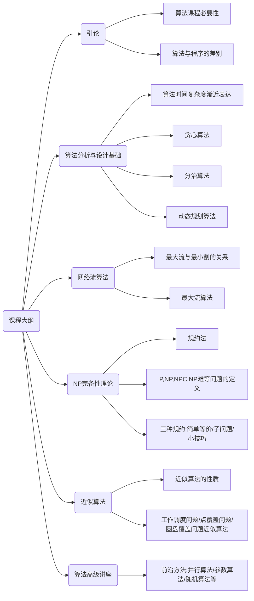

### 算法设计与分析 第一章

---

#### 课程大纲



#### 引论

算法+数据结构=程序

算法的基本特征：输入，输出，确定性（每一条指令都有确切的定义，没有二义性），有穷性（算法必须总能够在执行有限步之后终止）

算法设计的例子：

求两个正整数m,n的最大公约数gcd(m,n)

欧几里得方法：重复使用：gcd(m,n) = gcd(n,m mod n)

算法描述：

（1）如果$n=0$则直接返回$m$的值作为结果，结束，否则继续第二步

（2）使用$m/n$，将余数赋给$r$

（3）将$n$的值赋给$m$，将$r$的值赋给$n$，返回第一步

```python
import sys

def gcd(m,n):
	while (n!=0):
		r = m%n
		m = n
		n = r
	return m

if __name__ == "__main__":
	argvs = sys.argv
	m = int(argvs[1])
	n = int(argvs[2])
	print(gcd(m,n))	
```

也可以递归实现：

```python
def gcd2(m,n):
	if n == 0:
		return m
	return gcd2(n,m%n)
```

当然求解gcd(m,n)的方法还有很多，比如说连续整数检测法，找到m,n中的最小值赋给t，使用m/t如果余数为0则使用n/t，如果余数为0则返回t作为结果，如果m/t的余数不为0则将t的值减1继续重复m/t，如果前面的n/t余数不为0则同样的将t的值减少1继续前面的m/t.

当然也可以使用中学时的方法，寻找所有的质因数再进行相乘。

关于不同的问题的定义：

(1) P问题：存在在多项式时间内实现的算法

(2) NP问题：可以在多项式时间验证一个问题的解是否正确

(3) NPC问题：问题不一定有多项式时间的算法（这个定义不太准确）

