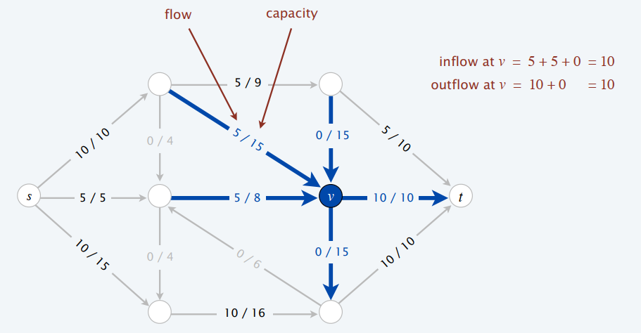
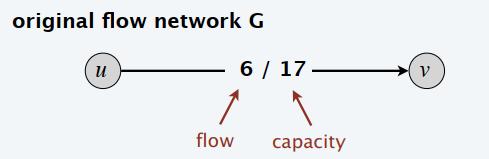
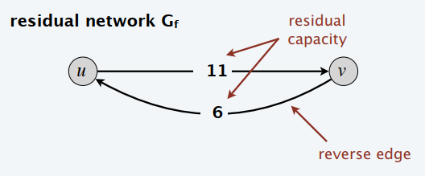
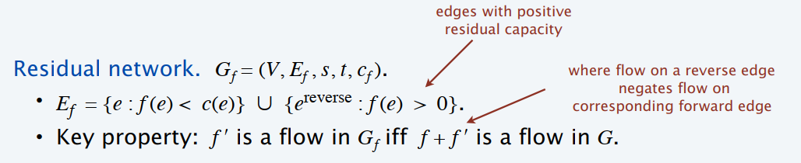
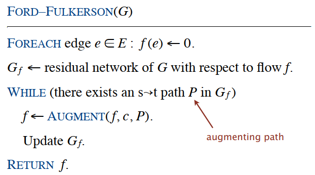
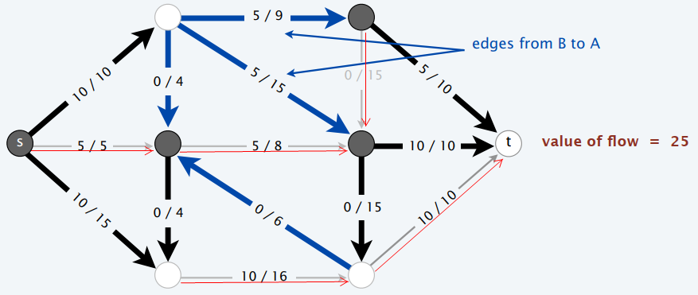
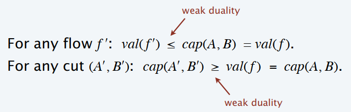
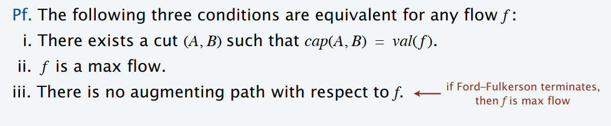

### 算法分析与设计 第三章

---

#### 3.1 max-flow and min-cut problems

流网络的基本定义：$G=(V,E,s,t,c)$.

- 有向图$(V,E)$其中有一个源点$s\in V$同时有一个汇点$t\in V$.
- 对于每一条边$e\in E$都有容量$c(e)\geq 0$.

定义：一个$st-$flow $f$是一个函数满足如下要求：

- 对于每一条边$e\in E$都有$0\leq f(e)\leq c(e)$.
- 对于每一个顶点$v\in V-\{s,t\}$: $\sum_{e \text{ in to }v}f(e)=\sum_{e \text{ out of }v}f(e)$

定义：一个流$f$的值为：$val(f)=\sum_{e \text{ out of s}}f(e)-\sum_{e\text{ in to }s}f(e)$.

最大流问题：$\max val(f)$.

定义：$st-$cut表示的是关于节点集合的一个划分$(A,B)$，其中$s\in A,t\in B$. 

$cap(A,B)=\sum_{e \text{ out of }A}c(e)$.

#### 3.2 Ford-Fulkerson algorithm

贪心算法不一定得到最优解。

Greedy Algorithm

- 初始对于每一条边的流量为：$f(e)=0$.
- 找到一条$s\to t$的路径，其中每一条边上的流量都满足$f(e)<c(e)$.
- 根据路径$P$增加流量.
- 重复这个过程直到找不到路径.

残余网络：

残余容量：
$$
c_f(e)=
\begin{cases}
c(e)-f(e) &\text{if }e\in E\\
f(e) & \text{if } e^{\text{reverse}}\in E
\end{cases}
$$

有了残余网络就可以定义增广路径（augmenting path）

定义：一个增广路径就是一个在残余网络$G_f$中的$s\to t$的简单路径。

有了上面的两个定义就可以引出Ford-Fulkerson算法

#### 3.3 max-flow min-cut theorem

在引入最大流最小割定理之前先引入流值定理，定义$f$是网络中的任意一个流，$(A,B)$表示任意的一个割。那么这个网络流的值$f$一定是等于穿过割$(A,B)$的网络流。
$$
val(f)=\sum_{e\text{ out of }A}f(e)-\sum_{e\text{ in to }A}f(e)
$$
举一个实例来理解这个流值定理：

所有的节点被分为黑色节点集合和白色节点集合，定义黑色节点集合为$A$，白色节点集合为$B$. 那么以考虑$A$集合为例，从$A$集合中的节点流出的流量为$(10+10+5+10)=35$. 而从集合$A$中节点流入的流量为$5+5=10$. 因此流量$f=35-10=25$.

弱对偶性：定义$f$是任意的一个流，$(A,B)$是任意的一个割，那么$val(f)\leq cap(A,B)$. （$cap(A,B)$表示的是从$A$集合所有出边上的流量的和）

推论：定义$f$是任意的一个流，$(A,B)$是任意的一个割，如果$val(f)=cap(A,B)$，那么$f$是一个最大流，$(A,B)$是一个最小割。

证明如下：

最大流最小割定理：

- 最大流最小割定理：最大流=最小割
- 增广路径定理：对于一个流$f$来说当且仅当不存在增广路径时其为最大流。

结论1，2，3可以互相推导。

#### 3.4 capacity-scaling algorithm

首先对Ford-Fulkerson算法进行算法时间复杂度的分析。假设：每一条边的容量为$c(e)$且都为一个在$1$到C 之间的整数。

