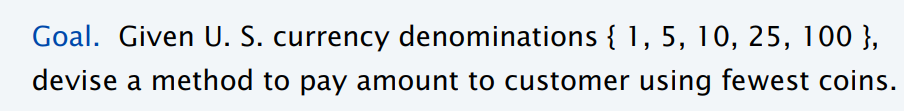
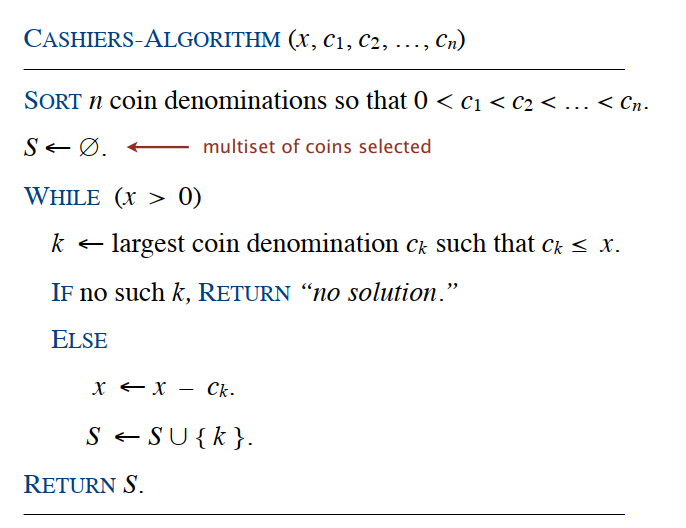
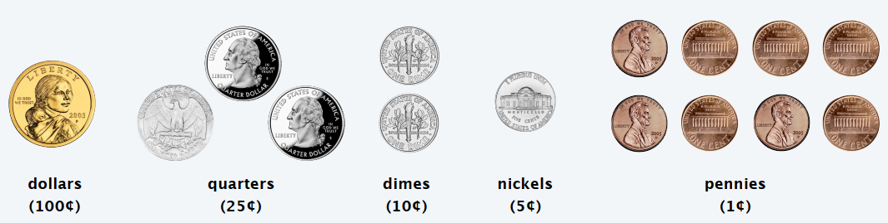

### 算法分析与设计 第二章

---

#### 2.1 算法复杂性分析

算法分析是对一个算法需要多少计算时间以及存储空间做定量的分析。

运行时间的度量单位：

使用算法的基本操作的执行次数来度量算法的时间效率

基本操作通常是算法最内层循环中最费时的操作

算法运行时间的估计：$T(n)\approx c_{op}C(n)$

$n$是算法的输入规模，$c_{op}$是指特定计算机上一个算法基本操作的执行时间，$C(n)$是该算法需要执行基本操作的次数。

需要指数级操作次数的算法只能用来解决规模较小的问题。

算法效率的主要指标是基本操作次数的增长次数，定义了三种符号：

$O$：上界

$\Omega$：下界

$\Theta$：近似

渐近上界符号$O$的定义：存在正常数$c$和$n_0$使得对于所有的$n\geq n_0$都有$f(n)\leq cg(n)$. 记为$f(n)\in O(g(n))$.

渐近下界符号$\Omega$的定义：存在正常数$c$和$n_0$使得对于所有的$n\geq n_0$都有$f(n)\geq cg(n)$. 记为$f(n)\in \Omega (g(n))$.

渐近近界符号$\Theta$的定义：存在正常数$c_1,c_2$和$n_0$使得对于所有的$n\geq n_0$有：$c_2 g(n)\leq f(n)\leq c_1 g(n)$. 记为$f(n)\in \Theta(g(n))$.

渐近分析中函数比较：

$f(n)=O(g(n))\approx a\leq b$

$f(n)=\Omega(g(n))\approx a\geq b$

$f(n)=\Theta(g(n))\approx a = b$

$f(n)=o(g(n))\approx a < b$

$f(n)=\omega(g(n))\approx a> b$

**例题**：给定$f_1(n)=O(f(n))$，$g_1(n)=O(g(n))$，证明：$f_1(n)+g_1(n)=O(\max\{f(n),g(n)\})$

*Proof.* 因为$f_1(n)\in O(f(n))$，因此我们可以得到的结论是存在一个正常数$c_1$和$n_1$使得对于所有的$n\geq n_1$都有$f_1(n)\leq c_1f(n)$.（根据定义来的），类似地我们可以得到对于$g_1(n)$，我们可以找到一个正常数$c_2$和$n_2$使得对于所有地$n\geq n_2$都有$g_1(n)\leq c_2f(n)$. 假设令$c_3=\max\{c_1,c_2\}$，$n_3=\max\{n_1,n_2\}$，$h(n)=\max\{f(n),g(n)\}$.

对于所有的$n\geq n_3$，有$f_1(n)+g_1(n)\leq c_1f(n)+c_2g(n)\leq c_3f(n)+c_3g(n)=c_3(f(n)+g(n))$

根据前面的定义我们还能得到上式小于等于$ 2 c_3\max\{f(n),g(n)\}=2c_3 h(n)=O(\max\{f(n),g(n)\})$

证毕。

基本效率的类型：

常量$(c)$ < 对数$(\log n)$ < $\log^2n$ < 线性$(n)$ < $n\log n$ < 平方$(n^2)$ < 立方$(n^3)$ < 指数$(2^n)$ < 阶乘$(n!)$ 

渐近增长率比较的三种方法：

1. 定义法

   找到正常数$c$和$n_0$使得对于所有的$n\geq n_0$有$f(n)\leq cg(n)$. 则$f(n)=O(g(n))$.

2. 极限法

   比较两个函数的渐近增长率时，可以对两个函数进行相除，令变量趋于无穷，观察这个极限值是无穷大还是一个大于零的常数还是趋于0.
   $$
   \lim_{n\rightarrow \infty}\frac{t(n)}{g(n)}=
   \begin{cases}
   0 & \text{表明}t(n)\text{的增长次数比}g(n)\text{小}\\
   c & \text{表明}t(n)\text{的增长次数和}g(n)\text{相同}\\
   \infty & \text{表明}t(n)\text{的增长次数比}g(n)\text{大}\\
   \end{cases}
   $$
   前两种情况意味着$t(n)\in O(g(n))$，后两种情况意味着$t(n)\in \Omega(g(n))$，第二种情况意味着$t(n)\in \Theta(g(n))$.

3. 取对数法

   对于比较难以比较的两个函数，我们可以对他们同时取对数后再进行比较。

   比如举个例子：比较$(\log n)^{3n}$和$2^{n\log n}$之间进行比较。

   两边分别取对数后得到：$3n\log \log n$和$n\log n$，显然有前者的时间复杂度小于后者。

**渐近增长率比较的练习题**

对下列函数按照渐近关系$O$从小到大排列：

$f_1(n)=10^n$

$f_2(n)=n^{1/3}$

$f_3(n)=n^n$

$f_4(n)=\log_2 n$

$f_5(n)=2^{\sqrt{\log_2 n}}$

首先比较容易得到的是：$f_4(n)=O(f_2(n)), f_2(n)=O(f_1(n))$，前一个是因为对数复杂度低于多项式；后一个是因为指数高于多项式。

对于$f_3$不难发现在$n<10$的情况下$f_3<f_1$，但是当$n\geq 10$时，$10^n\leq n^n$，因此根据定义，我们有当$n\geq 10$并且$c=1$的情况下，有$10^n\leq cn^n$. 因此$f_1(n)=O(f_3(n))$.

因此不难得到：$f_4(n) < f_2(n) < f_1(n) < f_3(n)$，下面主要是$f_5(n)$的问题，首先将$f_5(n)$和$f_4(n)$比较一下，同时取对数，我们可以得到：$\log z < z^{1/2}$（这里假设：$z=\log_2 n$），显然对数低于多项式。下面对比$f_5(n)$和$f_2(n)$，同样的同时取对数，我们可以得到：$z^{1/2} < \frac{1}{3}z$，同样是多项式时间复杂度，$f_5(n)$更小一些。

---

将下列函数按照渐近增长率由低到高排列出来。

$f_1(n)=n (\log n)^{100}$

$f_2(n)=2^{\log n +\log \log n}$

$f_3(n)=\sqrt{n^{2.5}\log n}$

$f_4(n)=2^{\sqrt{n}}$

$f_5(n)=\log^2 n+n^{\sqrt{2}}$

首先第五个，由于$\log ^2 n < n$，因此我们知道其复杂度取决于$n^\sqrt{2}$. 是一个多项式时间的复杂度。使用极限法，我们不难得到$f_2(n) < f_1(n)$, $f_1(n)<f_3(n)$, $f_3(n) < f_5(n)$, $f_5(n)<f_4(n)$.

首先第一步进行化简，显然会发现(2)可以化简为$n\log n$，很容易发现(1)的渐近增长率是高于(2)的，另外我们再看(3)，不难发现(3)表示为$n^{5/4}(\log n)^{1/2}$. 也很容易发现其渐近增长率高于(2)，因为主导权在多项式级的复杂度上，再看(5)，多项式时间级复杂度，同时$\sqrt{2}>5/4$，因此我们很容易发现(5)的复杂度是高于3的，最后再看(4)，(4)的复杂度显然是最高的。

因此渐近增长率的从小到大的顺序为：$2,1,3,5,4$.

---

练习

$f_1(n)=n(\log n)^n$

$f_2(n)=\log n ^{100\log n}$

$f_3(n)=n^2\log n$

$f_4(n)=2^{\log n + \log \log n}$

$f_5(n)=\sqrt[10]{n}$

显然我们会发现(4)的复杂度可以化简为$n\log n$. (2)可以化简为$100\log ^2 n$. 从而可以得到3>4，另外我们发现通过极限法得到5<4, 2<5, 最后主要需要判断的是1和3，通过极限法很难直接判断，因此改用取对数法，我们可以得到(1)取对数为：$\log n + n\log \log n$，(3)取对数后为：$2\log n + \log \log n$, 显然1>3. 从而最终我们可以得到渐近增长率的排名为：2<5<4<3<1.

2018年秋考试题：

$f_1(n)=\sqrt{n}+(\log n)^{100}$

$f_2(n)=2^{\log n + \log\log n}$

$f_3(n)=\log (n^{100} \times 3^n)$

$f_4(n)=n^{200}+3^n$

$f_5(n)=\log n^{100\log n}$

$f_6(n)=100^n+n!$

给出答案：5<1<3<2<4<6. 首先2，3，5都是可以进行化简的，其次发现4，6明显与其他4个不在一个级别上。因此后面的通过极限法基本就可以确定结果了。

在渐近增长率比较的时候利用常见的关系式：

$c < \log n<\log^2 n<n < n\log n < n^2 < n^3 < 2^n < n!$.

渐近增长率比较例题3：

$f_1(n)=2014 n^6 + 5n^4$

$f_2(n)=n ^{2014} + 3^n$

$f_3(n)=2014 \sqrt{n^{2.014}}$

$f_4(n)=\log n +(2014 \log n)^3$

$f_5(n)=2^n+n!+5^n$

$f_6(n)=3\log (2^n) + \log \log n$

$f_7(n)=2^{n\log n}+\log^n n$

答案：$4<6<3<1<2<5<7$.

---

#### 2.2 Greedy Algorithms 

##### 找零钱问题（Coin Changing）

给出Cashier's Algorithm

找零钱算法对于美国coins的问题上可以得到最优解，因为美国零钱的性质比较特殊。对于一些一般性的问题上来说，这个算法就不是最优解的算法。

美国零钱的种类如下：

下面证明找零钱的贪心算法对于这个特殊情况下是最优的，在证明之前首先给出一些性质。

（1）pennies的数量一定小于等于4个；（2）nickels的数量一定小于等于1个；（3）quarters的数量一定小于等于3个；（4）nickels和dimes的数量之和一定小于等于2.

*Proof.* 假设在$c_k\leq x < c_{k+1}$的时候贪心选择了$c_k$，下面我们想办法证明最优解也一定选择了$c_k$. 假设最优解没有选择$c_k$，那么最优解一定在$c_1,\cdots,c_{k-1}$之中选择足够多数量的coins来达到$x$. 下面给出表格证明无法做到这一点。

