### 算法分析与设计 第二章

---

#### 2.1 算法复杂性分析

算法分析是对一个算法需要多少计算时间以及存储空间做定量的分析。

运行时间的度量单位：

使用算法的基本操作的执行次数来度量算法的时间效率

基本操作通常是算法最内层循环中最费时的操作

算法运行时间的估计：$T(n)\approx c_{op}C(n)$

$n$是算法的输入规模，$c_{op}$是指特定计算机上一个算法基本操作的执行时间，$C(n)$是该算法需要执行基本操作的次数。

需要指数级操作次数的算法只能用来解决规模较小的问题。

算法效率的主要指标是基本操作次数的增长次数，定义了三种符号：

$O$：上界

$\Omega$：下界

$\Theta$：近似

渐近上界符号$O$的定义：存在正常数$c$和$n_0$使得对于所有的$n\geq n_0$都有$f(n)\leq cg(n)$. 记为$f(n)\in O(g(n))$.

渐近下界符号$\Omega$的定义：存在正常数$c$和$n_0$使得对于所有的$n\geq n_0$都有$f(n)\geq cg(n)$. 记为$f(n)\in \Omega (g(n))$.

渐近近界符号$\Theta$的定义：存在正常数$c_1,c_2$和$n_0$使得对于所有的$n\geq n_0$有：$c_2 g(n)\leq f(n)\leq c_1 g(n)$. 记为$f(n)\in \Theta(g(n))$.

渐近分析中函数比较：

$f(n)=O(g(n))\approx a\leq b$

$f(n)=\Omega(g(n))\approx a\geq b$

$f(n)=\Theta(g(n))\approx a = b$

$f(n)=o(g(n))\approx a < b$

$f(n)=\omega(g(n))\approx a> b$

**例题**：给定$f_1(n)=O(f(n))$，$g_1(n)=O(g(n))$，证明：$f_1(n)+g_1(n)=O(\max\{f(n),g(n)\})$

*Proof.* 因为$f_1(n)\in O(f(n))$，因此我们可以得到的结论是存在一个正常数$c_1$和$n_1$使得对于所有的$n\geq n_1$都有$f_1(n)\leq c_1f(n)$.（根据定义来的），类似地我们可以得到对于$g_1(n)$，我们可以找到一个正常数$c_2$和$n_2$使得对于所有地$n\geq n_2$都有$g_1(n)\leq c_2f(n)$. 假设令$c_3=\max\{c_1,c_2\}$，$n_3=\max\{n_1,n_2\}$，$h(n)=\max\{f(n),g(n)\}$.

对于所有的$n\geq n_3$，有$f_1(n)+g_1(n)\leq c_1f(n)+c_2g(n)\leq c_3f(n)+c_3g(n)=c_3(f(n)+g(n))$

根据前面的定义我们还能得到上式小于等于$ 2 c_3\max\{f(n),g(n)\}=2c_3 h(n)=O(\max\{f(n),g(n)\})$

证毕。

基本效率的类型：

常量$(c)$ < 对数$(\log n)$ < $\log^2n$ < 线性$(n)$ < $n\log n$ < 平方$(n^2)$ < 立方$(n^3)$ < 指数$(2^n)$ < 阶乘$(n!)$ 

渐近增长率比较的三种方法：

1. 定义法

   找到正常数$c$和$n_0$使得对于所有的$n\geq n_0$有$f(n)\leq cg(n)$. 则$f(n)=O(g(n))$.

2. 极限法

   比较两个函数的渐近增长率时，可以对两个函数进行相除，令变量趋于无穷，观察这个极限值是无穷大还是一个大于零的常数还是趋于0.
   $$
   \lim_{n\rightarrow \infty}\frac{t(n)}{g(n)}=
   \begin{cases}
   0 & \text{表明}t(n)\text{的增长次数比}g(n)\text{小}\\
   c & \text{表明}t(n)\text{的增长次数和}g(n)\text{相同}\\
   \infty & \text{表明}t(n)\text{的增长次数比}g(n)\text{大}\\
   \end{cases}
   $$
   前两种情况意味着$t(n)\in O(g(n))$，后两种情况意味着$t(n)\in \Omega(g(n))$，第二种情况意味着$t(n)\in \Theta(g(n))$.

3. 取对数法

   对于比较难以比较的两个函数，我们可以对他们同时取对数后再进行比较。

   比如举个例子：比较$(\log n)^{3n}$和$2^{n\log n}$之间进行比较。

   两边分别取对数后得到：$3n\log \log n$和$n\log n$，显然有前者的时间复杂度小于后者。

**渐近增长率比较的练习题**

对下列函数按照渐近关系$O$从小到大排列：

$f_1(n)=10^n$

$f_2(n)=n^{1/3}$

$f_3(n)=n^n$

$f_4(n)=\log_2 n$

$f_5(n)=2^{\sqrt{\log_2 n}}$

首先比较容易得到的是：$f_4(n)=O(f_2(n)), f_2(n)=O(f_1(n))$，前一个是因为对数复杂度低于多项式；后一个是因为指数高于多项式。

对于$f_3$不难发现在$n<10$的情况下$f_3<f_1$，但是当$n\geq 10$时，$10^n\leq n^n$，因此根据定义，我们有当$n\geq 10$并且$c=1$的情况下，有$10^n\leq cn^n$. 因此$f_1(n)=O(f_3(n))$.

因此不难得到：$f_4(n) < f_2(n) < f_1(n) < f_3(n)$，下面主要是$f_5(n)$的问题，首先将$f_5(n)$和$f_4(n)$比较一下，同时取对数，我们可以得到：$\log z < z^{1/2}$（这里假设：$z=\log_2 n$），显然对数低于多项式。下面对比$f_5(n)$和$f_2(n)$，同样的同时取对数，我们可以得到：$z^{1/2} < \frac{1}{3}z$，同样是多项式时间复杂度，$f_5(n)$更小一些。

---

将下列函数按照渐近增长率由低到高排列出来。

$f_1(n)=n (\log n)^{100}$

$f_2(n)=2^{\log n +\log \log n}$

$f_3(n)=\sqrt{n^{2.5}\log n}$

$f_4(n)=2^{\sqrt{n}}$

$f_5(n)=\log^2 n+n^{\sqrt{2}}$

首先第五个，由于$\log ^2 n < n$，因此我们知道其复杂度取决于$n^\sqrt{2}$. 是一个多项式时间的复杂度。使用极限法，我们不难得到$f_2(n) < f_1(n)$, $f_1(n)<f_3(n)$, $f_3(n) < f_5(n)$, $f_5(n)<f_4(n)$.

首先第一步进行化简，显然会发现(2)可以化简为$n\log n$，很容易发现(1)的渐近增长率是高于(2)的，另外我们再看(3)，不难发现(3)表示为$n^{5/4}(\log n)^{1/2}$. 也很容易发现其渐近增长率高于(2)，因为主导权在多项式级的复杂度上，再看(5)，多项式时间级复杂度，同时$\sqrt{2}>5/4$，因此我们很容易发现(5)的复杂度是高于3的，最后再看(4)，(4)的复杂度显然是最高的。

因此渐近增长率的从小到大的顺序为：$2,1,3,5,4$.

---

练习

$f_1(n)=n(\log n)^n$

$f_2(n)=\log n ^{100\log n}$

$f_3(n)=n^2\log n$

$f_4(n)=2^{\log n + \log \log n}$

$f_5(n)=\sqrt[10]{n}$

显然我们会发现(4)的复杂度可以化简为$n\log n$. (2)可以化简为$100\log ^2 n$. 从而可以得到3>4，另外我们发现通过极限法得到5<4, 2<5, 最后主要需要判断的是1和3，通过极限法很难直接判断，因此改用取对数法，我们可以得到(1)取对数为：$\log n + n\log \log n$，(3)取对数后为：$2\log n + \log \log n$, 显然1>3. 从而最终我们可以得到渐近增长率的排名为：2<5<4<3<1.

2018年秋考试题：

$f_1(n)=\sqrt{n}+(\log n)^{100}$

$f_2(n)=2^{\log n + \log\log n}$

$f_3(n)=\log (n^{100} \times 3^n)$

$f_4(n)=n^{200}+3^n$

$f_5(n)=\log n^{100\log n}$

$f_6(n)=100^n+n!$

给出答案：5<1<3<2<4<6. 首先2，3，5都是可以进行化简的，其次发现4，6明显与其他4个不在一个级别上。因此后面的通过极限法基本就可以确定结果了。

在渐近增长率比较的时候利用常见的关系式：

$c < \log n<\log^2 n<n < n\log n < n^2 < n^3 < 2^n < n!$.

渐近增长率比较例题3：

$f_1(n)=2014 n^6 + 5n^4$

$f_2(n)=n ^{2014} + 3^n$

$f_3(n)=2014 \sqrt{n^{2.014}}$

$f_4(n)=\log n +(2014 \log n)^3$

$f_5(n)=2^n+n!+5^n$

$f_6(n)=3\log (2^n) + \log \log n$

$f_7(n)=2^{n\log n}+\log^n n$

答案：$4<6<3<1<2<5<7$.

---

#### 2.2 Greedy Algorithms 

##### 找零钱问题（Coin Changing）

给出Cashier's Algorithm

找零钱算法对于美国coins的问题上可以得到最优解，因为美国零钱的性质比较特殊。对于一些一般性的问题上来说，这个算法就不是最优解的算法。

美国零钱的种类如下：

下面证明找零钱的贪心算法对于这个特殊情况下是最优的，在证明之前首先给出一些性质。

（1）pennies的数量一定小于等于4个；（2）nickels的数量一定小于等于1个；（3）quarters的数量一定小于等于3个；（4）nickels和dimes的数量之和一定小于等于2.

*Proof.* 假设在$c_k\leq x < c_{k+1}$的时候贪心选择了$c_k$，下面我们想办法证明最优解也一定选择了$c_k$. 假设最优解没有选择$c_k$，那么最优解一定在$c_1,\cdots,c_{k-1}$之中选择足够多数量的coins来达到$x$. 下面给出表格证明无法做到这一点（即既没有选择$c_k$同时也达到了最优结果）。

因此这个问题就转换为了$x-c_k$的新问题上，不断进行规约我们可以发现最终由cashier's algorithm得到的结果就是最优解。

##### 区间规划问题

工作$j$的开始时间为$s_j$, 结束时间为$f_j$.

如果两个工作不交叉则我们认为这两个工作是相容的。

目标：寻找一个最大的相容的工作子集

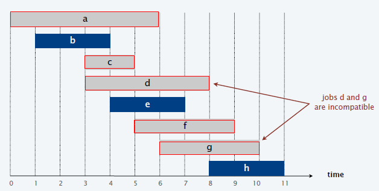

解决这个问题的算法：最早结束时间优先算法

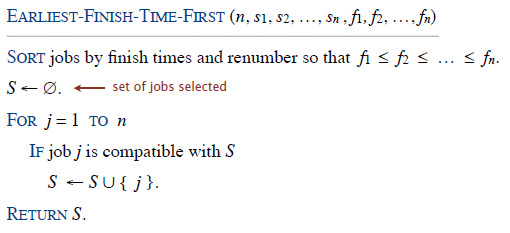

我们可以知道的一些结论，首先这个算法的时间复杂度为$O(n\log n)$.

找到最后一个被添加到$S$集合中的工作$j^\ast$. 我们会发现当且仅当$s_j\geq f_{j^\ast}$时工作$j$才能够被添加到集合中去。

我们还知道最早结束时间算法对于这个问题来说是最优解，那么其他的一些将工作进行一定次序排列的方式是否能够达到最优解呢？这里给出一部分反例。

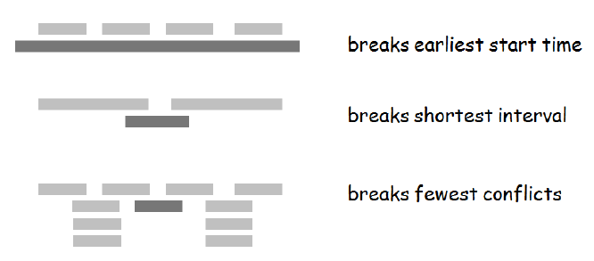

最后我们还会发现最早结束时间与最晚开始时间的排序是等价的。

给出最早结束时间优先算法最优性的证明。

*Proof.* 使用反证法进行证明。假设贪心不是最优的，考虑接下来会发生什么。定义$i_1,i_2,\cdots,i_k$表示的是根据贪心算法选出来的工作；定义$j_1,j_2,\cdots,j_m$表示最优解下选择的工作，同时我们认为$i_1=j_1,i_2=j_2,\cdots,i_r=j_r$. $r$是满足这个条件的最大的值。

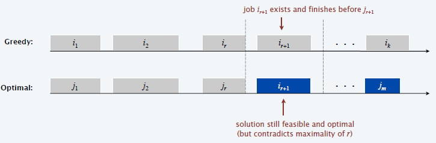

（在带权的工作安排问题上，最早结束时间优先的算法就不会是最优算法）

##### 区间划分问题

假设有一节课$j$的开始时间为$s_j$，结束时间为$f_j$.

目标：找到能够安排下这些课程的最小数量的教室数。（不能出现冲突）

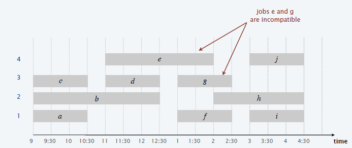

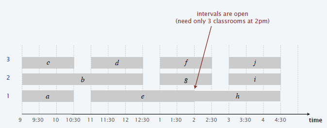

最早开始时间优先算法：

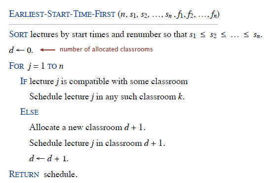

结论：最早开始时间优先算法的时间复杂度为$O(n\log n)$.

*Proof.* 将所有的教室存储在一个优先队列中，优先队列的排序键值为该教室最后一个课程的结束时间。为了判断$j$是否和一些教室相容，将$s_j$和优先队列中的最小值教室进行对比。如果能够加入则将$j$加入到$k$同时将$k$号教室的键值提升到$f_j$. 对于这个优先队列来说需要的处理时间为$O(n)$，而关于排序的时间复杂度为$O(n\log n)$.

（每次有新的课程加入进来时，我们选择的是结束时间最早的那个教室，判断新的课程是否能够容纳）

下面证明这个算法的最优性：

首先定义一个depth的概念：一个开区间的深度表示的是包含任何给定点的区间的最大数量。

我们不难发现：number of classrooms needed $\geq$ depth；同时需要的最少数量的教室数总是会等于depth的 ，而最早开始时间优先算法得到的结果一定是一个教室数量等于depth的结果。

给出一个demo：

* 首先进行排序：

  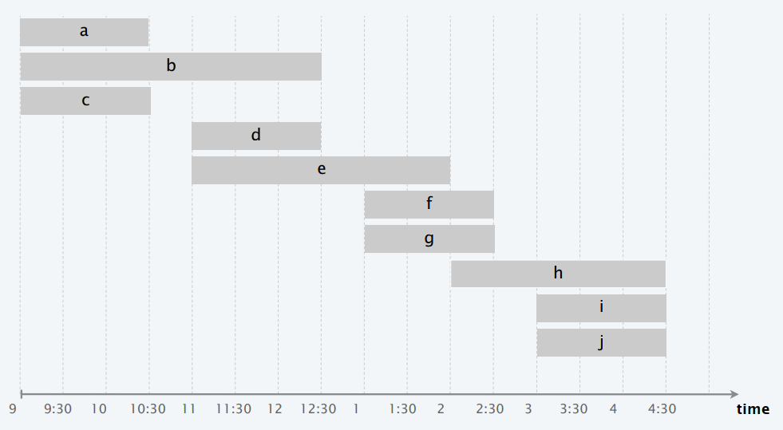

* 依次将课程放入可以相容的教室

  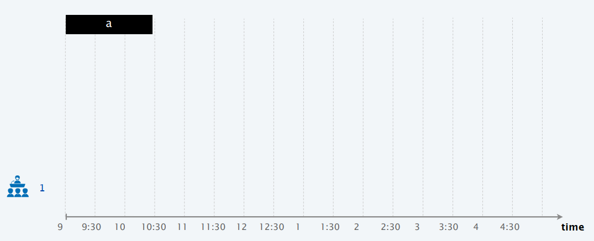

  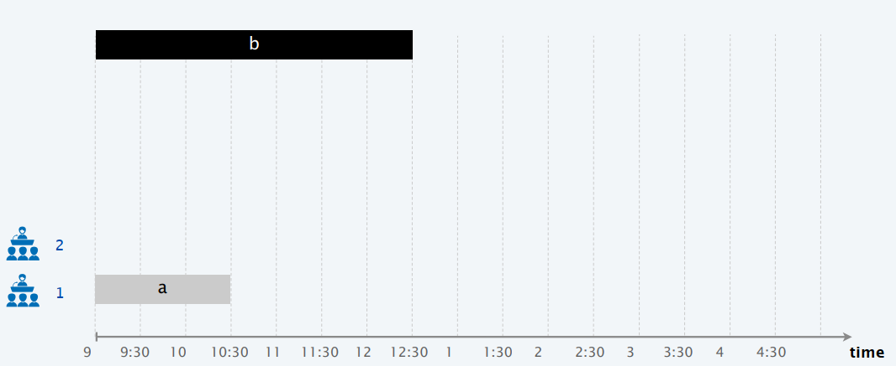

  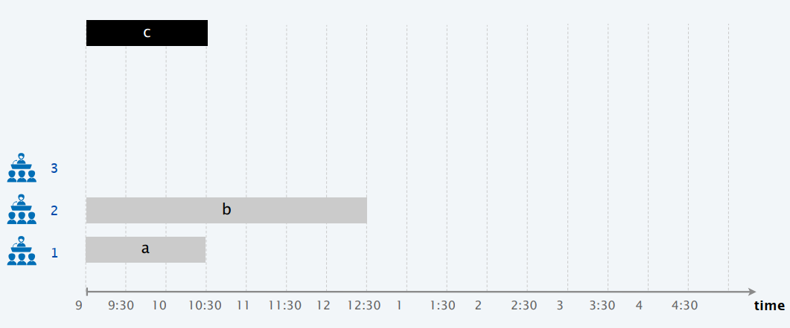

  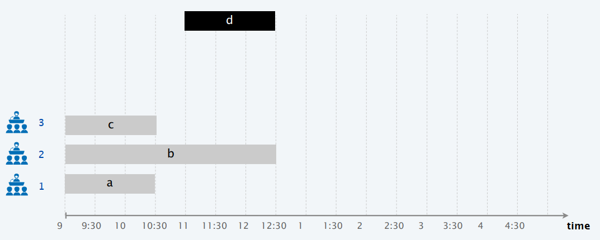

  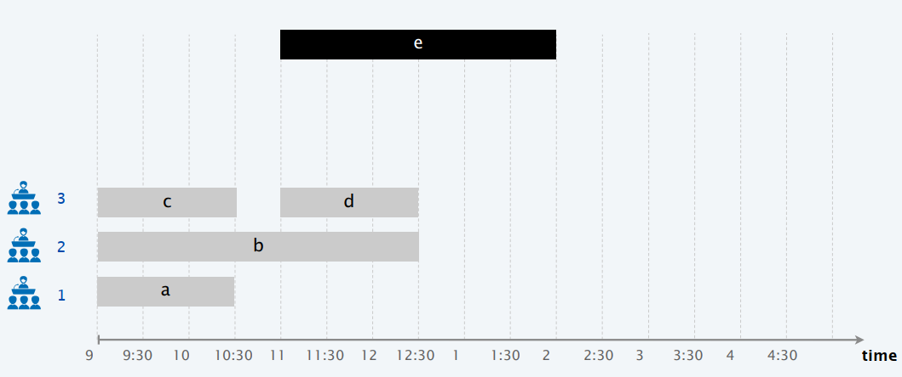
  $$
  \vdots\\
  \vdots
  $$
  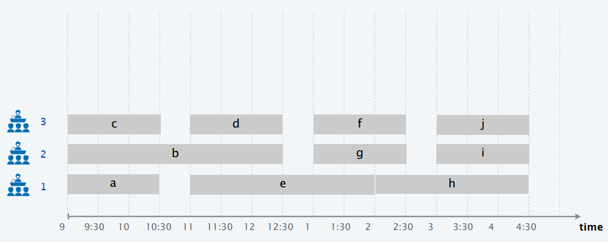

* 完成整个区间安排算法。

**Theorem.** 最早开始时间优先算法是最优的。

（这个没太看懂还需要回头再仔细琢磨琢磨）

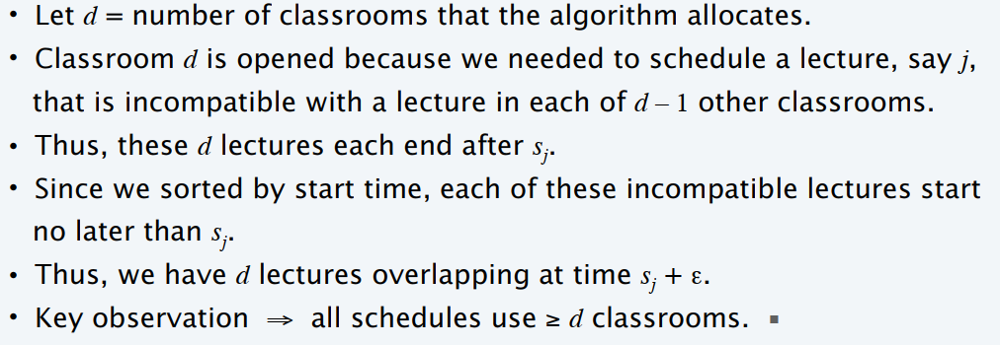

##### 最小延迟调度问题 Scheduling to Minimizing Lateness

基本的描述：

- 单一资源一次处理一个工作。
- 工作$j$要求$t_j$个单元的处理时间同时要求在$d_j$时间到期结束（最晚的结束时间）。
- 假设$j$的开始时间为$s_j$则其结束时间为$f_j=s_j+t_j$.
- 延迟时间等于$\ell_j=\max\{0,f_j-d_j\}$.
- 目标：安排完所有的工作同时最小化最大的延迟：$L=\max_j \ell_j$.

Example:

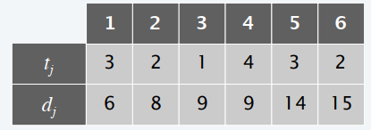

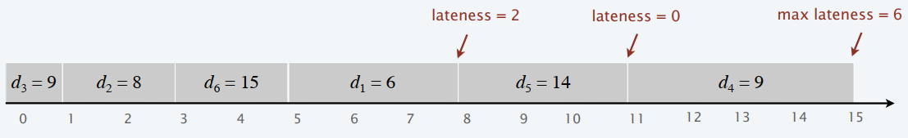

**Minimizing lateness: earliest deadline first**

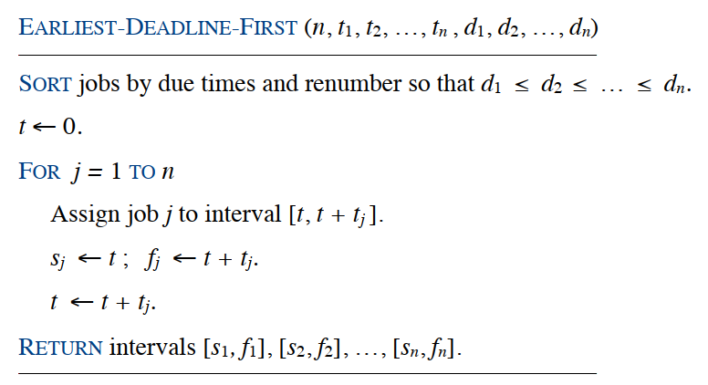

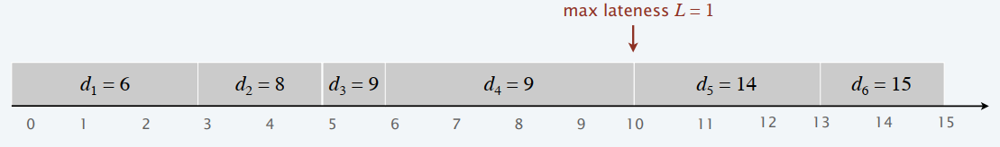

首先我们知道存在一个最优调度没有空闲时间；其次最早结束时间优先算法是没有空余时间的。

定义**inversion**表示一对工作$i,j$，其中$i$的结束时间早于$j$但是$j$安排在了$i$的前面。我们可以发现最早结束时间优先是唯一的没有空闲时间同时没有**inversion**的算法。

如果一个没有空闲时间的调度存在一个inversion的话，那么他一定存在一个相邻的inversion.

*Proof.*  定义$i-j$是一个最近的inversion，假设$k$是在$j$右边相邻的工作，第一种情况，如果$j>k$的话，那么$j-k$就是这样一对inversion；第二种情况，如果$j<k$那么$i-k$是一对更加临近的inversion，因为$i<j<k$.

下面引入一个关键的claim：如果我们交换了两个邻接的倒序的工作，那么我们可以知道inversion的数量会减少1，同时我们不会增加最大延迟值。

**Theorem.** 最早结束时间优先算法$S$一定是最优的。

*Proof.* 假设定义$S^\ast$是具有最少inversions的最优调度，可以假设$S^\ast$是没有空闲时间的，如果$S^\ast$没有inversions，那么我们可以知道$S=S^\ast$. 第二种情况如果$S^\ast$存在inversion，那么我们可以认为$i-j$是一个邻接的inversion，我们交换$i,j$的顺序可以使得inversion的数量降低1同时不会增加最大延迟，但是这样的话就于我们的最少inversion的假设冲突，因此不成立，综上我们可以认为$S$一定是最优的算法。

##### 证明贪心算法的策略

**贪心算法保持最好的结果：**我们可以证明在每一个贪心选择之后得到的结果都是至少和其他任何的算法得到的结果是一样好的。

**结构分析：**找到一个简单的结构化的界限，这个界限使得每一个可能的解都有一个确定的值，然后称述你的算法每一步达到的解都是达到了最好的界限。

**交换策略：**逐步地将任意的一个解向着greedy算法靠近同时不会改那个解的性质。

其他的一些贪心算法：Gale-Shapley, Kruskal, Prim, Dijkstra, Huffman等等

---

#### 2.3 Divide and Conquer

分治递归算法的基本思路：

- 将问题划分为相同种类的子问题
- 递归地求解每一个子问题
- 最后将所有的子问题的解合并得到整个问题的解

暴力求解算法时间复杂度为：$O(n^2)$; 使用分治递归算法的时间复杂度：$O(n\log n)$.

##### Counting inversions

匹配两个人之间的逆序数量。假设你排了$n$首歌曲。现在音乐系统希望你去寻找到一个跟你相似的音乐品味的人。

相似性度量使用的是两个rankings之间的逆序数量。给出一个范例：

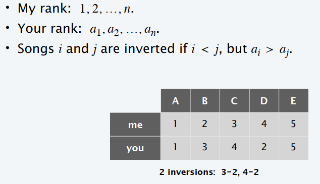

逆序对的定义是：如果对于两首歌$i,j$，如果$i<j$，但是存在$a_i>a_j$.

我们会发现这两个rankings之间存在两个逆序对，一个是3-2，另一个是4-2.

如果使用暴力解法我们可以知道时间复杂度为$\Theta(n^2)$.

假如使用分治递归的方法，如何考虑这个问题：

1. 首先将这个list分为两个部分：$A,B$.
2. 其次在每个list中递归地去数存在的inversions的数量
3. 数inversion $(a,b)$，其中$a\in A,b\in B$的数量
4. 返回所有的逆序的数量

如何去计算inversion $(a,b)$，其中$a\in A,b\in B$的数量？如果是有序的数组就很好计算了

首先对$A$和$B$分别进行排序，然后对于每一个$b\in B$我们使用二分搜索的方式在$A$中寻找有多少个$A$中的元素比$b$更大。

算法的基本流程：

input: List $L$.

output: Number of inversions in $L$ and $L$ in sorted order.

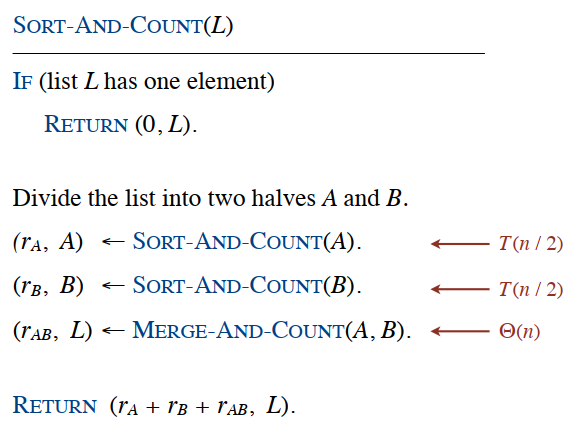