### 第四章 poly-time reductions

---

#### 4.1 INTRACTABILITY Ⅰ

算法设计模式：贪心，分治，动态规划等等，其中还包含刚刚使用到的对偶理论，**规约**等等。

算法设计反模式：NP-completeness，NPC问题等等。

常见的存在多项式时间算法以及不存在多项式时间的算法：

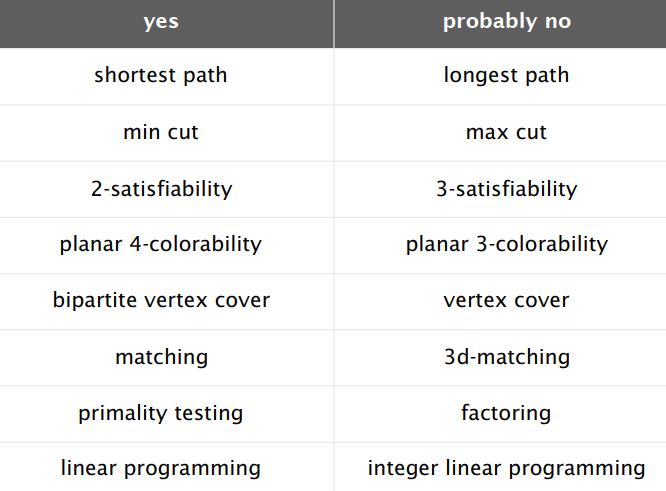

将所有的问题根据能否通过多项式时间来解决分为两类。

假设现在我们可以在多项式时间内解决问题$Y$. 那么其他的我们还能去解决什么问题呢？

**规约（Reduction）**：如果说问题$X$的任意一个实例都可以通过下面的方式解决：

- 多项式数量的标准计算步骤
- 多项式次数地调用解决问题$Y$的oracle（这里表示的是一步操作或者说在$O(1)$的时间复杂度下获得一个问题$Y$实例的解）. 

那么我们就认为问题$X$是可以在多项式时间之内规约到问题$Y$的。

符号表示为：$X\leq_{P}Y$.

这里注意因为我们在写出所有需要的问题$Y$的实例的时候是需要花费时间的，因此必须保证的是关于问题$Y$的实例的数量一定是多项式级别的。

**如果$X\leq_{P}Y$，那么如果问题$X$不能够在多项式时间内解决，那么问题$Y$也一定不能使用多项式时间解决。**

**如果$X\leq_P Y$，且问题$Y$可以在多项式时间内解决，那么问题$X$也一定可以在多项式时间内解决。**

如果$X\leq_P Y$同时$Y\leq_P X$，那么我们表示为$X\equiv_P Y$. 在这种情况下，当且仅当问题$Y$可以在多项式时间内解决，问题$X$可以在多项式时间内解决。

##### 独立集合问题

给定一个图$G=(V,E)$和一个整数$k$，是否存在一个大小为$k$个顶点的子集使得任意两个顶点都没有边相互连接。

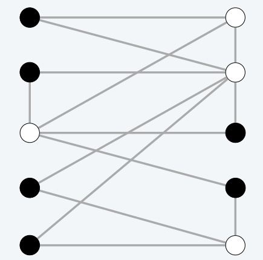

以上图为例，我们能够发现最大的独立集大小为$6$. 不存在大小为$7$的独立集。（黑点）

##### 点覆盖问题

给定一个图$G=(V,E)$和一个整数$k$，问是否存在一个元素为$k$的最小子集使得图中所有的边都在这个子集中，也就是说所有的边都有一个及以上的顶点在这个子集中。

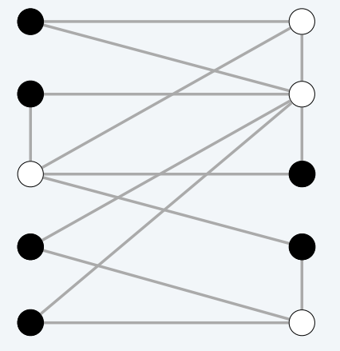

在上述这个图中最小的点覆盖子集的大小为$4$，不存在大小为3的点覆盖子集。（白点） 

##### 关于点覆盖问题和独立集问题

**Theorem.** INDEPENDENT-SET$\equiv_P$VERTEX-COVER 

*Proof.* 证明的思路是我们能够找到一个大小为$k$的独立集$S$当且仅当$V-S$是一个大小为$n-k$的点覆盖问题。

$\Rightarrow$

- 令$S$表示一个尺寸为$k$的独立集.
- 那么集合$V-S$的元素个数为$n-k$.
- 考虑任意的一条边$(u,v)\in E$.
- 由于$S$是一个独立集，那么：
  - 要么$u\notin S$，要么$v\notin S$，要么都不在这个独立集中
  - 要么$u\in V-S$，要么$v\in V-S$，要么都在$V-S$中

- 因此$V-S$包含了边$(u,v)$.

反过来证明思路是类似的。

##### 集合覆盖问题

给定一个集合$U$，定义$S$表示一个集族，表示的是一个$U$的子集的集合，同时给定一个整数$k$，问是否存在小于等于$k$的子集数量的集合使得他们的并集为$U$？

给出一个实例：

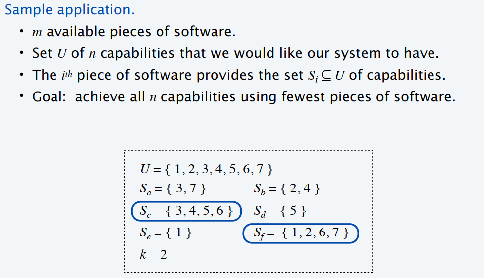

##### 由点覆盖问题归约到集合覆盖问题

**Theorem.**  VERTEX-COVER$\leq_P$ SET-COVER

*Proof.* 给定一个点覆盖实例$G=(V,E)$和整数$k$，我们构建一个集合覆盖的实例$(U,S,k)$，结论是当且仅当图$G$中有一个大小为$k$的点覆盖的情况下会存在大小为$k$集合覆盖。

构建对应关系：

- $U=E$
- 对于每一个节点$v\in V$，表示一个子集：$S_v=\{e\in E,e\text{ incident to }v\}$.

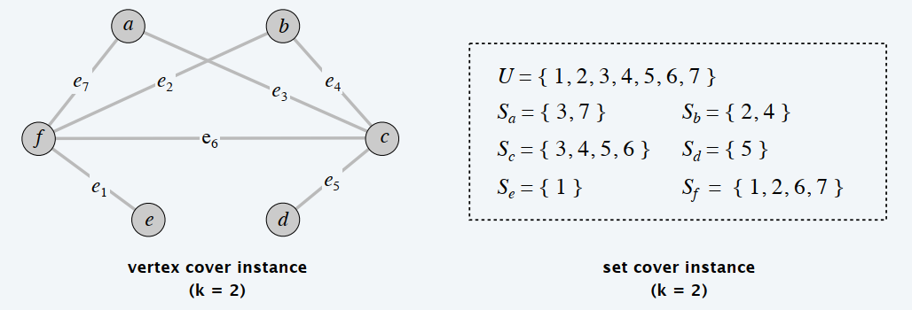

**Lemma.** $G=(V,E)$包含一个大小为$k$的点覆盖当且仅当$(U,S,k)$包含一个大小为$k$的集合覆盖。

*Proof.* 定义$X\subseteq V$表示在图$G$上的一个大小为$k$的点覆盖。那么$Y=\{S_v:v\in X\}$是一个大小为$k$的集合覆盖。（显然通过映射关系是成立的，这一部分证明了在顶点覆盖问题上的正确实例是满足条件的）反过来，令$Y\subseteq S$是在$(U,S,k)$上的大小为$k$的集合覆盖，那么$X=\{v；S_v\in Y\}$是在图$G$上的一个大小为$k$的顶点覆盖。

- 问题$X$归约到问题$Y$.
- $G$是问题$X$中任意的一个特例
- $H$是问题$Y$中任意的一个特例
- 问题$G$的求解转换为问题$Y$的求解

##### 三元可满足性问题

3-SAT问题：每个句子中包含三个字母，每个字母对应着一个不同的变量。给出一个例子：

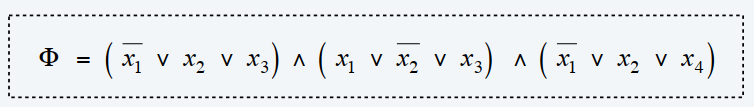

给出一个正实例：比如说当$x_1$取true，$x_2$取true，$x_3$取false，$x_4$取false. 这时整个析取范式取值为true.

将3-SAT规约到独立集问题：

3-SAT $\leq_p$ INDEPENDENT-SET

*Proof.* 给出一个$\Phi$的3-SAT实例，我们构建一个独立集实例：$(G,k)$. 当且仅当$\Phi$是可满足的时候，存在一个大小为$k=|\Phi|$的独立集。我们的构建方法如下：

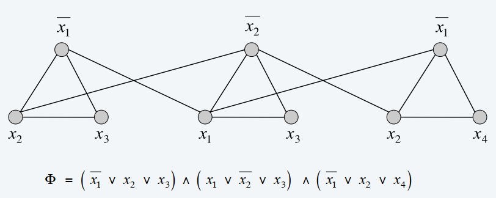

根据给出的3-SAT问题的实例，我们构造上面图所示的一种graph，其中每个式子中的字母表示一个顶点，任意一个式子之间的三个顶点是相互连接的，同时我们将相同字母的正与反都相互连接起来。

**Lemma.** 当且仅当我们构建起来的图$G$包含一个大小为$k=|\Phi|$的独立集，这个析取范式$\Phi$是可满足的。

*Proof.* 在每个三角形中我们选择任意一个为真的点，将这个点放入独立集中，最终我们得到的就是一个大小为$k$的独立集。反过来看，假设我们存在一个大小为$k$的独立集，那么我们在这个图$G$中一定是每一个三角形中选择了一个顶点且不能够选那些相邻三角形之间存在连边的顶点，那么我们就会发现这个问题上满足条件的一定能够在每个三角形上找到一个为真的字母。所有说反过来也是成立的。

**规约具有传递性！**

回顾之前已经考虑过的规约问题，首先是独立集问题和点覆盖问题的相互规约：

INDEPENDENT-SET$\equiv_p$ VERTEX-COVER

特殊情况到一般情况的规约：点覆盖问题归约到集合覆盖问题

VERTEX-COVER $\leq_p$ SET-COVER

还有一个问题：三元可满足性问题归约到独立集问题

3-SAT$\leq_p$ INDEPENDENT-SET

根据规约的传递性我们可以得到：

3-SAT $\leq_p$ INDEPENDENT-SET $\leq_p$ VERTEX-COVER$\leq_p$ SET-COVER

##### 决策问题，搜索问题以及优化问题

决策问题一般表示为：是否存在一个大小$\leq k$的点覆盖？

搜索问题一般表示为：寻找一个大小$\leq k$的点覆盖？

优化问题一般表示为：寻找一个最小尺寸的点覆盖。

**Self-reducibility** 自规约的问题

将一个优化问题或者说搜索问题多项式时间归约到一个决策问题

**Example**：寻找最小的点覆盖

Solution: 

- 使用二分搜索或者其他搜索的方法找到一个大小的$k^\ast$的最小点覆盖；
- 寻找一个使得$G-\{v\}$变为一个大小为$k^\ast-1$的点覆盖；（任何一个在最小点覆盖中的点都会具有这样的性质）
- 将顶点$v$添加到点覆盖中去；
- 迭代地去寻找这个最小的点覆盖$G-\{v\}$；

---

##### 课堂留下的小练习：

**Problem:** 如果可以多项式时间内判断一个平面图是否可以3着色，请设计多项式时间算法给出一个平面图的3着色方案。（这就是一个自归约的问题）

**Solution：**定义1：判断一个平面图是否可以3着色问题为问题X. 定义2：给出一个平面图的3着色方案的问题为问题Y. 那么目标变为将问题Y归约到问题X，如果能够得到：$Y\leq_P X$，由于问题X可以在多项式时间内解决，那么问题Y也可以在多项式时间内求解，即得到了题中目标多项式时间算法给出平面图的3着色问题。
因此下面证明：$Y\leq_P X$ .

大概的思路可以表示为：首先判断目标图是否可以进行三着色，如果不可以直接返回不可以；如果可以，先使用一种颜色着色一个部分，判断剩下的图是否可以三着色，如果不可以直接返回此图不能进行三着色，反之则继续使用另外的一种颜色进行着色，反复重复这个过程。如果整个图都能够完成着色则这就给出了一个三着色的方案，否则的话此图不存在一个三着色的方案。

---

#### 4.2 INTRACTABILITY Ⅱ

##### P问题

决策问题：

- 存在一个集合$X$
- $s$是一个实例
- 使用算法$A$来解决问题$X$: $A(s)=yes \quad \text{if }s\in X;A(s)=no \quad \text{if }s\notin X$.

P问题表示的是：存在多项式时间算法的决策问题的集合。

一些P问题的实例：

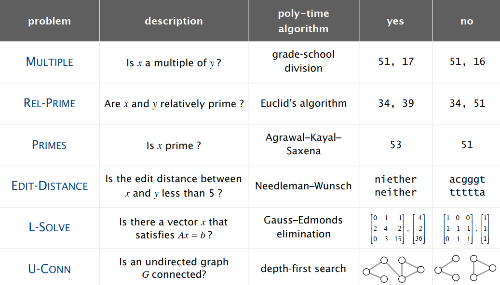

##### NP问题

如果对于每一个实例$s$算法$C(s,t)$都是对于问题$X$的证据使得：当且仅当存在一个实例$t$使得$C(s,t)=yes$的情况下$s\in X$.

NP问题可以理解为：能够在多项式时间内去验证一个决策问题的解的那些决策问题的集合。

- $C(s,t)$是一个多项式时间的算法；
- 证据$t$是多项式规模的：$|t|\leq p(|s|)$.

哪些问题是一个NP问题呢？

SAT$\in $NP; 3-SAT$\in $NP; HAMILTON-PATH$\in $NP

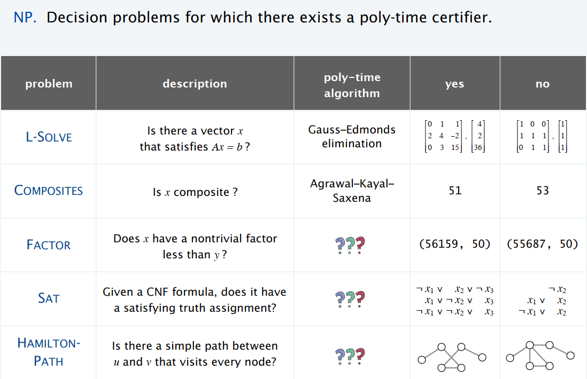

#### P, NP, EXP问题

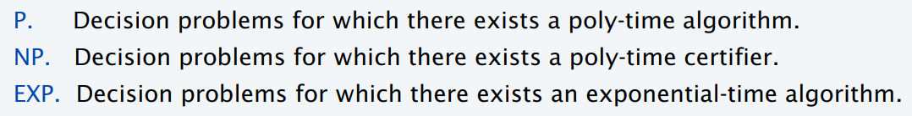

一些基本的结论：

- $P\subseteq NP$

- $NP\subseteq EXP$
- $P\neq EXP\Rightarrow$要么$P\neq NP$要么$NP\neq EXP$要么都成立

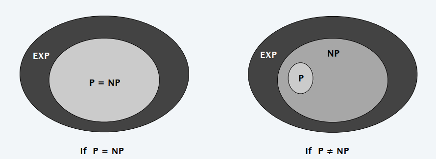

##### NPC问题（NP完全问题）

如果一个问题$Y\in NP$，同时所有的问题$X\in NP$都有$X\leq_p Y$. 那么我们认为这个问题$Y$是一个NPC问题。

第一个NPC问题是SAT问题

当我们希望证明一个问题是NPC问题时，分为三个步骤：

1. 说明$Y\in NP$
2. 选择一个NPC问题$X$
3. 证明问题$X$可以多项式时间归约到问题$Y$

**推论：**如果$X\in$NP-Complete，$Y\in $NP同时问题$X$多项式时间归约到问题$Y$，那么问题$Y$也是一个NP-C问题

归约的历史：

首先由SAT问题归约到3-SAT问题

其次从3-SAT问题多项式时间归约到独立集问题，节点覆盖问题，集合覆盖问题；

然后由3-SAT问题归约到有向图的哈密顿圈问题，哈密顿圈问题；

再次从3-SAT问题归约到三着色问题；

另外从3-SAT问题归约到子集求和的问题和背包问题；

同样的上述的所有问题都还能够反向归约回去，因此上面所述的所有问题都是可以互相在多项式时间内进行相互归约的。

大部分的NP问题要么是P问题，要么是NP-Complete问题当然也有很多问题现在还属于介于两者中间，属于NP-intermediate问题（因子分解问题，离散的对数问题，图的同构问题等等）

##### Co-NP问题

我们去关注NP问题的不对称性，其不对称性在于说我们只需要一些证据来说明其yes实例而不是no实例。

从SAT问题到UN-SAT问题

这样的例子还有很多。

如何解决这样的问题？

我们现在知道的是：SAT问题本身属于NP-Complete问题，同时SAT$\equiv_p$ UN-SAT问题，但是我们并不知道UN-SAT问题是否属于NP问题，因此我们就不能得到UN-SAT问题是一个NP-C问题。（对于哈密尔顿圈也是这样的规则）

我们定义一类新的问题：co-NP问题

co-NP问题是属于NP决策问题的补问题。例如：UN-SAT，NO-HAMILTON-CYCLE以及PRIMEs.

如果NP$\neq$co-NP，那么P $\neq$ NP.

*Proof.* 首先我们知道P问题对于补运算是封闭的。如果P=NP那么NP问题对于补运算也一定是封闭的，这样也就是说NP=co-NP了，但是这就与我们的结论矛盾了。

一个比较重要的结论：**P$\subseteq$NP$\cap$co-NP**

给出一个例子：Factoring is in NP $\cap$ co-NP

因式分解问题：给定一个整数$x$，我们去寻找他的质数分解的结果。

因子问题：给出两个整数$x,y$，我们去找出$x$是否存在一个小于$y$的非平凡因子。

这两个问题之间是可以相互规约的。

从因子问题归约到因式分解问题是非常容易的；从因式分解问题归约到因子问题我们可以先使用二分搜索寻找一个因子，然后将这个因子划分，反复进行这样的操作，看是否存在一个小于$y$的非平凡因子。

---

#### 4.3 一些重要的NP-C问题的归约方法

##### 有向图的哈密顿圈问题归约到一般哈密顿圈问题

DIRECT-HAMILTON-CYCLE $\leq_p$ HAMILTON-CYCYLE

*Proof.* 归约的方式为：对于一个有向图$G=(V,E)$，我们可以构建其对应的一个图$G'$，这个图$G'$中存在3n个节点。

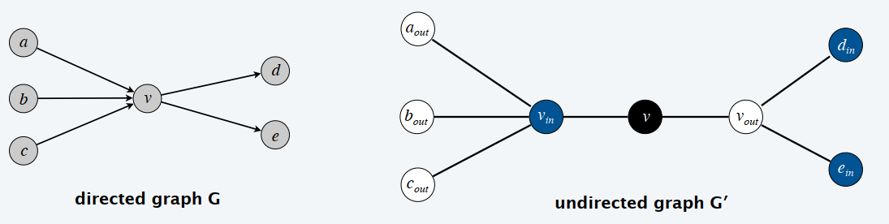

首先考虑对于一个有向图$G$来说，如果$G$中存在一个哈密顿圈，那么我们一定可以通过一样的方式在构造的无向图$G'$中找到一个相同顺序的哈密顿圈；反过来考虑，如果在构造的无向图$G’$中存在一个哈密顿圈，那么这个哈密顿圈的顺序一定是按照：“黑-白-蓝”或者“黑-蓝-白”的顺序进行排序的，因此我们可以知道在这个无向图中存在一个哈密顿圈，那么在对应的有向图中一定存在跟其顺序一样的哈密顿圈或者是一个完全反向的哈密顿圈。

##### 3-SAT问题归约到有向图的哈密顿圈问题 

3-SAT $\leq_p$ DIRECT-HAMILTON-CYCLE

这个归约的过程比较复杂：主要思想是给定一个3-SAT的实例我们构造一个有向图$G$的实例当且仅当这个$\Phi$是可满足的时候，有向图存在一个哈密尔顿圈。构造图的过程为：定义$n$表示为在析取范式$\Phi$中的变量的数量，我们构建一个存在$2^n$个哈密尔顿圈的图，其中每个圈对应了$2^n$个真值实例中的一个实例。

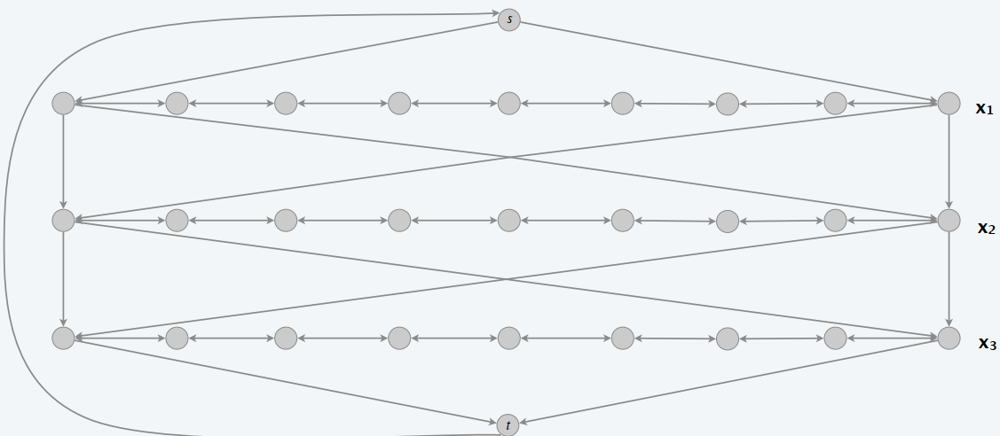

定义：中间的穿越path如果是从左往右流的，那么我们就认为对应的$x_i$的真值表达为true.

