### 第三章 有限状态自动机

---

#### 3.0 引入

定义一个语言可以从产生语言的角度，也可以从接收或者识别的角度定义。

产生语言的角度：（1）找到基本句子；（2）找到其他句子的形成规则；（3）使用产生式的形式描述形成规则。

接收识别语言的角度：使用自动机来接收字符串；接收的所有字符串形成的集合称为语言。

有限自动机的分类：（1）有限状态自动机FA；（2）下推自动机PDA；（3）图灵机TM

#### 3.1 有限状态自动机

如上图一个输入存储带被分解为单元，每个单元存放一个输入符号（字母）。一个有穷状态控制器FSC的状态只能是有限多个，FSC通过读头读取当前带上单元的字符。

**定义：**FA是一个五元式：$FA=(Q,\Sigma,\delta,q_0,F)$.

$Q$是有限状态的集合。

$\Sigma$是字母表即输入带上的字符集合。

$q_0\in Q$是开始状态。

$F\subseteq Q$是接收状态（终止状态）集合。

$\delta$是$Q\times \Sigma\to Q$的状态转换函数即$\delta(q,x)=q'$代表FA在状态$q$时扫描到字符$x$后状态改变为$q'$.

状态转换函数的个数为$|Q|*|\Sigma|$.

**DFA：有限状态自动机**

如果我们定义DFA为$DFA=(\{q_0,q_1\},\{0,1\},\delta,q_0,\{q_0\})$

其中的$\delta$表示为：$\delta(q_0,0)=q_1,\delta(q_0,1)=q_1,\delta(q_1,0)=q_1,\delta(q_1,1)=q_0$

还可以写为一个矩阵形式：

还可以表示为图的形式：

对于字母表$\Sigma$上的DFA，能够接收的所有串的集合，就是DFA能够接收的语言，记为$L(DFA)$，也称为有限状态语言（FSL）.

**扩展的状态转移函数**

给定DFA，扩展的状态转换函数：

$\delta^\ast:Q\times \Sigma^\ast\to Q$即$\delta^\ast (q,w)=q'$. 即DFA在一个状态$q$时，扫描串$w$后到达唯一确定的状态$q'$.

递归定义扩展的状态转换函数：
$$
\delta^\ast(q,\epsilon)=q\\
\delta^\ast(q,a)=\delta(q,a)
$$
对于串$w=\alpha a(\alpha\in \Sigma^+)$. 
$$
\delta^\ast(q,w)
=\delta^\ast(q,\alpha a)
=\delta(\delta^\ast(q,\alpha),a)
$$
DFA接收的语言：DFA=$(Q,\Sigma,\delta,q_0,F)$接收的语言L(DFA)=$\{w|\delta^\ast(q_0,w)\in F\}$.

对于状态q，如果不能接收字母a，则我们将状态转换为一个特殊的状态陷阱状态$q_t$.

**DFA的瞬时描述（格局）**

格局是一个二元式：$qy$

$q$是DFA当前状态，$y$是输入带上还没有被扫描到的串，读头即将扫描到$y$串的第一个字母。

串扫描过程中，格局发生转换（改变），格局的（一次）转换的原因是由于$\delta$函数的一次作用。

DFA的格局转换

如果当前格局是：$qar$，有$\delta$函数：$\delta(q,a)=q'$. 则下一格局为：$q'r$. 格局的转换可以记为：$qar\Rightarrow q'r$.

DFA特殊格局：初始格局为：$q_0w$，接收格局为：$q_f\epsilon$. 其中$q_f$是某一个接收状态。
$$
L(DFA)=\{w|q_0w\Rightarrow^\ast q_f\epsilon; w\in \Sigma^\ast\text{ and }q_f\in F\}
$$
DFA停机的条件是：输入串扫描结束时。（唯一的停机情况）

**定理：**每个FSL都是一个右线性语言。

FSL和RG之间的关系：DFA最重要的部分是状态转换函数，文法最重要的是部分是产生式。

状态转换函数和产生式是等价的可以将状态转换函数改造为产生式。

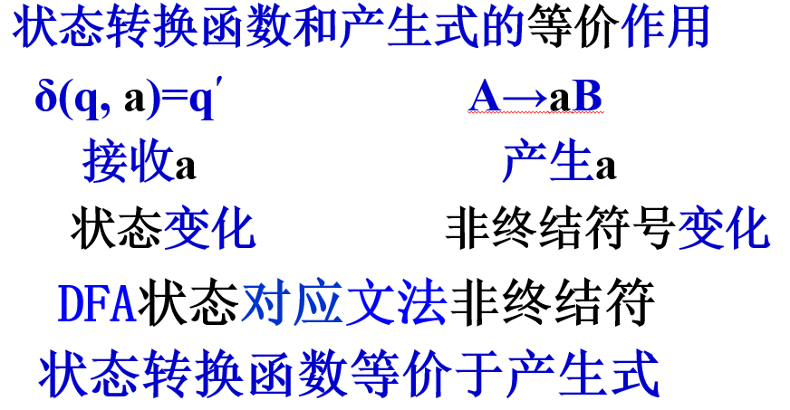

DFA转换为RLG的方法思路：

- 将DFA的状态看作是RLG的非终结符（开始状态就是开始符号）
- 对于某个句子：DFA通过状态的改变逐步接收句子的每一个字母；RLG通过非终结符号的改变，逐步产生了句子的每个字母。

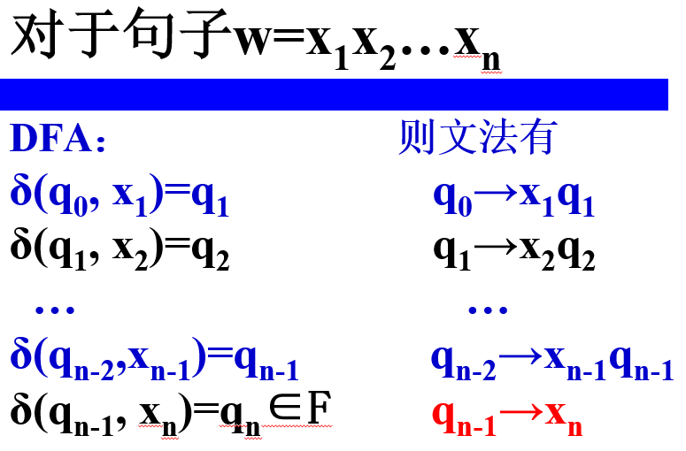

对于陷阱状态而言：文法中是无用非终结符。

**FSL对于补运算是封闭的。**

假设$L_1$是$\Sigma$上的FSL，且$L_1=L(DFA_1)$，其中$DFA_1=(Q,\Sigma,\delta,q_0,F)$.

构造$DFA_2=(Q,\Sigma,\delta,q_0,Q)$.（$DFA_2$接收的是$L_1$的对应的全集，就是$\Sigma^\ast$）

那么我们可以构造出$DFA_3=(Q,\Sigma,\delta,q_0,Q-F)$. 那么$L_3$接收的就是关于$L_1$的补，$L_3$也是FSL语言。

##### DFA接收语言的例子

构造DFA接收语言：$L=\{ab\}$.

1. 首先写出基本句子。

   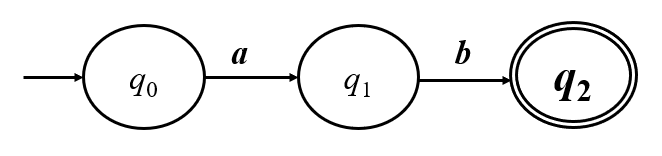

2. 添加陷阱状态。

   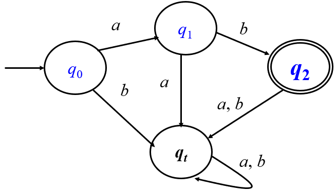

接收语言$L=\{x000y|x,y\in\{0,1\}^\ast\}$.

基本思路：一一读入字符，如果输入串读入了一个0那么他可能是000中的第一个0，如果紧接着读入了一个1，那么前面刚刚读到的0就不是000中的第一个0，我们就需要重新寻找000中的第一个0，依次类推。使用四个状态来记录：初始状态$q_0$，接收到0到达状态$q_1$，接收到00到达状态$q_2$，接收到000到达状态$q_3$.

基本的状态转移函数就有三个：$\delta(q_0,0)=q_1$，$\delta(q_1,0)=q_2$，$\delta(q_2,0)=q_3$. 用来接收基本句子000.

同时我们还需要考虑其他的状态转移函数。

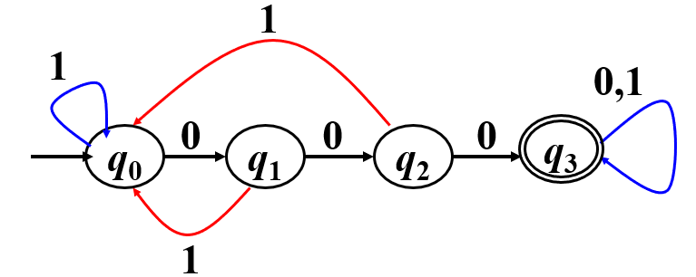

如果需要接收语言$L\cup\{\epsilon\}$.

我们需要考虑修改开始状态，注意文法的开始状态只用于负责串的推导的开始，DFA的开始状态只负责接收输入串的第一个字母。因此我们就在DFA中添加一个开始符号:

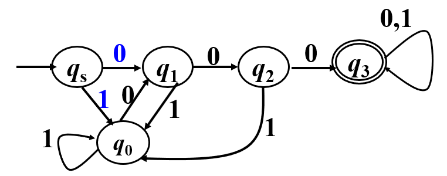

构造DFA接收语言$L=\{0^{2k+3m}|m,k\geq 0\}$.

注意一个特性：$2k+3m$可以表示任意的非负整数（除了1之外），因此这个语言可以写成$0^\ast-\{0\}$.

例题：接收$\{0,1\}$上的语言，该语言的每一个字符串不包含00子串（允许空串）

可以使用DFA对于补运算封闭的性质，先构造一个必须包含00子串的DFA，然后取补：

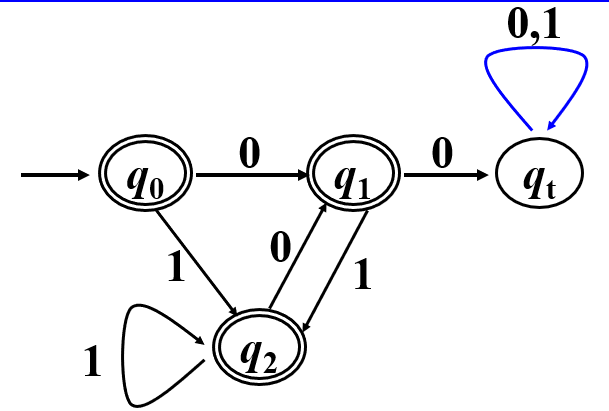

​    

或者也可以写为：

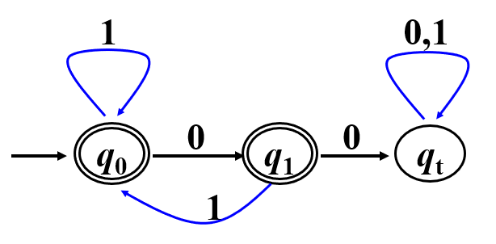

例题：构造DFA接收$\{0,1,2\}$上的语言，该语言每一个字符串代表的数字都能够整除3.

【解】基本思路：将整数当作一个字符串，从左到右一一读入，使用3个状态分别代表已经读入的整数对3的余数的情况。使用3个状态分别代表已经读入的整数对于3的余数的情况。

- $q_0$：已读入的整数除以3，余数为0.
- $q_1$：已读入的整数除以3，余数是1.
- $q_2$：已读入的整数除以3，余数是2.

已知$q_i(i=0,1,2),x=0,1,2$.应该如何确定$j$？

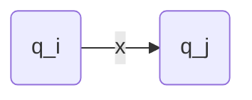

w=3n+i

wx=10w+x

j=(i+x) mod 3

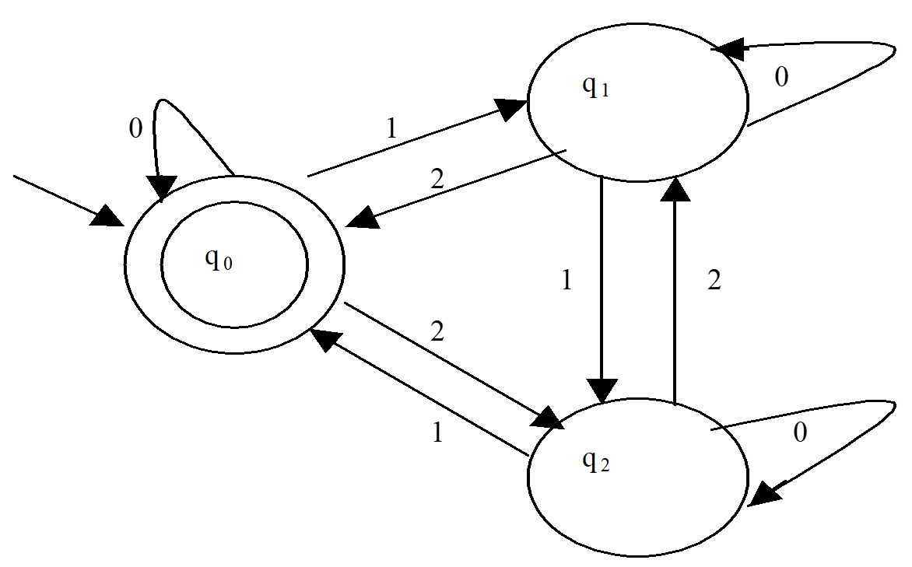

定义：set集合

对于状态$q$，能将DFA从$q_0$转换到$q$状态的所有字符串的集合为：
$$
set(q)=\{w|w\in \Sigma^\ast,\delta^\ast(q_0,w)=q\}
$$
那么有限自动机DFA能够接收的语言可以定义为：
$$
L(DFA)=\cup set(q_\alpha)
$$
其中：$q_{\alpha}\in F$.

按状态进行划分：对于DFA来说，可以定义关系R，如果$x,y\in \Sigma^\ast,q\in Q$那么$xRy$当且仅当$x\in set(q),y\in set(q)$

R=｛(x,y)|x∈set(q),y∈set(q)   q∈Q｝是 ∑*上的二元关系

DFA的每一个状态对应一个等价类。利用一个状态去表示一个等价类是构造DFA的一条有效思路！

构造DFA接收$\{0,1,2,4,5,6,7,8,9\}$上的语言，该语言的每一个字符串代表的数字能够整除3.

不难发现状态可以表示为3种：余数为1，2，3.

难点在于找到状态之间的转换关系。

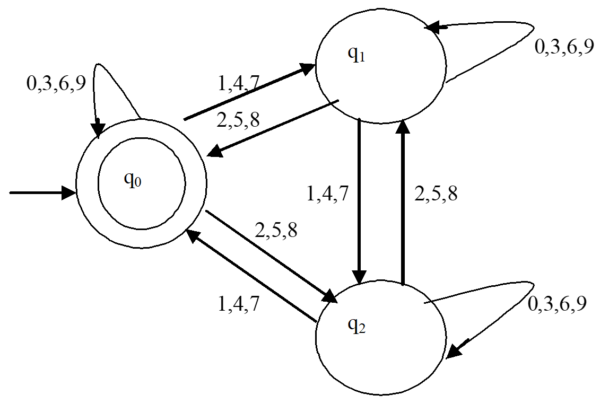

构造DFA接收$\{0,1\}$上的语言，该语言的每一个字符串当成二进制数时，代表的数字能够整除3.

思路是类似的，DFA的每个状态对应一个等价类，利用一个状态去表示一个等价类，除以3的余数只能为0,1,2.

不能接收空串因此需要设置一个开始状态$q_s$。

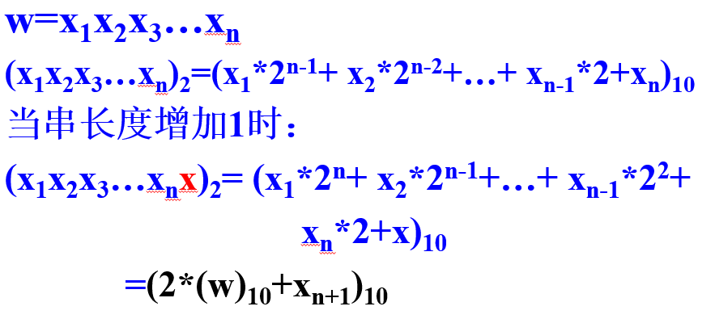

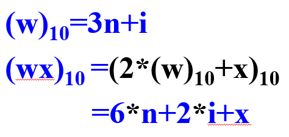

实际上我们不难发现2*i+x对3的余数就是wx对于3的余数。

设w是当前已经读入的输入串：$q_s$表示开始状态，读入0时，进入状态$q_0$；读入1时，进入状态$q_1$.

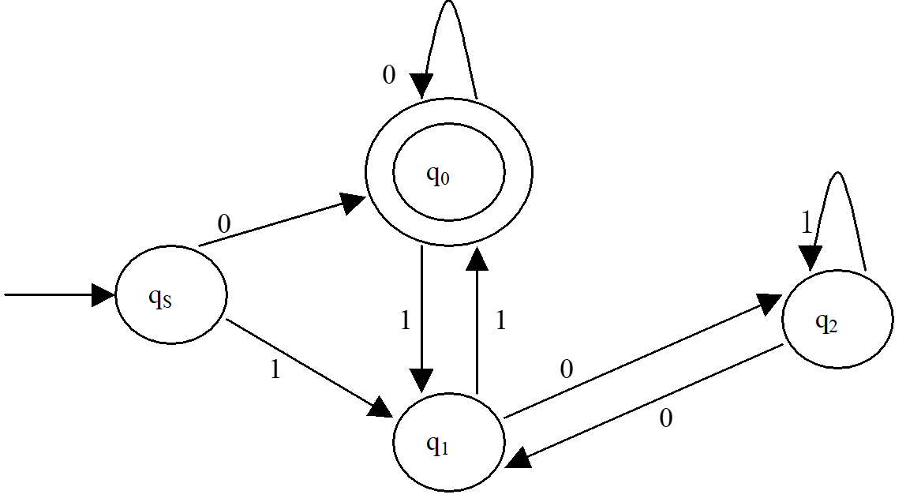

构造DFA，接收$\Sigma=\{x_1,x_2,\cdots,x_m\}$上的语言，该语言的句子当成**base**进制数时代表的数字能整除**N.**（或者说代表的数字对N的余数为K）

对N的余数只能为0,1,...和N-1，N个状态代表已经读入的串对于N的不同的余数的等价类。

$q_i$: 余数为$i$的输入串的等价类。

假设当前读入的字符为x，则wx表示的十进制数为：
$$
(wx)_{10}=base*(w)_{10}+x=base*(N*n+i)+x=N*base*n+base*i+x
$$
该数对于N取余数的结果就应该是base*i+x对于N的余数，如果该余数为j，则相应的状态就是应该从$q_i$变换为$q_j$.

例题：构造DFA，接收$\{0,1\}$上的语言，$L=\{0^n1^m2^k|n,m,k\geq 1\}$.

观察这个语言的串的特点是：0在最前面，1在中间，2在最后面。0,1,2不能交叉，顺序不能颠倒，0，1，2的个数至少都为1.

需要的状态共有4个：

- $q_0$表示开始状态，等待接收第一个0.
- $q_1$已经接收了第一个0，负责接收可能的多个0，等待接收第一个1.
- $q_2$已经接收了第一个1，负责接收可能的多个1，等待接收第一个2.
- $q_3$已经接收了第一个2，负责接收可能的多个2.

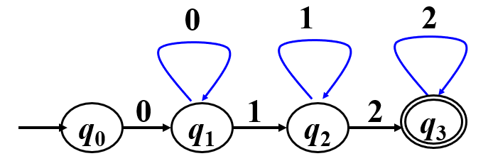

#### 3.2 不确定有限状态自动机

每个FSL都是右线性语言（$\delta(q,a)=q'\in F,q\to aq'$）

不确定的有限状态自动机：NFA.

定义：NFA是一个五元式，$NFA=(Q,\Sigma,\delta,Q_0,F)$

- $Q$表示一个有限状态的集合
- $\Sigma$是字母表
- $Q_0\subseteq Q$是开始状态集合
- $F\subseteq Q$是接收状态集合
- $\delta$是$Q\times \Sigma\to 2^Q$的状态转换函数：$\delta(q,a)\subseteq 2^Q$. NFA在状态$q$扫描字母a后到达一个状态的集合。

NFA与DFA之间非常重要的不同在于转移函数的不同。$\delta(q,x)$对应状态集合Q的一个子集

NFA的停机存在两种情况：将扫描的串扫描结束或者$\delta(q,a)=\empty$（也就是说对应的$\delta$没有定义）

NFA接收串w：如果至少存在一条路径可以使得NFA在扫描串w后到达接收状态，则串w能够被NFA接收。

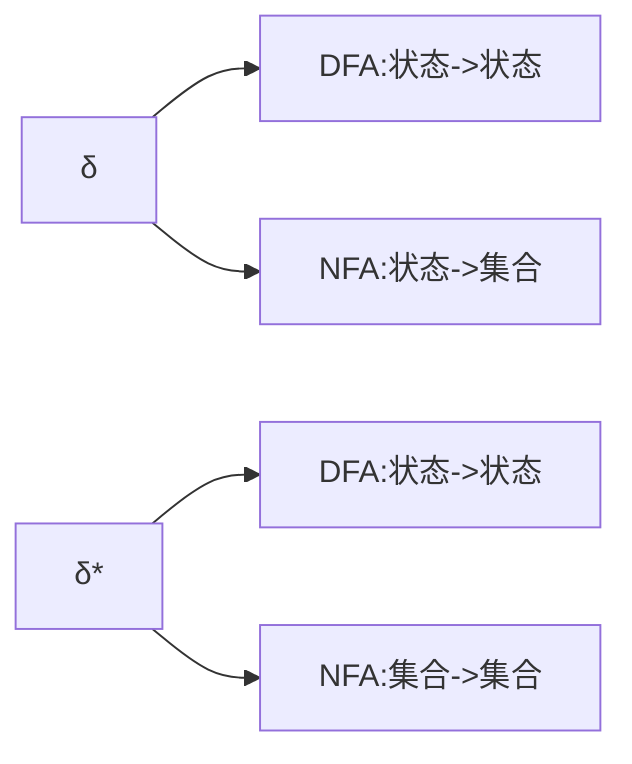

NFA的扩展状态转换函数

如果$P=\{q_1,q_2,\cdots,q_n\}$. $\delta^\ast(P,\epsilon)=P$.

如果$a\in \Sigma$，$\delta^\ast(P,a)=\cup\{\delta(q,a)|q\in P\}=\{\delta(q_1,a),\delta(q_2,a),\cdots,\delta(q_n,a)\}$.

##### NFA的确定化

DFA可以转换为NFA，NFA可以转换为DFA（确定化）

$\delta_1(q,a)=\{\delta(q,a)\}$

将DFA的一个状态看作NFA的一个状态的集合

将NFA的一个状态集合看作是DFA的一个状态

一个非常常规的思路就是：

1. 给出一个语言的正则表达式
2. 构造满足该语言的NFA接收该语言
3. 将NFA转换为等价的DFA                                                                     

  