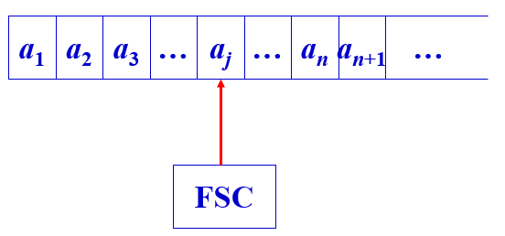
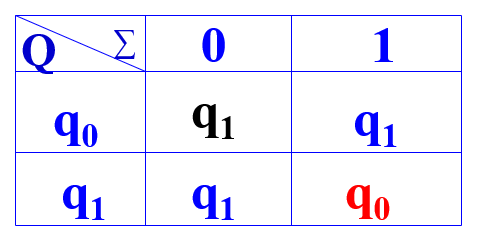
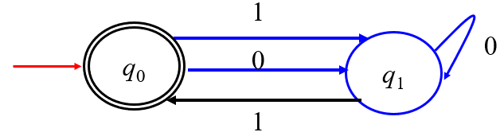

### 第三章 有限状态自动机

---

#### 3.0 引入

定义一个语言可以从产生语言的角度，也可以从接收或者识别的角度定义。

产生语言的角度：（1）找到基本句子；（2）找到其他句子的形成规则；（3）使用产生式的形式描述形成规则。

接收识别语言的角度：使用自动机来接收字符串；接收的所有字符串形成的集合称为语言。

有限自动机的分类：（1）有限状态自动机FA；（2）下推自动机PDA；（3）图灵机TM

#### 3.1 有限状态自动机

如上图一个输入存储带被分解为单元，每个单元存放一个输入符号（字母）。一个有穷状态控制器FSC的状态只能是有限多个，FSC通过读头读取当前带上单元的字符。

**定义：**FA是一个五元式：$FA=(Q,\Sigma,\delta,q_0,F)$.

$Q$是有限状态的集合。

$\Sigma$是字母表即输入带上的字符集合。

$q_0\in Q$是开始状态。

$F\subseteq Q$是接收状态（终止状态）集合。

$\delta$是$Q\times \Sigma\to Q$的状态转换函数即$\delta(q,x)=q'$代表FA在状态$q$时扫描到字符$x$后状态改变为$q'$.

状态转换函数的个数为$|Q|*|\Sigma|$.

**DFA：有限状态自动机**

如果我们定义DFA为$DFA=(\{q_0,q_1\},\{0,1\},\delta,q_0,\{q_0\})$

其中的$\delta$表示为：$\delta(q_0,0)=q_1,\delta(q_0,1)=q_1,\delta(q_1,0)=q_1,\delta(q_1,1)=q_0$

还可以写为一个矩阵形式：

还可以表示为图的形式：

