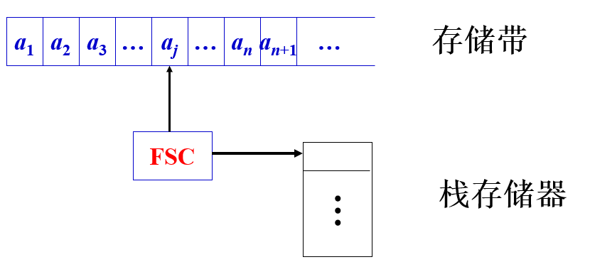
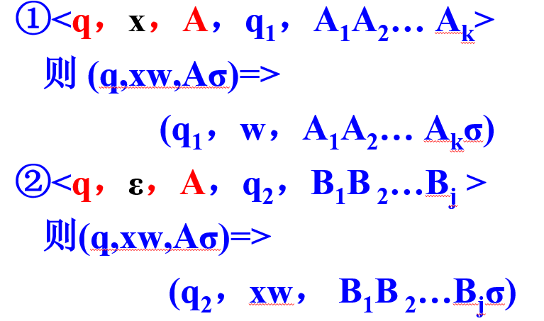
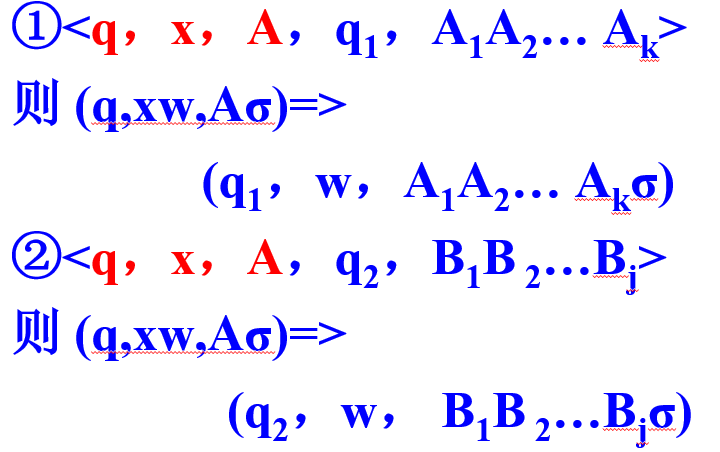
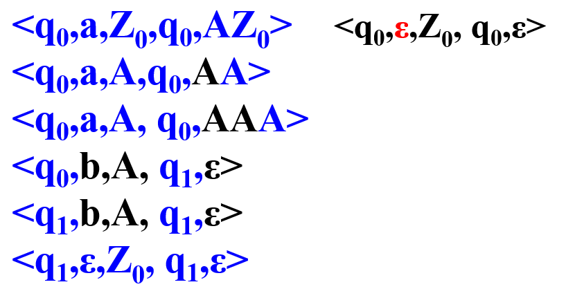

### 第五章 下推自动机PDA

---

**FA识别正则语言（右线性语言）**

**PDA识别上下文无关语言**

为什么FA识别不了上下文无关语言？

【解】正则文法产生无穷语言是因为$A\to \omega A$，不需要记录$\omega$的个数。无关文法生成无穷语言$A\to \alpha A\beta$. 需要记录$\alpha$和$\beta$之间的对应关系，FA的循环方式无法进行存储。

#### 5.1 下推自动机

为FA扩充一个无限容量的栈，栈+FA可以表示无限存储：下推自动机Push-Down-Automaton--PDA

栈存储器两个操作：入栈——将内容压入栈中；出栈——将栈顶元素移出。

##### 5.1.1 确定下推自动机（单态PDA）

使用一个特殊符号$Z_0$表示栈底（初始化时先压入栈），使用三元式：
$$
<x,D,V>
$$
表示PDA的一个动作或者规则或者指令。表示的意思是：现在$x$是串$\omega$的当前符号，$D$表示当前栈顶符号，使用符号$V$替代$D$，将$D$弹出栈，将串$V$压入栈。

**接收**：$L=\{\omega|\omega\in (a,b)^\ast,且a和b的数量相等\}$

确定PDA：

<a, Z_0, AZ_0>

<b, Z_0, BZ_0>

<a, A, AA>

<b, B, BB>

<a, B, $\epsilon$>

<b, A, $\epsilon$>

<$\epsilon$, Z_0, $\epsilon$>

注意确定PDA无法接收：$L=\{\omega|\omega\in (a,b)^+,且a和b的数量相等\}$，原因在于无法处理<$\epsilon$, Z_0, $\epsilon$>

**接收**：$L=\{a^nb^n|n\geq 0\}$

<a, Z_0, AZ_0>

<a, A, AA>

<b, A, $\epsilon$>

<$\epsilon$, Z_0, $\epsilon$>

（上面这个结果不正确，因为无法保证a,b的顺序）

**接收**：$L=\{wcw^T|w\in (a,b)^\ast\}$

基本思想：将$w$中的各个字符压入栈中，栈中的内容从栈顶到栈底的顺序刚好是$w^T$的顺序。

为了区别压栈和出站两个动作需要增加两个状态：read和match

规则：<q, x, D, q', V>

如果PDA处于状态q，串当前字母是x，当前栈顶符号为D，则自动机状态改变为q'同时符号串V代替D.

< read，a，Z，read，AZ>
< read，b，Z，read，BZ>
< read，c，Z，match，Z>
< match，a，A， match，ε>
< match，b，B， match，ε>
< match，ε，Z_0，match，ε>

回头再看接收：$L=\{a^nb^n|n\geq 0\}$

<q_0, a, Z_0, q_0, AZ_0>

<q_0, a, A, q_0, AA>

<q_0, b, A, q_1, $\epsilon$>

<q_1, b, A, q_1, $\epsilon$>

<q_1, b, Z_0, q_1, $\epsilon$>

##### 5.1.2 不确定下推自动机

**接收**：$L=\{\omega\omega^T|\omega\in (a,b)^\ast\}$

没有中心点字符，扫描过程中没有确定的位置进行状态转换具有不确定性。

使用规则：<read ,$\epsilon$, Z, match, Z>

表示的是在read状态时，可随时改变为match状态（栈的内容和扫描符号不变）

该PDA是不确定的，处于状态read时可以随机继续扫描或者状态转换为match 

对于不确定的PDA和串w，如果存在至少一个扫描过程使得当串w扫描结束时，栈为空则称串w能够被PDA所识别。

**接收语言**：$L=\{(ab)^n|n\geq 0\}$的不确定下推自动机PDA的规则为：

<q_0, a, Z_0, q_1, AZ_0>

<q_1, b, A, q_0, $\epsilon$>

<q_1, $\epsilon$, Z_0, q_1, $\epsilon$>

**接收语言**：$L=\{(ab)^n|n> 0\}$的不确定下推自动机PDA的规则为：

<q_0, a, Z_0, q_0, AZ_0>

<q_0, b, A, q_1, $\epsilon$>

<q_1, a, Z_0, q_2, AZ_0>

<q_2, b, A, q_1, $\epsilon$>

<q_1, $\epsilon$, Z_0, q_1, $\epsilon$>

下推自动机（PDA）是一个七元式：
$$
PDA=<Q,\Sigma,\Gamma,\delta, q_0,Z_0,F>
$$
$Q$是一个有限状态集合

$\Sigma$是输入串的字母集合

$\Gamma$是栈内符号集合

$q_0\in Q$是开始状态

$Z_0\in \Gamma$是栈底符号

$F\subseteq Q$是接收状态集合

$\delta: Q\times(\Sigma\cup \{\epsilon\})\times \Gamma\to Q\times \Gamma^\ast$

一般使用$<q,x,D,q',V>$来表示$\delta$函数

PDA的格局是一个三元式：$(q,\omega, \sigma)$

其中$q$表示状态，$\omega=x_1x_2\cdots x_n$表示还没有扫描的串，$\sigma=Z_1Z_2\cdots Z_m$表示栈内的内容，其中$Z_1$在栈顶，$Z_m$在栈顶底

初始格局为：$(q_0,\omega,Z_0)$，接收格局为：$(q,\epsilon,\epsilon)$

格局的转换是由于状态转移函数的作用引起的。

对于确定的PDA：<q, x, A, q_1, A_1A_2...A_k> （A_1在栈顶）引起的格局转换为：
$$
(q,x\omega,A\sigma)\Rightarrow (q_1,\omega,A_1A_2\cdots A_k\sigma)
$$
对于不确定的PDA（情况一）：

对于不确定的PDA（情况二）：

##### 5.1.3 PDA接收语言的两种方式

PDA以空栈形式接收的语言为$L(M)$，且：
$$
L(M)=\{\omega|(q_0,\omega,Z_0)\Rightarrow^\ast (q,\epsilon,\epsilon),q\in Q\}
$$
接收格局与接收状态无关，只要当串$\omega$扫描结束，而栈为空则串$\omega$被PDA以空串方式所接收。

PDA以终态方式接收的语言为$F(M)$，且：
$$
F(M)=\{\omega|(q_0,\omega,Z_0)\Rightarrow^\ast(q',\epsilon,\sigma),q'\in F,\sigma\in \Gamma^\ast\}
$$
**定理：**语言$L$被PDA以终态方式接收当且仅当它被PDA以空栈方式接收。即终态接收与空栈接收方式等价。

##### 5.1.4 广义PDA和单态PDA

广义PDA是七元式：PDA=<Q, $\Sigma$, $\Gamma$, $\delta$, $q_0$, $Z_0$, F>，除了$\delta$其他均与一般的PDA相同

对比一下广义PDA和一般PDA的状态转移函数的定义：
$$
一般PDA: \delta: Q\times(\Sigma\cup \{\epsilon\})\times \Gamma\to Q\times \Gamma^\ast
$$

$$
广义PDA: \delta: Q\times \{\Sigma\cup \{\epsilon\}\}\times \Gamma^+ \to Q\times \Gamma^\ast
$$

一般的PDA只考虑栈顶一个符号；广义PDA考虑栈顶可以为多个符号。

广义PDA可以转换为一般PDA；一般PDA是广义PDA的特殊形式。

**单态PDA**

只有一个状态的PDA，规则简化为：<x, D, V>

如果单态PDA的$F=\{\ast\}$，那么任意时刻都处于接收状态，所有串都可以被接受。一般单态PDA的$F=\empty$. 

单态PDA一般用于接收右线性语言

等价性问题：一个NFA可否转换为一个单态PDA？（复习时再看证明）

#### 5.2 上下文无关文法和范式

$G$是一个上下文无关文法，则存在一个上下文无关文法$G'$，使得：

1. $L(G)=L(G')$
2. 如果$\epsilon \neq L(G)$，则$G'$中没有空串产生式
3. 如果$\epsilon\in L(G)$，则$G'$有$S'\to \epsilon$且$S'$不出现在$G'$的任何产生式的右边
4. $G'$中没有$A\to B$形式的产生式

前三条来自于空串定理

##### 5.2.1 Chomsky范式（CNF）

上下文无关文法：$G=(\Sigma,V,S,P)$如果$G$的每一个产生式是下列的形式之一：

A -> BC A,B,C$\in$V

A -> a A$\in $V, a$\in \Sigma$

S -> $\epsilon$ 且$S$不出现在产生式的右边

##### 5.2.2 Greibach范式（GNF）

上下文无关文法：$G=(\Sigma,V,S,P)$如果$G$的每一个产生式形式为：

A -> bW 

其中：$b\in \Sigma,W\in V^\ast, S\to \epsilon$且$S$不出现在产生式的右边

#### 5.3 PDA与上下文无关语言

对于上下文无关语言$L$和文法$G$，如果$L=L(G)$，那么语言$L$能被不确定的单态PDA所接收

接收语言：$L=\{w2w^T|w\in \{0,1\}^\ast\}$

<read, 0, Z, read, 0Z>

<read, 1, Z, read, 1Z>

<read, 2, Z, match, Z >

<match, 0, 0, match, $\epsilon$>

<match, 1, 1, match, $\epsilon$>

<match, $\epsilon$, Z_0, match, $\epsilon$>

第二种方法：构造单态PDA

<0, S, SA> //S->0SA

<1, S, SB> //S->1SB

<2, S, $\epsilon$> //S->2

<0, A, $\epsilon$> //A->0

<1, B, $\epsilon$> //B->1

**定理：**如果M是多态的PDA，则存在一个单态PDA'，使得L(PDA)=L(PDA')

**注意：**确定PDA和不确定PDA不等价。

构造（广义）PDA接收语言：$L=\{\omega|\omega\in \{a,b\}^\ast且\omega中a的个数是b的2倍\}$

考虑出现两倍的情况大概就是：aba, aab, baa

<a, Z_0, AZ_0>

<b, Z_0, BZ_0>

<a, A, AA>

<a, B, AB>

<b, B, BB>

<b, A, BA>

<a, BA, $\epsilon$> // aba出栈

<a, AB, $\epsilon$> // aab出栈

<b, AA, $\epsilon$> // baa出栈

<$\epsilon$, Z_0, $\epsilon$>

例题：构造PDA接收：$L=\{a^nb^m|0\leq n\leq m,m\leq 2n\}$

文法：

$S\to aSB|aSBB|\epsilon$

$B\to b$

对应的可以写出单态的PDA：

$<a,S,SB>$

$<a,S,SBB>$

$<\epsilon,S,\epsilon>$

$<b,B,\epsilon>$

或者可以构造多态PDA

