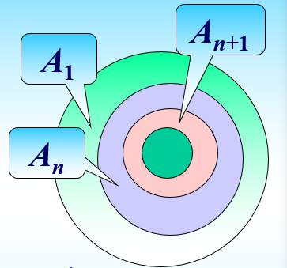
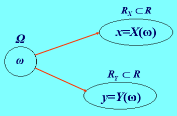
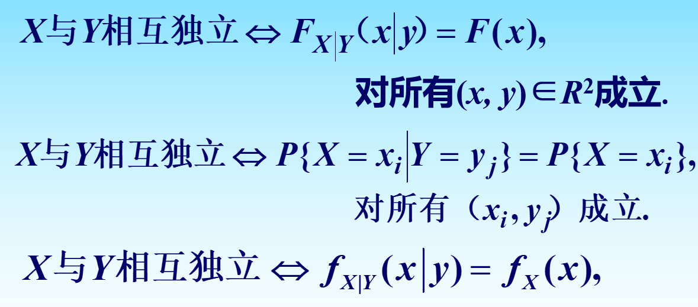
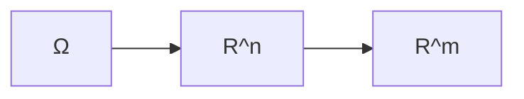
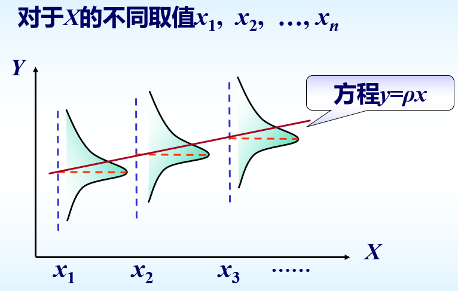

### 第一章  引言

---

#### 1.1 概率空间

**定义1.1.1** $\sigma$代数：假设随机试验$E$的样本空间为$\Omega$，$F$为$\Omega$的子集组成的集族，满足：

（1）$\Omega \in F$

（2）若$A\in F$, 则$\bar{A}\in F$（对于逆运算封闭）

（3）若$A_i\in F,i\in 1,2,\cdots$, $\bigcup_{i=1}^{\infty} A_i\in F$. （对于可列并运算封闭）（$\sigma$可加）

这样则称$F$是$\Omega$的一个$\sigma-$代数（事件体），$F$中的集合称为事件。

对于同一个研究对象的同一个试验，试验的目的不同其样本空间和$\sigma$代数的结构会不同。

**定义1.1.2** 可测空间：样本空间$\Omega$和$\sigma$代数的二元体$(\Omega,F)$称为可测空间。

可测空间的性质：

（1）$\empty\in F$

（2）对于可列交运算是封闭的，如果$A_i\in F (i=1,2,\cdots)$，则$\bigcap_{i=1}^\infty A_i\in F$.

（简单证明：$\bigcup_{i=1}^\infty A_i=\bigcap_{i=1}^\infty \bar{A}_i$，）

（3）对于有限并，有限交封闭，若$A_i\in F,i=1,2,\cdots,n$, 则有：$\bigcup_{i=1}^n A_i\in F$或$\bigcap_{i=1}^n A_i\in F$.

（4）对于差运算也封闭：若$A\in F, B \in F$, 则$A-B\in F$. （$A-B=A\cap \bar{B}\in F$）

**定义1.1.3** 设$(\Omega,F)$是一个可测空间，那么对于$A\in F$定义在$F$上的实数集函数$P(A)$，满足：

（1）非负性：对于$\forall A\in F,0\leq P(A)\leq 1$

（2）规范性：$P(\Omega)=1$（必然事件概率为1）

（3）可列可加性：对于$\forall A_i\in F,i=1,2\cdots;A_i\cap A_j=\empty,i\neq j$，则有$P(\bigcup_{i=1}^{\infty}A_i)=\sum_{i=1}^\infty P(A_i)$

那么就称$P$是可测空间$(\Omega,F)$上的概率（测度），$P(A)$是事件A的概率。

三元体$(\Omega,F,P)$称为一个概率空间。

**例题：**假设路口到达的车辆数量为$m$，基本事件为$\{m\}$, 样本空间$\Omega=\{0,1,2,\cdots\}$, $F$是$\Omega$的一切子集组成的集族，那么$F$是一个$\sigma$代数。

定义$P(\empty)=0$同时对于每一个事件$A\in F$令：
$$
P(A)=\sum_{k\in A} e^{-\lambda}\frac{\lambda^k}{k!},\lambda >0
$$
下面证明这个$P$是一个可测空间上的测度（概率）。

首先可以直接证明的是$P(\Omega)=1$规范性，$P(\Omega)=\sum_{k\in \Omega}e^{-\lambda}\frac{\lambda^k}{k!}=e^{-\lambda}\sum_{k=0}^\infty \frac{\lambda^k}{k!}=1$；其次证明非负性：由于定义了$\lambda>0$，所以对于$\forall k$都有$e^{-\lambda}\frac{\lambda^k}{k!}\geq 0$, 从而$0\leq P(A)=\sum_{k\in A}e^{-\lambda}\frac{\lambda^k}{k!}\leq \sum_{k\in \Omega}e^{-\lambda}\frac{\lambda^k}{k!}=1$. 最后$\forall A_i\in F,i=1,2\cdots;A_i\cap A_j=\empty,i\neq j$，我们可以得到：$P(\bigcup_{i=1}^\infty A_i)=\sum_{k\in \bigcup_{i=1}^\infty A_i}e^{-\lambda}\frac{\lambda^k}{k!}=\sum_{i=1}^\infty\sum_{k\in A_i}e^{-\lambda}\frac{\lambda^k}{k!}=\sum_{i=1}^\infty P(A_i)$. 从而我们得到这个集函数$P$是$(\Omega,F)$上的概率（测度），从而进一步有$(\Omega,F,P)$是一个概率空间。

##### 乘积样本空间

假设$A,B$是两个集合，称$A\times B=\{(x,y):x\in A,y\in B\}$为$A$和$B$的积集。

**定义1.1.4** 假设随机试验$E_i,i=1,2,\cdots,n$的样本空间分别为$\Omega_i,i=1,2,\cdots,n$，称：
$$
\Omega_1\times\Omega_2\times\cdots\times \Omega_n=\{(\omega_1,\omega_2,\cdots,\omega_n),\omega_i\in \Omega_i,i=1,2,\cdots,n\}
$$
为乘积样本空间。

##### 概率的性质

假设$(\Omega, F,P)$是概率空间，则概率$P$的性质如下：

（1）$P(\empty)=0$

（2）有限可加性：如果$A_i\in F,i=1,2,\cdots,n;A_i\cap A_j=\empty,i\neq j$, 则$P(\bigcup_{i=1}^nA_i)=\sum_{i=1}^nP(A_i)$.

推论1：$P(A)+P(\bar{A})=1$

推论2：单调性：如果$B\subset A$, 则$P(A-B)=P(A)-P(B)$且$P(A)\geq P(B)$

（3）概率的连续性：如果$A_1\supset A_2\supset\cdots,$且$\bigcap_{i=1}^\infty A_i=\empty$, 则$\lim_{n\rightarrow \infty}P(A_n)=0$.（向内收缩逼近）

*Proof.* $A_n=(A_n-A_{n+1})\cup (A_{n+1}\cup A_{n+2})\cup \cdots=\cup_{k=n}^\infty (A_k-A_{k+1})=\cup_{k=n}^\infty B_k,n=1,2,\cdots$

上面的图可以很好的理解，构成$A_n$的方式可以理解为通过无数个同心圆环的累加构成的。这里的所有的同心圆环表示的就是$B_k$，其中$B_1,B_2,\cdots$是互不相容的，因此由完全可加性可以得到：
$$
1\geq P(A_1)=P(\bigcup_{k=1}^{\infty}B_k)=\sum_{k=1}^\infty P(A_k-A_{k+1})\geq 0
$$

$$
P(A_n)=\sum_{k=n}^\infty P(A_k-A_{k+1})\rightarrow 0, \text{as }n\rightarrow \infty
$$

由上面的方式还可以得到（向外扩散逼近）：如果$A_1\subset A_2\subset\cdots,$且$\bigcup_{i=1}^\infty A_i=\empty$, 则$\lim_{n\rightarrow \infty}P(A_n)=0$.

还有两个推论：

如果$A_1\supset A_2\supset\cdots,$且$\bigcap_{i=1}^\infty A_i=A$, 则$\lim_{n\rightarrow \infty}P(A_n)=P(A)$.

如果$A_1\subset A_2\subset\cdots,$且$\bigcup_{i=1}^\infty A_i=A$, 则$\lim_{n\rightarrow \infty}P(A_n)=P(A)$.

（4）多除少补原理

假设：$A_i\in F,i=1,2,\cdots,n$, 有：
$$
P(\bigcup_{i=1}^n A_i) = \sum_{i=1}^nP(A_i)-\sum_{1\leq i\leq k\leq n}P(A_iA_k)+\cdots + (-1)^{n-1}P(\bigcap_{i=1}^n A_i)
$$
推论：概率具有次可加性。
$$
P(\bigcup_{i=1}^n A_i)\leq \sum_{i=1}^n P(A_i)
$$
（注意：前面的可列可加性和有限可加性的前提是事件是不相容的）

##### 条件概率

假设概率空间$(\Omega,F,P)$, $A,B\in F$, 且$P(B)>0$. $P(A|B)=\frac{P(AB)}{P(B)}$.

在上述的概率空间和条件下，对于$\forall A\in F$, 有$P(A|B)$对应，则集函数$P(\cdot |B)$满足以下三条公理：

（1）$\forall A\in F, 0\leq P(A|B)\leq 1$.

（2）$P(\Omega|B)=1$

（3）$A_i\in F,i=1,2,\cdots$, 且$A_i\cap A_j=\empty,(i\neq j)$, 则$P(\bigcup_{i=1}^\infty A_i|B)=\sum_{i=1}^\infty P(A_i|B)$.

##### 全概率公式与bayes公式

假设$(\Omega,F,P)$是概率空间，如果：

（1）$A_i\in F$, 且$P(A_i)> 0,(i=1,2,\cdots)$

（2）$\bigcup_{i=1}^{\infty}A_i=\Omega$, $A_iA_j=\empty$

则对于任意的$B\in F$都有：

（1）$P(B)=\sum_{i=1}^\infty P(A_i)P(B|A_i)$

（2）$P(A_j|B)=\frac{P(A_j)P(B|A_j)}{\sum_{i=1}^\infty P(A_i)P(B|A_i)},(j=1,2,\cdots)$

#### 1.2 随机变量及其分布

**定义1.2.1** 假设$(\Omega,F,P)$表示概率空间，而$X(\omega)$是定义在$\Omega$上的单值实函数，如果对于任意实数$x\in R$, 有：
$$
\{\omega:X(\omega)\leq x\}\in F
$$
则称$X(\omega)$是一个随机变量。（可测空间$(\Omega,F)$上的可测函数）

$X$是概率空间$(\Omega,F,P)$上的随机变量，有对于$\omega\in \Omega$，有唯一的$X(\omega)$与之对应。

随机变量$X$可以理解为从样本空间$\Omega$到实数集合$R_X$的一个映射。

由随机变量的定义和性质我们有：

$\{X=x\}=\{X\leq x\}-\bigcup_{k=1}^{+\infty}\{X\leq x-\frac{1}{k}\}\in F$

$\{X< x\}=\{X\leq x\}-\{X=x\}\in F$

$\{X>x\}=\Omega-\{X\leq x\}\in F$

**定义1.2.2** 设$X(\omega)$是定义在概率空间$(\Omega,F,P)$上的随机变量，令：$F(x)=P(X\leq x),\forall x\in R$. 称$F(x)$是随机变量$X$的分布函数。对于$\forall a<b\in R,P(a<X<b)=F(a)-F(b)$.

（1）$F(x)$是单调不减的函数

（2）$0\leq F(x)\leq 1$, $\lim_{x\rightarrow -\infty} F(x)=0,\lim_{x\rightarrow +\infty} F(x)=1$

（3）$F(x)$是右连续函数，即对$\forall x\in R, F(x+0)=F(x)$

**定义1.2.3** 如果$X$和$Y$是定义在同一个概率空间$(\Omega,F,P)$上的两个随机变量，称$(X,Y)$为二维随机变量。

二维随机变量的“维”主要是体现在因变量分量的个数上，也就是$D\to_f R^n$.

从原概率空间$(\Omega,F,P)$映射到标准概率空间$(R^n,F',P')$. 

对于二维的随机变量来说：

找一个经典例子：

假设一个试验，先抛一枚硬币，再掷一枚骰子，则这个试验的样本空间为：$\Omega=\Omega_1\times \Omega_2=\{(\omega_1,\omega_2),\omega_i\in \Omega_i,i=1,2\}$. 对于$\omega=(\omega_1,i)\in \Omega,\omega_1=H,T,i=1,2,\cdots,6$

二维随机变量:
$$
(X(\omega),Y(\omega))=
\begin{cases}
(1,i) & \omega_1=T,\omega_2=i;\\
(0,i) & \omega_1=H,\omega_2=i;
\end{cases}
$$
联合分布函数的定义：

设$(X,Y)$是定义在概率空间$(\Omega,F,P)$上的随机变量，对于$\forall (x,y)\in R^2$
$$
F(x,y)=P\{\omega:X(\omega)\leq x,Y(\omega)\leq y\}
$$
我们称$F(x,y)$是$(X,Y)$的联合分布函数。

联合分布函数的一些性质：

（1）$F(x,y)$分别对于$x,y$单调不降

（2）$F(x,y)$对每一个变元右连续

（3）$\lim_{x\to -\infty}F(x,y)=0$, $\lim_{y\to -\infty}F(x,y)=0$, 

（4）$\forall x_1<x_2,y_1<y_2$, $F(x_2,y_2)-F(x_1,y_2)-F(x_2,y_1)+F(x_1,y_1)\geq 0$.

##### 条件分布

假设$(X,Y)$的联合分布函数为$F(x,y)$, 记$F_{Y|X}(y|x)=P(Y\leq y|X=x)$等于：
$$
\lim_{\alpha \rightarrow 0^+}\frac{F(x,y)-F(x-\alpha,y)}{F(x,+\infty)-F(x-\alpha,+\infty)} ,(\alpha>0)
$$
如果极限存在则称为在$X=x$的条件下，随机变量$Y$的条件分布函数。

需要满足的条件是：$\forall \alpha > 0$,
$$
\begin{split}
&F(x,+\infty) = F(x-\alpha, +\infty)\\
=&F_X(x) - F_X(x-\alpha)\\
=&P(x-\alpha < X\leq x)>0
\end{split}
$$
**例题：**射手进行射击，击中目标两次则停止射击，每一次的命中率为$p(0<p<1)$, 令$X$表示第一次命中目标时的射击次数，令$Y$表示第二次命中目标时的射击次数，求条件分布律。

【解】求解的目标是：$P\{X=i|Y=j\},i=1,2,\cdots,j-1$

联合分布：$P\{X=i,Y=j\}=p^2(1-p)^{j-2},(1\leq i<j=2,3,\cdots)$

关于$Y$的边缘分布：$P\{Y=j\}=\sum_{i=1}^{j-1}P\{X=i,Y=j\}=\sum_{i=1}^{j-1}p^2(1-p)^{j-2}=(j-1)p^2(1-p)^{j-2},(j=2,3,\cdots)$

从而下面求条件分布：
$$
\begin{split}
&P\{X=i|Y=j\}=P\{X=i,Y=j\}/P(Y=j)\\
=& p^2(1-p)^{j-2}/(j-1)p^2(1-p)^{j-2}\\
=&\frac{1}{j-1},(i=1,2,\cdots,j-1)
\end{split}
$$
**例题：**矿山一年发生事故的总数为$X\sim P(\lambda)$，一个事故是致命事故的概率为$p \,(0<p<1)$, 假设一年内发生致命事故的次数为$Y$，求$Y$的分布律。

【解】求解目标是：$P(Y=i),i=0,1,2,\cdots$.

我们首先很容易知道：$P(X=k)=\frac{\lambda^k}{k!}e^{\lambda},(k=0,1,2,\cdots)$

而当发生了$k$次事故的情况下我们可以得到发生致命事故的次数可以写为：
$$
P(Y=i|X=k)=C^i_kp^i(1-p)^{k-i},(i=0,1,2,\cdots,k)
$$
根据条件概率公式我们可以计算得到$(X,Y)$的联合概率分布律为：
$$
\begin{split}
&P(X=k,Y=i)=P(X=k)P(Y=i|X=k)\\
=& \frac{\lambda^k}{k!}e^{-\lambda}C^i_kp^i(1-p)^{k-i},(0\leq i \leq k=1,2,\cdots)
\end{split}
$$
从而我们最后再计算$Y$的分布律为：
$$
\begin{split}
P(Y=i)&=\sum_{k=i}^\infty\frac{\lambda^k}{k!}e^{-\lambda}C^i_kp^i(1-p)^{k-i}\\
&=\frac{(\lambda p)^i}{i!}e^{-\lambda}\sum_{k=i}^\infty \frac{[\lambda(1-p)]^{k-i}}{(k-i)!}\\
&=\frac{(\lambda p)^i}{i!}e^{-\lambda p}
\end{split}
$$
重要计算公式：

对于连续性的$(X,Y)$我们可以得到：
$$
F_{Y|X}(y|x)=P(Y\leq y|X=x)=\frac{\int_{-\infty}^y f(x,v)\mathrm{d}v}{f_X(x)}
$$
同时概率密度函数可以表示为：
$$
f_{Y|X}(y|x)=F'_{Y|X}(y|x)=\frac{f(x,y)}{f_X(x)}
$$
这个概率密度函数表示的是在$X=x$的条件下，随机变量$Y$的条件密度函数。

**例题：**假设随机变量$(X,Y)$在$D$上服从均匀分布：$D=\{(x,y):0\leq x\leq 1,0\leq x+\frac{y}{2}\leq 1\}$. 试求$f_{X|Y}(x|y)$和$f_{Y|X}(y|x)$.

【解】以求解$f_{X|Y}(x|y)$为例，首先求解$(X,Y)$的联合分布函数，二维均匀分布的概率密度函数等于构成面积的倒数，因此我们可以写出：
$$
f(x,y)=
\begin{cases}
\frac{1}{2}, & (x,y)\in D\\
0 ,&(x,y)\notin D\\
\end{cases}
$$
从而我们可以求出随机变量$X$的边缘概率密度函数：
$$
f_X(x)=\int_{-\infty}^{+\infty}f(x,y)\mathrm{d}y=\int_{-2x}^{2(1-x)}\frac{1}{2}\mathrm{d}y,(0<x<1)
$$
其他的情况下均为0.

同样的我们可以求出随机变量$Y$的边缘概率密度函数：
$$
f_Y(y)=\int_{0}^{1-\frac{y}{2}}\frac{1}{2}\mathrm{d}x ,(0\leq y <2)
$$
其他情况下为0.

接下来就可以计算条件概率密度函数：

当$0<x<1$的时候：
$$
f_{Y|X}(y|x)=\frac{f(x,y)}{f_X(x)}\\
=\begin{cases}
\frac{1}{2},& -2x<y<2(1-x)\\
0,&\text{otherwise}
\end{cases}
$$
当$-2<y<0$的时候：
$$
f_{X|Y}(x|y)=\frac{f(x,y)}{f_Y(y)}\\
=\begin{cases}
\frac{1}{1-y/2},& \frac{y}{2}< x < 1\\
0,&\text{otherwise}
\end{cases}
$$
当$0\leq y <2$的时候：
$$
f_{X|Y}(x|y)=\frac{f(x,y)}{f_Y(y)}\\
=\begin{cases}
\frac{1}{1-y/2},& 0< x < 1-\frac{y}{2}\\
0,&\text{otherwise}
\end{cases}
$$

##### 随机向量的独立性

设$(X,Y)$是二维随机变量，对于$\forall (x,y)\in R_2$，$P(X\leq x,Y\leq y)=P(X\leq x)P(Y\leq y)$成立则称$X$和$Y$相互独立。

#### 1.3 随机变量的函数

关于这个问题上存在两个点：（1）随机变量的函数是否仍然在同一个概率空间上？（2）如何确定其分布？

第一个问题有充分条件成立。

第二个问题如何确定分布。

假设已知$(X_1,X_2,\cdots,X_n)$的联合分布，并有$k$个$n$元连续函数：
$$
y_1=g_1(x_1,\cdots,x_n),\cdots,y_k=g_k(x_1,\cdots,x_n)
$$
则$Y_i=g_i(X_1,\cdots,X_n)$，$(i=1,2,\cdots,k)$是随机变量。联合分布函数为：
$$
F(y_1,y_2,\cdots,y_k)=P(Y_1\leq y_1,\cdots,Y_k\leq y_k)=P(g_1(X_1,\cdots,X_n)\leq y_1,\cdots,g_k(X_1,\cdots,X_n)\leq y_k)
$$
连续性做积分，离散型做加和。

二维随机变量的变换：

假设$(X_1,X_2)$的联合密度为：$f(x_1,x_2)$，若函数：$y_1=g_1(x_1,x_2)$和$y_2=g_2(x_1,x_2)$满足下面的条件：

（1）存在唯一的反函数：$x_1=x_1(y_1,y_2),x_2=x_2(y_1,y_2)$.

（2）有连续的一阶偏导数

（3）Jacobi行列式:
$$
J=\begin{bmatrix}
\frac{\part x_1}{\part y_1} & \frac{\part x_1}{\part y_2}\\
\frac{\part x_2}{\part y_1} & \frac{\part x_2}{\part y_2}
\end{bmatrix}
\neq 0
$$
（关于Jacobi行列式不为0的问题，也就是说通过空间映射之后面积不为0（原相不为0））

则$Y_1=g_1(X_1,X_2),Y_2=g_2(X_1,X_2)$的联合概率密度为：$f[x_1(y_1,y_2),x_2(y_1,y_2)]|J|$

*Proof.* $Y_1,Y_2$是随机变量，其联合分布函数为：
$$
F(y_1,y_2)=\iint_D f(x_1,x_2)\mathrm{d}x_1\mathrm{d}x_2
$$
其中$D=\{(x_1,x_2):g_1(x_1,x_2)\leq y_1,g_2(x_1,x_2)\leq y_2\}$

做积分变换：
$$
\begin{cases}
x_1=x_1(u_1,u_2);\\
x_2=x_2(u_1,u_2).
\end{cases}
$$

$$
F(y_1,y_2)=\int_{-\infty}^{y_1}\int_{-\infty}^{y_2} f[x_1(u_1,u_2),x_2(u_1,u_2)]|J|\mathrm{d}u_1\mathrm{d}u_2
$$

**例题：**和的分布$Y=X_1+X_2$

令：
$$
\begin{cases}
y_1=x_1\\
y_2=x_1+x_2
\end{cases}
$$
则：
$$
\begin{cases}
x_1=x_1\\
x_2=y_2-y_1
\end{cases}
$$

$$
J=\begin{bmatrix}
\frac{\part x_1}{\part y_1} & \frac{\part x_1}{\part y_2}\\
\frac{\part x_2}{\part y_1} & \frac{\part x_2}{\part y_2}
\end{bmatrix}
=\begin{bmatrix}
1 & 0\\
-1 & 1
\end{bmatrix}=1
$$

我们不难得到$Y_1=X_1$和$Y_2=X_1+X_2$的联合密度为：
$$
f_{Y_1,Y_2}(y_1,y_2)=f_{X_1,X_2}(y_1,y_2-y_1)|J|
$$
进一步得到$Y_2=X_1+X_2$的边缘密度为：
$$
f_{X_1+X_2}(y_2)=\int_{-\infty}^{+\infty}f_{X_1,X_2}(y_1,y_2-y_1)\mathrm{d}y_1
$$
如果$X_1,X_2$相互独立则：
$$
f_{X_1+X_2}(y_2)\int_{-\infty}^{+\infty}f_{X_1}(y_1)f_{X_2}(y_2-y_1)\mathrm{d}y_1
$$
上面的这个公式也被称为两个函数的卷积或者褶积。

#### 1.4 随机变量的数字特征

首先提到随机变量的数字特征我们第一时间想到的是期望和方差。

关于期望的定义在概率论中定义为：
$$
E(x)=
\begin{cases}
\int_{-\infty}^{+\infty}xf(x)\mathrm{d}x & \text{连续型r.v.}\\
\sum_{i=1}^\infty x_i P(X=x_i)&\text{离散型r.v.}
\end{cases}
$$
上面的定义我们存在一个前提条件就是匀质的介质下的计算方式，而在非匀质的条件下不能够使用这样的方式计算，因此这里我们引入了R-S积分的概念。

##### R-S(黎曼-斯蒂阶)积分简介

设$f(x),g(x)$为定义在$[a,b]$上的实值函数，在区间内做一个剖分，得到$a=x_0<x_1<\cdots < x_n=b$. 任取点：$x_k^\ast\in [x_k,x_{k+1}],k=0,1,2\cdots,n-1$.

和式：（跟最初讲微积分的思想非常相似，取足够小的间隔乘上在该极小区间上的密度做求和运算）
$$
\sigma=\sum_{k=0}^{n-1}f(x^\ast_k)[g(x_{k+1})-g(x_k)]
$$
如果存在实数$I$使得对于$\forall \epsilon > 0,\exist \delta>0$只要：
$$
\lambda=\max_{1\leq k\leq n-1}(x_{k+1}-x_k)< \delta
$$
对于任意分点以及任意$x_k^\ast$的取法均有：
$$
|\sigma-I|< \epsilon
$$
记为：$(R) \int_a^bf(x)\mathrm{d}g(x)=\lim_{\lambda\rightarrow 0}\sigma=\lim_{\lambda\rightarrow 0}\sum_{k=0}^{n-1}f(x_k^\ast)[g(x_{k+1})-g(x_k)]=I$

我们需要注意到这里的积分后面的$g(x)$不可以随意取出。这个$g(x)$我们定义为基函数或者势函数。

正式定义：我们称$I$是$f(x)$关于$g(x)$在区间$[a,b]$上的R-S积分，简记为：
$$
I=\int_a^b f(x)\mathrm{d}g(x)
$$
如果$\int_{-\infty}^{+\infty}f(x)\mathrm{d}g(x)=\lim_{a\rightarrow -\infty,b\rightarrow +\infty}\int_a^b f(x)\mathrm{d}g(x)$存在，则称为广义R-S积分。

黎曼积分$\int_a^b f(x)\mathrm{d}x$是R-S积分的特例。

一些性质：

（1）被积函数的线性运算性质

（2）势函数或者说基函数的线性运算性质

（3）提出常数项

（4）区间可加性

（5）类似分部积分的性质

**广义R-S积分定理：**如果$f(x)$在R上 连续且有界，则$g(x)$在R上单调有界，则积分：
$$
\int_a^b f(x)\mathrm{d}g(x)
$$
存在而且（1）$g'(x)$在R上存在，在任意有限区间$[a,b]$上黎曼可积，则：
$$
\int_{-\infty}^{+\infty} f(x)\mathrm{d}g(x)=\int_{-\infty}^{+\infty} f(x)g'(x)\mathrm{d}x
$$
（2）可离散化处理（略过）

有了R-S积分我们就可以重新定义期望：

对于离散型随机变量：
$$
E(x)=\int_{-\infty}^{+\infty}x \mathrm{d}F(x)=\sum_{k=-\infty}^\infty x_kp_k
$$
对于连续性随机变量：
$$
E(x)=\int_{-\infty}^{+\infty}x \mathrm{d}F(x)=\int_{-\infty}^{+\infty} f(x)p(x)\mathrm{d}x
$$
R-S可以推广到二阶，这里略过这部分内容。

##### 数学期望和方差

随机变量$X$的分布函数为$F(x)$，若$\int_{-\infty}^{+\infty}|x|\mathrm{d}F(x)<+\infty$, 则：
$$
E(X)=\int_{-\infty}^{+\infty}x \mathrm{d}F(x)
$$
连续型：
$$
E(X)=\int_{-\infty}^{+\infty}xf(x)\mathrm{d}x
$$
离散型：
$$
E(X)=\sum_{i=1}^\infty x_iP(X=x_i)
$$
假设$F(x)$是随机变量$X$的分布函数，$g(x)$在$R$上连续，如果$\int_{-\infty}^{+\infty}|g(x)|\mathrm{d}F(x)<\infty$, 则$Y=g(X)$的数学期望存在且：
$$
E(Y)=E(g(x))=\int_{-\infty}^{+\infty}g(x)\mathrm{d}F(x)
$$
重要公式（这里略去一些条件的说明）

方差：
$$
D(X)=\int_{-\infty}^{+\infty}[x-E(X)]^2\mathrm{d}F(x)
$$

柯西-施瓦茨不等式：

对于任意的随机变量$X,Y$, 如果$E(X^2),E(Y^2)$有限，则有：
$$
\{E[|XY|]\}^2\leq E[X^2]\cdot E[Y^2]
$$
等式成立当且仅当$P\{Y=aX\}=1$时成立。

对于方差也有公式：
$$
0\leq D(X)=E(X^2)-[E(X)]^2
$$
从而导出：
$$
[\int_{-\infty}^{+\infty}x\mathrm{d}F(x)]^2\leq \int_{-\infty}^{+\infty}x^2\mathrm{d}F(x)
$$
期望的平方小于等于平方的期望。（方差为0时取等号，也就是说是一个概率为1的事件（常量随机变量））

##### 条件数学期望

定义：假设$(X,Y)$是二维随机变量，条件分布函数$F_{Y|X}(y|x)$存在，又若：
$$
\int_{-\infty}^{+\infty}|y|\mathrm{d}F_{Y|X}(y|x)<\infty
$$
则我们称:
$$
E(Y|x)=E(Y|X=x)=\int_{-\infty}^{+\infty}y\mathrm{d}F_{Y|X}(y|x)
$$
为在$X=x$的条件下，随机变量$Y$的条件数学期望。

如果$(X,Y)$为连续性随机变量，那么：
$$
E(Y|x)=\int_{-\infty}^{+\infty}yf_{Y|X}(y|x)\mathrm{d}y
$$

$$
E(X|y)=\int_{-\infty}^{+\infty}xf_{X|Y}(x|y)\mathrm{d}x
$$

**Example. 1** if $(X,Y)\sim N(0,1;0,1;\rho),(-1<\rho<1)$, 在$X=x$的条件下，$Y\sim N(\rho x,\sqrt{1-\rho^2})$.

第一步：先求条件分布密度函数：
$$
f_{Y|X}(Y|x)=\frac{f(x,y)}{f_X(x)}
$$
回忆二维正态分布的联合概率密度函数和边缘概率密度函数的求法：

得到：
$$
f_{Y|X}(Y|x)=\frac{1}{\sqrt{2\pi}\sqrt{1-\rho^2}}e^{-\frac{1}{2(1-\rho^2)}(\rho x-y)^2}
$$
第二步根据条件分布期望的求解方法：
$$
E(Y|X)=\int_{-\infty}^{+\infty}yf_{Y|X}(Y|x)\mathrm{d}y
$$
可以写出：
$$
E(Y|X)=\int_{-\infty}^{+\infty}y \frac{1}{\sqrt{2\pi}\sqrt{1-\rho^2}}e^{-\frac{1}{2(1-\rho^2)}(\rho x-y)^2}\mathrm{d}y
$$
最终结果为：$\rho x$.

同理我们可以得到：$E(X|Y)=\rho y$.

这个条件期望的结果本质上就是我们的回归方程，对于每一个$x_i$样本点，在得到样本点的取值情况下得到的$y$的结果为$\rho x$. （我们假设每一个样本点都是一个随机变量）

其他例子见PPT.

一般情况下给定联合概率分布，先求边缘分布，再求条件分布，最后求条件期望，最后得到的条件期望的结果大部分情况下是一个$X$关于$Y$的回归函数或者$Y$关于$X$的回归函数。一般是实值函数，可以证明随机变量的函数仍然是随机变量。
$$
E(Y|X)=\mu(x),E(X|Y)=\delta(y)
$$
对于随机变量的函数的条件期望，类似于求一般期望的情况。

绝对收敛的情况下：
$$
E(g(X)|Y=y)\int_{-\infty}^{+\infty}g(x)\mathrm{d}F_{X|Y}(x|y)
$$
条件方差：
$$
D(X|Y=y)=E(X-E(X|Y=y))^2
$$
定理：假设$X,Y,Z$是$(\Omega,F,P)$上的随机变量，$g(\cdot),h(\cdot)$是在$R$上连续的函数，且各数学期望都存在，则：

1. $E(c|Y)=c$, $c$是常数
2. $E[aX+bY|Z]=aE[X|Z]+bE[Y|Z]$, $a,b$是常数
3. 如果$X,Y$相互独立，则$E(Y|X=x)=E(Y)$.
4. $E[g(X)h(Y)|X]=g(X)E[h(Y)|X],E[g(X)h(Y)|Y]=h(Y)E[g(X)|Y]$.
5. $E\{E[g(X,Y)|Y]\}=E[g(X,Y)]$.
6. $E[X-E(X|Y)]^2\leq E[X-g(Y)]^2$

**全数学期望公式：**

1. $E(X)=E[E(X|Y)]$
2. $E[g(X)]=E\{E[g(X)|Y]\}$

**Example:**

假设某个时间内到达商场的顾客人数$N$服从参数为$\lambda$的泊松分布，每个顾客在该商场的消费额$X$服从$[a,b]$上的均匀分布。各位顾客之间消费是相互独立的且与$N$独立。求顾客在该商场总的消费额。

【解】我们假设第$i$个顾客的消费额为$X_i$，那么所有顾客的总消费额可以写为：
$$
T=\sum_{i=1}^N X_i
$$
根据全数学期望公式：
$$
E(T)=E[E(T|N)]=E[E(\sum_{i=1}^NX_i|N)]=\sum_{n=0}^\infty E(\sum_{i=1}^n X_i|n)P(N=n)
$$
而由于每个顾客的消费额与总人数是相互独立的，因此我们可以进一步写为：
$$
E(T)=\sum_{n=0}^\infty\sum_{i=1}^n E(X_i)P(N=n)=E(X)\sum_{n=0}^\infty nP(N=n)=E(X)E(N)=\frac{a+b}{2}\lambda
$$

---

#### 1.5 特征函数

定义：假设$X,Y$是实随机变量，复随机变量$Z=X+jY$的数学期望定义为：
$$
E(Z)=E(X)+jE(Y),j=\sqrt{-1}
$$

$$
\begin{split}
E(e^{jtX})&=E(\cos tX)+jE(\sin tX)\\
&=\int_{-\infty}^{+\infty}\cos t x\mathrm{d}F(x)+j\int_{-\infty}^{+\infty}\sin t x\mathrm{d}F(x)\\
&=\int_{-\infty}^{+\infty} e^{jtx}\mathrm{d}F(x)
\end{split}
$$

1. 对于所有的$t\in R$, $\cos tx$和$\sin tx$都是有界函数，因此$E(e^{jtX})$总是存在的。
2. $E(e^{jtX})$是实变量$t$的复值函数。

定义：设$X$是定义在$(\Omega,\mathcal{F},P)$上的随机变量，我们称：
$$
\varphi(t)=E(e^{jtX})=\int_{-\infty}^{+\infty}e^{jtx}\mathrm{d}F(x),t\in R
$$
为$X$的特征函数。（关于$X$的Fourier-Stieltjes变换）

连续型随机变量：
$$
\varphi(t)=\int_{-\infty}^{+\infty} e^{jtx}f(x)\mathrm{d}x
$$
离散型随机变量：
$$
\varphi(t)=\sum_{k}e^{jtx_k}p_k
$$
一些常见分布的特征函数：

1. 单点分布

   如果$P\{X=c\}=1$，则特征函数：$\varphi(t)=E(e^{jtc})=e^{jtc},t\in R.$

2. 二项分布

   $\varphi(t)=(q+pe^{jt})^n,t\in R$

3. 两点分布
   $$
   \begin{split}
   \varphi(t)&=e^{jt\cdot 0}(1-p)+e^{jt\cdot 1}p\\
   &=1-p+pe^{jt}=q+pe^{jt},t\in R
   \end{split}
   $$

4. 泊松分布

   $\varphi(t)=e^{\lambda (e^{jt}-1)},t\in R$

5. 均匀分布

   $U[-a,a]$

   $\varphi(t)=\frac{\sin at}{at},t\in R$

6. 指数分布
   $$
   f(x)=
   \begin{cases}
   \lambda e^{-\lambda x},&x\geq 0;\\
   0,& x<0.
   \end{cases}
   (\lambda>0)
   $$
   
   $$
   \begin{split}
   \varphi(t)&=\int_0^{+\infty}\lambda e^{jtx}e^{-\lambda x}\mathrm{d}x\\
   &=\int_0^{+\infty}\lambda e^{-\lambda x}\cos tx\mathrm{d}x+j\lambda\int_0^{+\infty}e^{-\lambda x}\sin tx\mathrm{d}x\\
   &=\lambda \frac{\lambda}{\lambda^2+t^2}+j\lambda\frac{t}{\lambda^2+t^2}\\
   &=\left(1-\frac{jt}{\lambda}\right)^{-1}
   \end{split}
   \quad (t\in R)
   $$

7. 正态分布

   $N(\mu,\sigma^2)$

   $\varphi(t)=e^{j\mu t-\frac{1}{2}\sigma^2 t^2},t\in R$

   特别正态分布$N(0,1)$.

   $\varphi(t)=e^{-\frac{1}{2}t^2},t\in R$

##### 特征函数性质

随机变量$X$的特征函数满足：

1. $|\varphi(t)|\leq \varphi(0)=1$; 有界函数
2. $\varphi(t)=\varphi(-t)$. 共轭对称

证明略。

如果随机变量$X$的特征函数为$\varphi_X(t)$，那么$Y=aX+b$的特征函数为：
$$
\varphi_Y(t)=e^{jbt}\varphi_X(at)
$$
（波赫纳-辛钦）：函数$\varphi(t)$为特征函数的充要条件是在$R$上一致连续，非负定且$\varphi(0)=1$.

##### 特征函数与矩的关系

如果随机变量$X$的$n$阶矩存在，那么$X$的特征函数$\varphi(t)$的$k$阶导数$\varphi^k(t)$存在，且：
$$
E(X^k)=j^{(-k)} \varphi^k(0),\quad (k\leq n)
$$
（逆不真）

例题：随机变量$X$的概率密度函数为：
$$
f(x)=
\begin{cases}
\frac{1}{2}\cos x & -\frac{\pi}{2}\leq x\leq \frac{\pi}{x}\\
0 &\text{otherwise}
\end{cases}
$$
试求解：$E(X)$和$D(X)$.

这个问题可以使用一般的方法，直接使用公式先求$E(X)$然后再用$D(X)=E(X^2)-E(X)^2$求解，但是在求解$D(X)$时计算$E(X^2)$会比较麻烦，因此这里使用特征函数进行求解会更加方便：

首先计算$X$的特征函数：
$$
\begin{split}
\varphi(t)&=E(e^{jtX})\\
&=\int_{-\frac{\pi}{2}}^{\frac{\pi}{2}} e^{jtx}\cdot \frac{1}{2}\cos x\mathrm{d}x\\
&=\int_{-\frac{\pi}{2}}^{\frac{\pi}{2}} \cos tx \cdot \frac{1}{2}\cos x \mathrm{d}x + j\int_{-\frac{\pi}{2}}^{\frac{\pi}{2}}\sin tx\cdot \frac{1}{2}\cos x\mathrm{d}x\\
&=2\int_{-\frac{\pi}{2}}^{\frac{\pi}{2}}\frac{1}{2}\cos tx \cos x\mathrm{d}x + 0\\
&=\frac{1}{2}\int_{0}^{\frac{\pi}{2}}[\cos (t+1)x+\cos (t-1)x]\mathrm{d}x\\
&= \frac{1}{2} \left\{ \frac{1}{t+1} \sin\left[ (t+1)\frac{\pi}{2} \right] + \frac{1}{t-1}\sin\left[ (t-1)\frac{\pi}{2} \right] \right\}
\end{split}
\quad (t\in R)
$$
一阶矩期望等于：$E(X)=j^{-1}\varphi'(0)=0$

二阶矩方差等于：$D(X)=E(X^2)=j^{-2}\varphi''(0)=-(2-\frac{1}{4}\pi^2)=\frac{1}{4}\pi^2-2$.

##### 反演公式和唯一性定理

 首先我们知道由一个随机变量$X$的分布函数我们可以唯一地确定其特征函数：$F(x)\Rightarrow \varphi(t)$.

反过来，能否由$X$的特征函数唯一确定其分布函数？

**反演公式：**假设随机变量$X$的分布函数和特征函数分别为：$F(x)$和$\varphi(t)$，则对于$F(x)$的任意连续点$x_1,x_2,(x_1<x_2)$有：
$$
F(x_2)-F(x_1)=\lim_{T\to \infty}\frac{1}{2\pi}\int_{-T}^T\frac{e^{-itx_1}-e^{-itx_2}}{it}\varphi(t)\mathrm{d}t
$$
**唯一性定理：**分布函数$F_1(x)$和分布函数$F_2(x)$恒等的充要条件是他们对应的特征函数$\varphi_1(t)$和$\varphi_2(t)$恒等。（一一对应关系）

如果随机变量$X$的特征函数$\varphi(t)$在$R$上绝对可积，则$X$是连续型随机变量，其概率密度函数为：
$$
f(x)=\frac{1}{2\pi}\int_{-\infty}^{+\infty}e^{-itx}\varphi(t)\mathrm{d}t
$$
对于连续型随机变量$X$，概率密度函数与特征函数之间互为Fourier变换（只差一个负号）

例题：随机变量$X$在$[-\frac{\pi}{2},\frac{\pi}{2}]$上服从均匀分布，$Y=\cos X$，利用特征函数求解$Y$的概率密度函数。

【解】基本思路：首先求解$X$的概率密度函数，然后根据特征函数的基本性质求解$Y$的特征函数，然后根据反演公式和唯一性定理求解概率密度函数。（当然不限制条件的话也可以直接求解）

1. 计算$X$的概率密度函数和$Y$的特征函数：
   $$
   \begin{split}
   \varphi_Y(t)&= E(e^{jtY})=E(e^{jt\cos X})\\
   &= \int_{-\frac{\pi}{2}}^{\frac{\pi}{2}} e^{jt\cos x} \frac{1}{\pi}\mathrm{d}x\\
   &=2\int_{0}^{\frac{\pi}{2}}e^{jt\cos x}\frac{1}{\pi}\mathrm{d}x\\
   \end{split}
   $$
   （智取）$v=\cos x,\mathrm{d}v-\sin x\mathrm{d}x=-\sqrt{1-v^2}\mathrm{d}v$.

   得到：
   $$
   \varphi_Y(t)=\frac{2}{\pi}\int_0^1e^{jtv}\frac{1}{\sqrt{1-v^2}}\mathrm{d}v
   $$
   
2. 对比唯一性定理给出的结果：
   $$
   \varphi_Y(t)=\int_R e^{ity}f_Y(y)\mathrm{d}y
   $$
   我们可以直接得到$Y$的概率密度函数：
   $$
   f_Y(y)=
   \begin{cases}
   \frac{2}{\pi} \frac{1}{\sqrt{1-y^2}},&0<y<1\\
   0.&\text{otherwise}
   \end{cases}
   $$

##### 独立随机变量和的特征函数

如果随机变量$X_1,\cdots,X_n$之间相互独立，令$Y=\sum_{k=1}^nX_k$，那么$Y$的特征函数为：
$$
\varphi_Y(t)=\prod_{k=1}^n \varphi_{X_k}(t)
$$
（由$n$个两点分布推导到二项分布的过程就可以使用上述性质）

##### 多维随机变量的特征函数

二维随机变量$(X,Y)$的特征函数定义为：
$$
\varphi(t_1,t_2)=E[e^{j(t_1X+t_2Y)}]=\int_{-\infty}^{+\infty}\int_{-\infty}^{+\infty}e^{j(t_1 x+t_2 y)}\mathrm{d}F(x,y)
$$
随机变量$X_1,X_2,\cdots,X_n$相互独立的充要条件：
$$
\varphi(t_1,t_2,\cdots,t_n)=\prod_{k=1}^n \varphi_{X_k}(t_k)
$$
与前面独立r.v的和特征函数之间的差别在于这里多维随机变量每个$t$都不一样。

有空再认真看一看这里的多维随机变量的特征函数。（课本P248-252）

第一章内容就到这里吧。