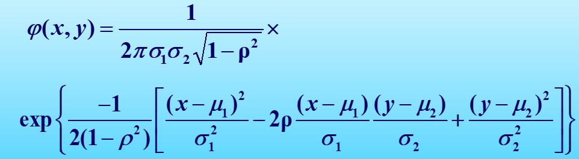
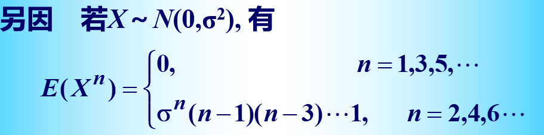
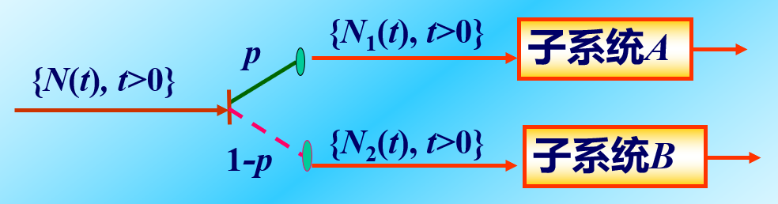

### 第三章

---

#### 3.1 正态过程

概率密度与特征函数

假设$(X,Y)\sim N(\mu_1,\sigma_1^2,\mu_2,\sigma_2^2,\rho)$，$(X,Y)$的联合概率密度函数：

这样的写法非常繁琐，因为我们可以写为矩阵算子的形式：

令$\mu=E\begin{bmatrix}X\\ Y\end{bmatrix}=\begin{bmatrix}E(X)\\ E(Y)\end{bmatrix}=\begin{bmatrix}\mu_1\\\mu_2\end{bmatrix}$

令$\mathcal{X}=\begin{bmatrix}x\\ y\end{bmatrix},B=\begin{bmatrix}\sigma_1^2 &\rho \sigma_1\sigma_2\\ \rho \sigma_1\sigma_2 & \sigma_2^2\end{bmatrix}$

因此这个联合概率密度函数可以写为：
$$
\varphi(x,y)=\frac{1}{2\pi |B|^\frac{1}{2}}\exp\left\{-\frac{1}{2}(\mathcal{X}-\mu)^{\tau}B^{-1}(\mathcal{X}-\mu) \right\}
$$
记为：$(X,Y)\sim N(\mu ,B)$

定义：设$B=(b_{ij})$是$n$阶的**正定对称矩阵**，$\mu$是$n$维实值列向量，定义$n$为随机向量：
$$
X=(X_1,X_2,\cdots,X_n)^{\tau}
$$
联合密度函数：
$$
f(x_1,x_2,\cdots,x_n)=\frac{1}{(2\pi)^{\frac{n}{2}}|B|^\frac{1}{2}}\exp \left \{ -\frac{1}{2}(\mathcal{X}-\mu)^\tau B^{-1}(\mathcal{X}-\mu) \right\}
$$
这里就考虑到一个问题在矩阵$B$是$n$阶正定对称矩阵时我们知道其行列式不等于0，但是如果考虑行列式等于0，也就是说这个协方差矩阵的不满秩的情况下，我们是无法通过上面的式子给出其概率密度函数的。这时候我们需要使用特征函数来解决这个问题：

我们不难写出$n$维正态分布随机向量$X=(X_1,X_2,\cdots,X_n)$的特征函数表示为：
$$
\phi(u)=\exp\left\{i\mu^\tau u-\frac{1}{2}u^\tau B u\right\}
$$
我们会发现在使用特征函数求解这个问题时是不需要考虑协方差矩阵是否可逆的问题，因为在写出特征函数时我们发现不需要求逆，而根据反演公式和唯一性定理我们又知道特征函数与分布函数是一一对应的，因此这里就出现疑问，如果协方差矩阵不可逆如何处理其概率密度函数。这里我们就引入一个新的概念叫做退化的正态分布或者说是奇异正态分布。

##### 边缘分布与二阶矩

假设存在随机向量$X=(X_1,\cdots,X_2,\cdots,X_n)^\tau$，服从分布：$N(\mu,B)$.

1. 多元正态分布的边缘分布仍然是正态分布。
2. $n$维的正态分布由其二阶矩确定。

**定理：**对于$n$维的正态分布随机向量$X_1,X_2,\cdots,X_n$来说，他们相互独立的充要条件是他们两两不相关。

##### 正态随机向量的线性变换

正态随机向量：$X=(X_1,X_2,\cdots,X_n)^\tau$，记$E(X)=\mu$，协方差矩阵为$B$.

对于$X$的线性组合：
$$
Y=\sum_{j=1}^{n}l_jX_j=LX,\quad L=(l_1,l_2,\cdots,l_n)
$$
我们可以得到：
$$
E(Y)=\sum_{j=1}^n l_j\mu_j=L\mu\\
D(Y)=\sum_{j=1}^n\sum_{k=1}^n l_jl_kb_{jk}=LBL^\tau
$$
定理：$X=(X_1,X_2,\cdots,X_n)^\tau$服从$n$维正态分布$N(\mu,B)$的充要条件是它的任何一个非零线性组合：$\sum_{j=1}^nl_jX_j$服从一维正态分布。

正态分布的线性变换不变性很重要！

**定理：**$X=(X_1,X_2,\cdots,X_n)^T$服从$n$维正态分布$N(\mu,B)$的充要条件是它的任何一个非零线性组合$\sum_{j=1}^n l_jX_j$服从一维正态分布。

**定理：**$X=(X_1,X_2,\cdots,X_n)^T$服从$n$维正态分布$N(\mu,B),C(c_{jk})_{m\times n}$是任意矩阵，则$Y=CX$服从$m$维正态分布$N(C\mu,CBC^T)$.

假设$X=(X_1,X_2)$是非退化的二维正态随机向量，线性变换$Y=CX$，则（1）每个分量都是服从正态分布的；（2）不能构成二维以及上的非退化联合正态分布

非退化正态分布随机向量$X$的行满秩线性变换仍然服从非退化的正态分布。

**定理：**如果随机向量$X$服从$N(\mu,B)$，则存在一个正交变换$U$，使得$Y=UX$是一个相互独立的正态随机向量

##### 正态随机过程

前面所述的多维正态联合分布的性质以及一系列的分析都是适用于正态随机过程的。

**例题1：**随机振幅电信号：$X(t)=\xi \cos \omega t+\eta \sin \omega t,t\in \mathcal{R}$, $E(\xi)=E(\eta)=0,E(\xi^2)=E(\eta^2)=\sigma^2$, $\xi,\eta$相互独立且服从正态分布。求（1）均值函数和相关函数；（2）写出一维概率密度函数和二维密度函数。

（1）$m(t)=E(\xi)\cos \omega t+E(\eta)\sin \omega t=0$
$$
\begin{align}
R_X(s,t)&=E[(\xi\cos \omega s+\eta \sin \omega s)(\xi\cos \omega t+\eta \sin \omega t)]\\&=E(\xi^2)\cos \omega s\cos \omega t+E(\eta^2)\sin \omega s\sin \omega t\\&=\sigma^2(\cos \omega s\cos \omega t+\sin \omega s\sin \omega t)\\&=\sigma^2\cos\omega(s-t)
\end{align}
$$
（2）
$$
D_X(t)=R_X(t,t)=\sigma^2 \cos 0=\sigma^2
$$
因此$X(t)$服从$N(0,\sigma^2)$的正态分布：
$$
f(x,t)=\frac{1}{\sqrt{2\pi}\sigma}\exp\{-\frac{x^2}{2\sigma^2}\}
$$
可以先求一个相关系数：
$$
\rho(s,t)=\frac{R(s,t)-m(s)m(t)}{\sqrt{D(s)D(t)}}=\frac{\sigma^2 \cos \omega(s-t)}{\sigma^2}=\cos\omega(s-t)
$$
因此二维概率密度函数应该服从$f(x,y,s,t)\sim N(0,\sigma^2,0,\sigma^2;\cos\omega(s-t))$.

同时我们又知道：

因此代入就可以求解得到二维概率密度函数。

**例题2：**随机过程$\{X(t),t\in T\}$和$\{Y(t),t\in T\}$相互独立，都是正态随机过程，设：
$$
Z(t)=X(t)+Y(t),t\in R
$$
证明$Z(t)$是一个正态过程。

*Proof.* 使用特征函数证明即可。

有结论可以记住：

对于$Z(t)$来说，均值向量表示为：$\mu_X+\mu_Y$；协方差矩阵表示为：$C_X+C_Y$.

---

#### 3.2 维纳过程

维纳过程——布朗运动

钉板实验：
$$
X(k)=
\begin{cases}
1 & \text{right move one grid at } k \text{ level}\\
-1 &\text{left move one grid at } k \text{ level}
\end{cases}
$$
$\{X(k),k\in N^+\}$是一个独立随机过程，令$Y(n)=\sum_{k=0}^nX(k)$表示小球在第$n$次碰撞后的位置。

$\{Y(n),n\in N^+\}$是一个平稳独立增量过程。$E(Y(n))=0,D(Y(n))=n$

$Y^\ast(n)=\frac{Y(n)}{\sqrt{n}},n=1,2,\cdots$依照分布收敛于标准正态分布随机变量。

**定义：**如果随机过程$\{W_t,t\geq 0\}$满足：

（1）是独立增量过程；

（2）对于任意的$s,t\geq0$，$W_t-W_s\sim N(0,\sigma^2|t-s|)(\sigma>0)$;

（3）$P\{W_0=0\}=1$

则称$\{W_t,t\geq 0\}$是参数为$\sigma^2$的维纳过程，如果$\sigma=1$，则称这个过程为标准维纳过程。

一些性质：

$W_t=W_t-W_0\sim N(0,\sigma^2t)(\sigma>0)$

均值函数为$E(W_t)=0$；方差：$D(W_t)=E(W^2_t)=\sigma^2t,t\geq 0$

平稳独立增量过程，初值为0，协方差函数为：$C(s,t)=\sigma^2\min\{s,t\},s,t\geq 0$

维纳过程是正态过程。

**例题3：**设$\{W(t),t\geq 0\}$是参数为$\sigma^2$的维纳过程，求下列过程的均值函数和相关函数。

（1）$X(t)=W^2(t),t\geq 0$;

（2）$X(t)=tW(\frac{1}{t}),t>0$

【解】：

（1）$E(X(t))=E(W^2(t))=D(W(t))=\sigma^2t$
$$
\begin{align}
R_X(s,t)&=E[X(s)X(t)]=E[W^2(s)W^2(t)]=E\{W^2(s)[W(t)-W(s)+W(s)]^2\}\\
&=E\{W^2(s)[W(t)-W(s)]^2\}+E\{2W^3(s)[W(t)-W(s)]\}+E[W^4(s)]\\
&=E\{W^2(s)[W(t)-W(s)]^2\}+E[W^4(s)]\\
&=\sigma^2 s \sigma^2(t-s)+3\sigma^4 s^2\\
&=\sigma^4(st+2s^2)
\end{align}
$$
因此$R_X(s,t)=\sigma^4(st+2\min^2\{s,t\})$

这个结论很重要，求任意的正态分布的$n$阶矩的时候经常用到。

（2）$E(X(t))=E(tW(\frac{1}{t}))=0$
$$
\begin{align}
R_X(s,t)&=E[(sW(\frac{1}{s}))(tW(\frac{1}{t}))]\\
&=stE[W(\frac{1}{s})W(\frac{1}{t})]\\
&=st\sigma^2\min\{\frac{1}{s},\frac{1}{t}\}\\
&=\sigma^2\min\{s,t\}
\end{align}
$$

---

#### 3.3 泊松过程（一）

随机过程$\{N(t),t\geq 0\}$称为计数过程，如果$N(t)$表示在$(0,t)$内事件$A$出现的总次数。计数过程应该满足：

（1）$N(t)\geq 0$;

（2）$N(t)$取非负整数值；

（3）如果$s<t$，则$N(s)\leq N(t)$；

（4）对于$s<t$，$N(t)-N(s)$表示时间间隔$(s,t)$内事件出现的次数；

Poisson过程数学模型：

电话呼叫过程：设$N(t)$为$[0,t)$时间内到达的呼叫次数，其状态空间为：$E=\{0,1,2,\cdots\}$

这个过程有以下的特点：

（1）零初值性：$N(0)=0$；

（2）独立增量性：任意两次不相重叠的时间间隔内到达的呼叫次数一定是相互独立的；

（3）齐次性：在$(s,t)$时间内到达的呼叫次数仅仅与时间间隔长度$t-s$有关，而与起始时间$s$无关；

（4）普通性：在充分小的时间间隔内到达的呼叫次数最多仅有一次；

给出数字的完整定义：假设计数过程$\{N(t),t\geq 0\}$满足：

1. $N(0)=0$;
2. 是平稳独立增量过程；
3. $P\{N(h)=1\}=\lambda h+o(h),\lambda>0$;
4. $P\{N(h)\geq 2\}=o(h)$.

称$\{N(t),t\geq 0\}$是参数为$\lambda$的齐次泊松过程。

齐次泊松过程$\{N(t),t\geq 0\}$在时间间隔$(t_0,t_0+t)$内事件出现$n$次的概率为：
$$
P\{[N(t_0+t)-N(t_0)]=n\}=\frac{(\lambda t)^n}{n!}e^{-\lambda t},(n=0,1,2,\cdots)
$$
**泊松过程的等价定义：**

假设计数过程$\{N(t),t\geq 0\}$满足下述条件：

1. $N(0)=0$;

2. $N(t)$是独立增量过程；

3. 对于一切$0\leq s<t$, $N(t)-N(s)\sim P(\lambda(t-s))$，即：
   $$
   P\{[N(t)-N(s)]=k\}=\frac{[\lambda(t-s)]^k}{k!}e^{-\lambda(t-s)}, (k=0,1,2,\cdots)
   $$

##### 齐次泊松过程的一些性质

**数字特征：**（$\forall t>0,N(t)\sim P(\lambda t)$）

均值函数：$m(t)=E\{N(t)\}=\lambda t$

方差函数：$D(t)=\lambda t$

$\lambda=E\{N(t)\}/t$表示为事件的到达率

协方差函数：$C(s,t)=\lambda\min\{s,t\}$

相关函数：$R(s,t)=\lambda\min\{s,t\}+\lambda^2 st$

**时间间隔和等待时间的分布**

假设用$T_n$表示事件$A$第$n-1$次出现与第$n$次出现的时间间隔。

假设$W_n$表示事件$A$第$n$次出现的等待时间（到达时间）。

则：$W_n=\sum_{i=1}^n T_i$和$T_n=W_n-W_{n-1}$

**定理：**设$\{T_n,n\geq 1\}$是参数为$\lambda$的泊松过程$\{N(t),t\geq 0\}$的事件间隔序列，则$\{T_n,n\geq 1\}$相互独立同分布服从指数分布，且$E\{T\}=\frac{1}{\lambda}$.

**定理：**参数为$\lambda$的泊松过程$\{N(t),t\geq 0\}$，事件$A$第$n$次出现的等待时间服从$\Gamma$分布，其概率密度函数为：
$$
f_{W_n}(t)=
\begin{cases}
\lambda e^{-\lambda t}\frac{(\lambda t)^{n-1}}{(n-1)!},&t\geq 0\\
0, &t>0
\end{cases}
$$
在排队论中$W_n$服从$n$阶爱尔朗分布。

$W_n$表示的是事件$A$在第$n$次出现的等待时间，因此$\{W_n\leq t\}=\{N(t)\geq n\}=\{(0,t)内A至少出现n次\}$

**到达时间的条件分布**

假设总体$X$有概率密度$f(x)$, $X_{(1)},X_{(2)},\cdots,X_{(n)}$是$X$的简单随机样本生成的顺序统计量。
$$
P(x_1,x_2,\cdots,x_n)=n!f(x_1)f(x_2)\cdots f(x_n)\quad (x_1<x_2<\cdots<x_n)
$$
下面给出定理：

假设$\{N(t),t\geq 0\}$是泊松过程，已知在$(0,t]$时间内$A$出现的次数为$n$次，这$n$次到达时间$W_1,W_2,\cdots,W_n$的联合条件分布密度为：
$$
f(t_1,t_2,\cdots,t_n|N(t)=n)=
\begin{cases}
\frac{n!}{t^n},&0<t_1<t_2<\cdots<t_n\\
0,&\text{otherwise}
\end{cases}
$$
$W_1,W_2,\cdots,W_n$与$n$个相互独立服从$[0,t]$上均匀分布随机变量$U_1,U_2,\cdots,U_n$的顺序统计量$U_{(1)},U_{(2)},\cdots,U_{(n)}$有相同的分布，且：$W_1<W_2<\cdots<W_n$.

因此$W_1,W_2,\cdots,W_n$可视为由相互独立在$(0,t)$上均匀分布随机变量$U_1,U_2,\cdots,U_n$所得的顺序统计量。

**例题：**假设到达电影院的观众组成强度为$\lambda$的泊松流，假设电影从$t$时刻开始，计算在$(0,t]$内到达电影院的观众等待时间总和的数学期望。

【解】：解题的思路是我们假设$W_k$表示第$k$名观众到达的时刻，在$(0,t)$内到达的观众数量为$N(t)$，则总的等待时间为：
$$
\sum_{k=1}^{N(t)}(t-W_k)
$$
根据全数学期望公式：
$$
E[\sum_{k=1}^{N(t)}(t-W_k)]=E\left[E[\sum_{k=1}^{N(t)}(t-W_k)]\mid N(t)=n\right]=nt-E\left[\sum_{k=1}^{N(t)}W_k|N(t)=n\right]
$$
又根据前面的结论：
$$
E\left[\sum_{k=1}^{N(t)}W_k|N(t)=n\right]=E\left[\sum_{k=1}^n U_{(k)}\right]=E\left[\sum_{k=1}^n U_k\right]=\frac{nt}{2}
$$
因此：$nt-\frac{nt}{2}=\frac{nt}{2}$.

从而：
$$
E\left[\sum_{k=1}^{N(t)}(t-W_k)|N(t)\right]=\frac{t}{2}N(t)
$$

$$
E[\sum_{k=1}^{N(t)}(t-W_k)]=E\left[E[\sum_{k=1}^{N(t)}(t-W_k)|N(t)]\right]=E[\frac{t}{2}N(t)]=\frac{\lambda t^2}{2}
$$

---

#### 3.4 泊松过程（二）

##### 更新计数过程

假设$\{N(t),t\geq 0\}$是一个计数过程，如果它的时间间隔序列$T_1,T_2,\cdots,T_n,\cdots$相互独立同分布，称为更新计数过程。

简而言之：对于一个计数过程，如果其时间间隔序列独立同分布，这就是一个更新计数过程，如果更进一步这个分布是指数分布，则这个更新计数过程就是一个泊松过程。

更新计数过程$\{N(t),t\geq 0\}$为更新计数过程：

1. 等待时间$W_k=\sum_{i=1}^k T_i$的特征函数为：
   $$
   \varphi_{W_k}(u)=[\varphi_T(u)]^k
   $$

2. 由于$\{W_k\leq t\}=\{N(t)\geq k\}$有：
   $$
   F_{W_{k+1}}(t)=1-F_{N(t)}(k)
   $$

3. $$
   m(t)=E[N(t)]=\sum_{k=0}^\infty kP\{N(t)=k\}=\sum_{k=0}^\infty k[F_{W_k}(t)-F_{W_{k+1}}(t)]=\sum_{k=1}^\infty F_{W_k}(t)
   $$

更新计数过程的增量一般是独立增量过程但不是平稳独立增量过程。

##### 复合泊松过程

复合泊松过程与泊松过程的区别在于：在一个时间轴上，有相继发生的事件，在某个时间点观察对于泊松过程来说是确定性的；但是对于复合泊松过程来说，某个时间点的取值是不确定的值。

**定义：**假设$\{N(t),t\geq 0\}$是强度为$\lambda$的齐次泊松过程，$\{\xi_n,n\geq 1\}$是相互独立同分布的随机变量序列，并与$N(t)$相互独立，称：
$$
X(t)=\sum_{n=1}^{N(t)}\xi_n
$$
为复合泊松过程。

**定理：**假设$\{X(t),t\geq 0\}$是复合泊松过程（定义如上），其中$\{N(t),t\geq 0\}$是强度为$\lambda$的泊松过程，$\xi_n,n=1,2,\cdots$是相互独立的且与$\xi$同分布，有：

1. $\{X(t),t\geq 0\}$是独立增量过程。

2. $\xi$的特征函数为：$\varphi_{\xi}(u)$，那么$X(t)$的特征函数为：
   $$
   \varphi_X(t,u)=e^{\lambda t[\varphi_{\xi}(u)-1]},t\geq 0
   $$

3. 均值函数：
   $$
   m_X(t)=E[X(t)]=E[N(t)]E(\xi)=\lambda tE(\xi)
   $$

4. 方差函数：
   $$
   D_X(t)=D(N)E(\xi^2)\lambda tE(\xi^2)
   $$

例题有两道题：保险公司赔偿金储备问题；仪器受到震动损伤问题。

##### 泊松过程的叠加与分解

假设$N_1(t)$和$N_2(t)$分别为强度为$\lambda_1$和$\lambda_2$的相互独立的泊松过程。

1. 令$Y(t)=N_1(t)-N_2(t),t>0$，求$Y(t)$的均值函数和相关函数。
2. 证明$X(t)=N_1(t)+N_2(t),t>0$是强度为$\lambda_1+\lambda_2$的泊松过程。
3. 证明$Y(t)=N_1(t)-N_2(t),t>0$不是泊松过程。

第一问可以直接根据定义求解；第二问显然根据泊松分布的可加性可以发现服从一个新的泊松分布；第三问的问题可以根据特征函数求解，由于分布函数与特征函数一一对应关系的唯一性可以发现求解得到的结果不是泊松过程。

叠加与分解

叠加不多赘述，没有大的变化。

分解的问题：分解模型类似随机并联系统

假设进入系统的质点数量$\{N(t),t\geq 0\}$是强度为$\lambda$的泊松过程，每个质点进入子系统$A$或者$B$与$\{N(t),t\geq 0\}$相互独立。

$N_1(t)$是以概率$p$进入子系统$A$的质点数；$N_2(t)$是以概率为$(1-p)$进入子系统$B$的质点数。

- 对于任意$t\in T$，$N(t)=N_1(t)+N_2(t)$;
- $N_1(t)$和$N_2(t)$分别是强度为$\lambda p$和$\lambda (1-p)$的泊松过程；
- 对于任意固定的$t\in T$，这两个子系统质子数相互独立。

泊松过程分解得到的两个服从$\lambda p$和$\lambda (1-p)$参数的泊松过程之间是相互独立的。

##### 非齐次泊松过程

- $N(0)=0$;
- $\{N(t),t\geq 0\}$是一个独立增量过程；
- $P\{N(t+\Delta t)-N(t)=1\}=\lambda(t)\Delta t+o(\Delta t)$
- $P\{N(t+\Delta t)-N(t)\geq 2\}=o(\Delta t)$

则我们称$\{N(t),t\geq 0\}$是具有速率函数为$\lambda(t)$的非齐次泊松过程。

**定理：**假设$\{N(t),t\geq 0\}$是非齐次泊松过程，且到达率$\lambda(t)$是连续函数，则在$[t_0,t_0+t]$时间内事件$A$出现$k$次的概率为：
$$
\begin{align}
P\{N(t_0+t)-N(t_0)=k\}
&=\frac{[m(t_0+t)-m(t_0)]^k}{k!}\exp\{-m(t_0+t)-m(t_0)\}
\end{align}
\quad k=0,1,2\cdots
$$
 其中$m(t)=\int_0^t \lambda(s)\mathrm{d}s$

（非齐次泊松过程的特点是$N(t)-N(s)$不仅仅与$(t-s)$有关系，还与初始的时间点$s$有关系）