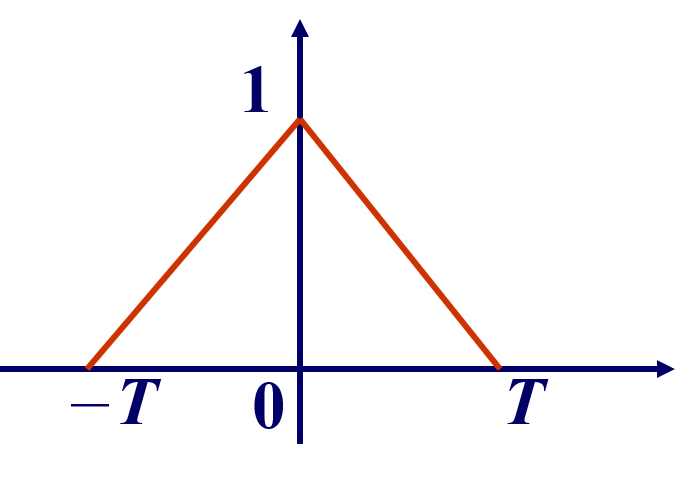

### 平稳过程

---

#### 5.1 平稳过程的概念

严平稳：联合分布一致（给定相对位置，有限维分布不变）

宽平稳：均值函数为常数；自相关函数仅仅与时间间隔（$\tau$）有关。

- 半随机二元信号传输：非宽平稳过程

  自相关函数会因为时间节点$t,s$的取值而变化，而不是只与时间间隔相关。

  （当$s,t$属于同一个时间区间内时，自相关函数为1，当$s,t$不属于同一个时间区间内时自相关函数为0）

- 随机二元信号传输：宽平稳过程

  $Y(t)-X(t-\xi),t\in \mathcal{R}$

  相对于半随机二元信号平移了一个随机的距离。

  均值函数为0，自相关函数表示为：
  $$
  E(Y(s)Y(t))=
  \begin{cases}
  0,&\text{if }|s-t|>T;\\
  1-\frac{|s-t|}{T},&\text{if }|s-t|<T.
  \end{cases}
  $$
  

  最大值为$R_X(0)=1$，且为偶函数。

- 随机电报信号：宽平稳过程。

- 维纳过程：非宽平稳过程；维纳过程的增量过程是一个宽平稳过程。

- 泊松过程：非宽平稳过程；泊松过程是平稳增量过程。

（平稳增量过程是指该过程的增量过程是一个平稳过程吗？）

宽平稳不一定是严平稳

严平稳不一定是宽平稳（前提要求是该过程是一个二阶矩过程（二阶矩存在））

对于正态过程，宽平稳与严平稳是等价的（任意一个正态过程由其一阶矩和二阶矩决定）

#### 5.2 平稳过程的自相关函数

复平稳过程的自相关函数$R_X(\tau)$的一些性质：

1. $R_X(0)=E[|X(t)|^2]\geq 0$.

2. $|R_X(\tau)|\leq R_X(0)$.

3. $R_X(-\tau)=R_X(\tau)$.

4. 非负定性：$\forall n\geq 1,t_1,\cdots,t_n\in T$，复数$\alpha_1,\alpha_2,\cdots,\alpha_n$有：
   $$
   \sum_{k,j=1}\alpha_j\bar{\alpha_k}R_X(t_k,t_j)\geq 0
   $$

上述的所有性质显然可以推广到实平稳过程中去。

**推论：**如果$\{X(t),t\in T\}$是周期为$L$的周期平稳过程，也就是$P\{X(t+L)=X(t)\}=1$，则$R_X(\tau)$也是周期函数，有$R(\tau+L)=R(\tau)$.

这个结论反过来也是成立的，一个平稳过程$X(t)$的相关函数为$R_X(\tau)$，且$R_X(t+L)=R_X(t)$，其中$L$是一个常数，$L>0$，则$P\{X(t+L)=X(t)\}=1$.

**定理：**实平稳过程$\{X(t),t\in T\}$均方连续的充要条件是相关函数$R_X(\tau)$在$\tau=0$处连续，且此时的$R_X(\tau)$处处连续。

##### 几个重要的结论：

对于平稳过程$X_T=\{X(t),t\in T\}$：

1. $X_T$均方可微的充要条件是$R_X(\tau)$在$\tau=0$处一阶导数和二阶导数均存在。
2. $X_T$均方可微，则其均方导数过程仍然为平稳过程且有均值函数为$m_{X'}(t)=0$，相关函数$R_{X'}(\tau)=-R''_X(\tau)$.

**推论：**对于$\{X(t),t\in T\}$是均方可微的实平稳过程，则对于$\forall t\in T,X(t)$和$X'(t)$不相关。

**推论：**对于$\{X(t),t\in T\}$是均方可微的实正态平稳过程，则对于$\forall t\in T,X(t)$和$X'(t)$相互独立。

**定理：**对于$\{X(t),t\in T\}$是均方连续的平稳过程，则在有限区间上，均方积分：$\int_a^b X(t)\mathrm{d}t$存在，且有：
$$
E[\int_a^b X(s)\mathrm{d}s\overline{\int_a^bX(t)\mathrm{d}t}]=\int_a^b\int_a^bR_X(t-s)\mathrm{d}s\mathrm{d}t
$$
特别地如果$\{X(t),t\in T\}$是实平稳过程，则：

- $E[\int_a^bX(t)\mathrm{d}t]=m_X(b-a)$.
- $E[\int_a^bX(t)\mathrm{d}t]^2=2\int_0^{b-a}[(b-a)-|\tau|]R(\tau)\mathrm{d}\tau$

##### 联合平稳过程的互相关函数

**定义：**如果对于任意的$\tau$，有$R_{XY}(s+\tau,t+\tau)=R_{XY}(s,t)$，那么我们就称平稳过程$\{X(t),t\in T\}$和平稳过程$\{Y(t),t\in T\}$是联合平稳的。

互相关函数仅仅与$(t-s)$的值有关系。

**定理：**平稳相关的平稳过程的互相关函数$R_{XY}(\tau)$有一些性质：

- $R_{XY}(\tau)=\overline{R_{XY}(-\tau)}$

- $|R_{XY}(\tau)|^2\leq R_X(0)R_Y(0),|R_{XY}(\tau)|^2\leq R_X(0)R_{Y}(0)$

- 对于任意复常数$\alpha, \beta$来说，$\alpha X(t)+\beta Y(t)$也是平稳过程且相关函数满足：
  $$
  R_{\alpha X+\beta Y}(\tau)=|\alpha|^2R_X(\tau)+\alpha \overline{\beta}R_{XY}(\tau)+\bar{\alpha}\beta R_{XY}(\tau)+|\beta|^2 R_Y(\tau)
  $$

#### 5.3 平稳过程的均方遍历性

对于平稳过程来说，由于其统计特性与计时的起点无关，那么是否可以使用一次实验得到的实验结果一条样本函数来决定该平稳过程的统计特性？

（一条样本函数的平均来估计它的统计平均）

平稳过程的各态历经性

假设$\{X(t),t\in (-\infty,+\infty)\}$是平稳过程，如果均方极限：
$$
<X(t)>=\mathop{l.i.m}_{T\to \infty}\frac{1}{2T}\int_{-T}^TX(t)\mathrm{d}t
$$
存在，则称$X(t)$在$(-\infty,+\infty)$上的时间平均。

对于固定的$\tau$，均方极限：
$$
<X(t),\overline{X(t+\tau)}>=\mathop{l.i.m}_{T\to \infty}\frac{1}{2T}\int_{-T}^T X(t)\overline{X(t+\tau)}\mathrm{d}t
$$
存在，则称为$X(t)$在$(-\infty,+\infty)$上的时间相关函数。

进一步：

1. 如果有$P\{<X(t)=m_X>\}=1$，时间平均依概率为1收敛到均值函数，则称$X(t)$的均值具有各态历经性（均方遍历性）。
2. 如果有$P\{<X(t)\overline{X(t+\tau)}>=R_X(\tau)\}=1$，时间相关函数依概率为1收敛到自相关函数，则称$X(t)$的自相关函数具有各态历经性（均方遍历性）。

各态历经性  $\Rightarrow$ 平稳过程

从定理证明均方遍历性太麻烦了……

**均值各态历经性的定理：**

假设$\{X(t),t\in \mathcal{R}\}$是平稳过程，均值均方遍历的充要条件是：
$$
\lim_{T\to \infty}\frac{1}{2T}\int_{-2T}^{2T}(1-\frac{|\tau|}{2T})C_X(\tau)\mathrm{d}\tau=0
$$
或者：
$$
\lim_{T\to \infty}\frac{1}{2T}\int_{-2T}^{2T}(1-\frac{|\tau|}{2T})(R_X(\tau)-|m_X|^2)\mathrm{d}\tau=0
$$
这个问题还有很多很多的推论在PPT上，用到的时候再说。

**相关函数的各态历经性的定理：**

$\{X(t),t\in \mathcal{R}\}$是均方连续的平稳过程，且对于固定的$\tau$, $\{X(t)\overline{X(t+\tau)},t\in\mathcal{R}\}$也是均方连续的平稳过程，则$\{X(t)t\in\mathcal{R}\}$的相关函数具有均方遍历性的充要条件是：
$$
\lim_{T\to\infty}\frac{1}{2T}\int_{-2T}^{2T}(1-\frac{|u|}{2T})(B(u)-|R_X(\tau)|^2)\mathrm{d}u=0
$$
其中：$B(u)=E\{X(t)\overline{X(t+\tau)}\overline{X(t+u)}X(t+\tau+u)\}$

