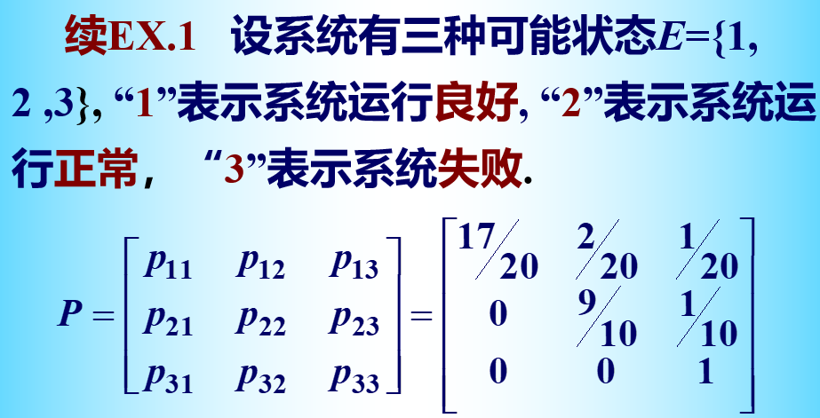
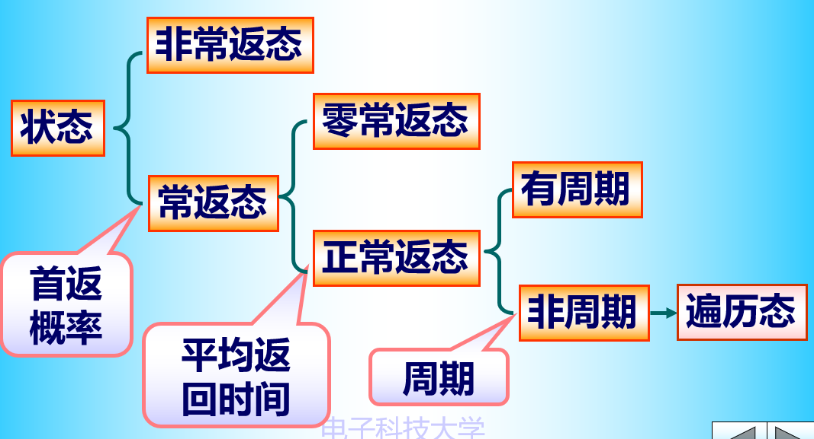

### 马尔可夫过程

---

#### 6.1 马尔可夫过程的概念

**定义：**随机过程$\{X(t),t\in T\}$，如果对于任意取定的参数$t_1<t_2<\cdots<t_n$有：
$$
P\{X(t_n)\leq x_n|X(t_1)=x_1,X(t_2)=x_2,\cdots,X(t_{n-1})=x_{n-1}\}=P\{X(t_n)=x_n|X(t_{n-1})=x_{n-1}\}
$$
则称这个随机过程为马氏过程。

独立过程是马尔可夫过程

独立增量过程是马尔可夫过程

泊松过程由于是独立增量过程，且$N(0)=0$，因此泊松过程是马尔可夫过程。

维纳过程同样也是马尔可夫过程

##### 马氏过程的有限维分布族

对于任意的$s,t\in T$，$P(s,t;x,y)=P\{X(t)\leq y|X(s)=x\}$成为马氏过程$\{X(t),t\in T\}$的转移分布函数

马氏过程的状态空间是连续的，则其有限维概率密度函数为：
$$
f(x_1,x_2,\cdots,x_{n-1};t_1,t_2,\cdots,t_{n-1})=f(x_1;t_1)f(x_2;t_2|x_1;t_1)\cdots f(x_{n};t_n|x_{n-1};t_{n-1})
$$
条件概率密度和$t_1$时刻的初始概率密度的乘积。

离散情况下有类似的结论

#### 6.2 马氏链序列（一）

假设$\{X(t),t\in T\}$为马氏过程，称$X(t)=x$为过程在$t$时刻处于状态$x$.

$E=\{x|X(t)=x,t\in T\}$称为过程的状态空间（可数集则为马氏链）

定义：设$\{X(n),n\geq 0\}$是马氏链，状态空间为$E=\{0,1,2,\cdots\}$，称条件概率为：
$$
p_{ij}^{(k)}(m)=P\{X(m+k)=j|X(m)=i\}
$$
表示为马氏链在$m$时刻的$k$步转移概率
$$
p^{(1)}_{ij}(m)=P\{X(m+1)=j|X(m)=i\}
$$
称为一步转移概率。

齐次马氏链：如果马氏链$\{X(n),n\geq0\}$的一步转移概率与起始时间无关，即对于任意的$m$
$$
p_{ij}^{(1)}(m)=P\{X(m+1)=j|X(m)=i\}=p_{ij}^{(1)}=p_{ij}
$$
称$\{X(n),n\geq 0\}$为齐次马氏链。

假设状态空间为$E=\{0,1,2,\cdots\}$

我们记：
$$
P=(p_{ij})=\begin{bmatrix}
p_{00}& p_{01}&p_{02}& \cdots\\
p_{10}& p_{11}&p_{12}& \cdots\\
p_{20}& p_{21}&p_{22}& \cdots\\
\vdots&\vdots&\vdots&\vdots
\end{bmatrix}
$$
称为$P$为一步转移矩阵。

矩阵中每个元素非负，每行之和均为1.

满足每个元素非负且行和为1的矩阵称为随机矩阵，满足这两个条件的行向量称为概率向量。

$n$次转移概率与$n$有关，$\{X(n),n\geq1\}$是非齐次马氏链

##### 切普曼-柯尔莫哥洛夫方程

齐次马氏链$\{X(n),n\geq 0\}$的$k$步转移概率满足切普曼-柯尔莫哥洛夫方程
$$
p_{ij}^{(s+k)}=\sum_{r\in E}p_{ir}^{(k)}p_{rj}^{(s)}
$$
其中$p_{ij}^{(m)}=P\{X(s+m)=j|X(s)=i\}$

直观解释：从状态$i$到状态$j$的$(s+k)$步状态转移概率等于从状态$i$到状态$r$的$k$步转移概率乘以状态$r$到状态$j$的$s$步状态转移，其中状态$r$是状态空间中除了$i,j$之外的其他状态。

需要使用：
$$
P(AB|C)=\frac{P(ABC)}{P(C)}=\frac{P(BC) P(ABC)}{P(C)P(BC)}=P(B|C)P(A|BC)
$$
*Proof.* 
$$
\begin{split}
&P\{X(m+k+s)|X(m)=i\}\\
=& \sum_{r\in E} P\{X(m+k)=r,X(m+k+s)=j|X(m)=i\}\\
=& \sum_{r\in E}P\{X(m+k)=r|X(m)=i\}\times P\{X(m+k+s)=j|X(m)=i,X(m+k)=r\}\\
=& \sum_{r\in E}P\{X(m+k)=r|X(m)=i\}\times P\{X(m+k+s)=j|X(m+k)=r\}
\end{split}
$$

##### C-K方程的矩阵形式

记$P^{(k)}=(p_{ij}^{(k)})$

那么我们可以得到：$P^{(k+s)}=P^{(k)}P^{(s)}$

齐次马氏链的$n$步转移矩阵为（一步）转移矩阵的$n$次幂：
$$
P^{(n)}=PP\cdots P=P^{n}
$$
**定理：**对于齐次的马氏链，绝对分布和有限维分布都是可以由初始分布和一步转移概率完全决定的。
$$
\pi(n)=\pi(0)P^{(n)}=\pi(0)P^{n}
$$
对于$n_1<n_2<\cdots<n_k$，有限维分布为：
$$
\begin{split}
&P\{X(n_1)=i_1,X(n_2)=i_2,\cdots,X(n_k)=i_k\}\\
=&\sum_{i\in E}P\{X(0)=i\}P\{X(n_1)=i_1|X(0)=i\}\times P\{X(n_2)=i_2|X(n_1)=i_1\}\cdots P\{X(n_k)=i_k|X(n_{k-1})=i_{k-1}\}
\end{split}
$$

#### 6.2 马氏链序列（二）

遍历性与平稳性

**定义：**假设$\{X(n),n=0,1,2,\cdots\}$是齐次马氏链，如果对于$\forall i,j\in E$下极限存在：
$$
\lim_{n\to \infty}p_{ij}^{(n)}=\pi_{j}>0\quad(i,j\in E)
$$
且与$i$无关，称此马氏链具有遍历性。（也就是说马氏链的状态转移过程无限进行系统最终会达到一个什么样的平衡状态？如果最终收敛了说明这个马氏链就是一个遍历的马氏链）

如果$\pi_j>0,j\in E$，且$\sum_{j\in E}\pi_j=1$则称$\{\pi_j,j\in E\}$为齐次马氏链的极限分布。（$\Pi=\{\pi_j,j\in E\}$）

齐次遍历马氏链的$n$步转移矩阵有：（$n\to\infty$）
$$
P^{(n)}\rightarrow 
\begin{bmatrix}
\Pi\\
\Pi\\
\vdots
\end{bmatrix}
=\begin{bmatrix}
\pi_1&\pi_2&\cdots & \pi_j&\cdots\\
\pi_1&\pi_2&\cdots & \pi_j&\cdots\\
\vdots &\vdots &\vdots &\vdots &\vdots
\end{bmatrix}
$$
对于直线上的随机游走：

状态空间$E=\{1,2,3\}$，一步转移概率矩阵为：
$$
P=\begin{bmatrix}
p_{11}&p_{12}&p_{13}\\
p_{21}&p_{22}&p_{23}\\
p_{31}&p_{32}&p_{33}\\
\end{bmatrix}
=\begin{bmatrix}
0&1&0\\
q&0&p\\
0&1&0
\end{bmatrix}
$$
考虑其遍历性：发现其多步的概率转移矩阵在两种不同的矩阵之间反复横跳。

**定理：**（遍历性定理）假设齐次马氏链$\{X(n),n=0,1,2,\cdots\}$的状态空间为$E=\{1,2,\cdots,s\}$. 如果存在正整数$n_0$, 对于任意的$i,j\in E$有$p_{ij}^{(n_0)}>0$, 则此马氏链是遍历的，且极限分布$\Pi$是方程组
$$
\pi_j=\sum_{i=1}^s \pi_ip_{ij},j=1,2,\cdots,s
$$
在满足条件：
$$
\pi_j> 0,\sum_{i=1}^s \pi_j=1
$$
的唯一解。

（如果存在正整数$n_0$, 使得$n_0$步转移矩阵的每一个元素都为正）

使用：
$$
\Pi=\Pi P
$$
这个公式就可以求马氏链的极限分布。

**定义：**不动点向量，如果行向量$U=(u_1,u_2,\cdots,u_s)$与$s$阶的方阵$R$满足：$UR=U$，则$U$为$R$的不动点向量。

如果$P$是遍历齐次马氏链的正则阵，则（1）都唯一的不动点向量（值均为正数）；（2）$P^{n}(n\geq 1)$随着$n$的增大而趋于矩阵$W$，$W$的每一行向量都等于不动点向量$\Pi$.

**定义：**设$\{X(n),n\geq 0\}$为齐次马氏链，若存在行向量$V=\{v_j,j\in E\}$满足：

1. $V$是一个概率向量
2. $V$是转移矩阵的不动点向量

则我们称马氏链是平稳的，称$V$是马氏链的平稳分布。

【补】$\{X_n,n=0,1,2,\cdots\}$为齐次的马氏链，如果存在$\{v_j,j\in E\}$满足条件：

1. $v_j\geq 0,j\in E$
2. $\sum_{j\in E} v_j=1$
3. $v_j=\sum_{i\in E}v_ip_{ij}$

则我们称这个马氏链是平稳的，$\{v_j,j\in E\}$是这个马氏链的平稳分布。

#### 6.3 齐次马氏链状态的分类（一）

##### 刻画状态特性的几个特征量

$f_{ij}^{(1)}=P\{X(1)=j|X(0)=i\}$

$f_{ij}^{(n)}=P\{X(n)=j,X(k)\neq j,k=1,2,\cdots,n-1|X(0)=i\}$称为n步首达概率

$f_{ij}=\sum_{n=1}^\infty f_{ij}^{(n)}$表示的是最终概率系统从状态$i$出发经过有限步转移后最终到达状态$j$的概率

首达概率可以表示为：
$$
f_{ij}^{(n)}=\sum_{i_1\neq j}\sum_{i_2\neq j}\cdots \sum_{i_{n-1}\neq j}p_{ii_1}p_{i_1i_2}\cdots p_{i_{n-1}j}
$$
首达时间：对于$j\in E$，我们称$T_{ij}=\min\{n:n\geq 1,X(n)=j,X(0)=i\}$

关于首达概率和首达时间的实际应用场景：

可以发现我们研究$P\{T_{13}>n\}$表示的就是系统在$[0,n]$时间内运行的可靠性，因为如果状态变为了失败表示系统的失效，因此来看研究首达概率和首达时间具有一定的实际工程意义。
$$
p_{ij}^{(n)}=\sum_{m=1}^n f_{ij}^{(m)}p_{jj}^{(n-m)}
$$
平均转移步数：$\mu_i=E[T_{ij}]=\sum_{n=1}^\infty nf_{ij}^{(n)}$

如果$i=j$那么就称为状态$j$的平均返回时间

$f_{jj}:$ 状态$j$的最终返回概率

$f_{jj}^{(n)}:$ 从状态$j$出发经过$n$步首次返回的概率

**定义：**对于$i\in E$，如果正整数集合$\{n|n\geq 1,p_{ii}^{(n)}>0\}$非空那么定义其最大公约数为状态$i$的周期，记为：
$$
d_{i}=GCD\{n|n\geq 1,p_{ii}^{(n)}>0\}
$$
如果$d_i=1$则我们称状态$i$是非周期的。

若整数集合$\{n|n\geq 1,f_{ii}^{(n)}>0\}$非空，记$h_i=GCD\{n:n\geq 1,f_{ii}^{(n)}>0\}$

以下根据状态的返回概率$f_{ii}$对状态进行分类：

对于状态$i\in E$，最终返回概率为$f_{ii}$:

如果$f_{ii}=1$，称状态$i$是常返的；

如果$f_{ii}<1$，称状态$i$是非常返的；

$f_{ii}=1$表示系统从状态$i$出发几乎必定会返回状态$i$

对于常返状态$i\in E$，平均返回时间为$\mu_{ii}$，

如果$\mu_{ii}<+\infty$称状态$i$是正常返的；

如果$\mu_{ii}=+\infty$称状态$i$是零常返的。

称非周期正常返的状态为遍历状态。

常返态：$f_{ii}=1$也就是说系统从状态$i$出发几乎必然迟早会返回状态$i$. 

非常返态：$f_{ii}<1$（瞬时状态）

状态$i$常返的充分必要条件是$\sum_{n=1}^\infty p_{ii}^{(n)}=\infty$.

状态$i$非常返的充分必要条件是：$\sum_{n=1}^\infty p_{ii}^{(n)}<\infty$.

如果非常返则一定会有$\lim_{n\to \infty}p_{ii}^{(n)}=0$.

吸收态一定是正常返的

**如何判别一个状态是常返状态：**

当且仅当下面的三个条件之一成立：

- $f_{ii}=1$，即表示为$j$的最终返回概率为1
- $\sum_{n=1}^\infty p_{jj}^{n}=+\infty$
- $P\{T_{jj}<+\infty|X(0)=j\}=1$（从常返状态$j$出发，首次返回状态$j$的转移次数一定是有限的）

**如何判别一个状态是非常返状态：**

- $f_{ii}<1$
- $\sum_{n=1}^\infty p_{jj}^{(n)}=\frac{1}{1-f_{jj}}<+\infty$

- $P\{T_{jj}<+\infty|X(0)=j\}<1$

#### 6.3 齐次马氏链状态的分类（二）

状态之间存在的关系，$\forall i,j\in E$，如果存在$n\geq 1$使得$p_{ij}^{(n)}>0$称从状态$i$可达状态$j$，我们记为$i\to j$.

而假设$i\to j$和$j\to i$同时成立，则称状态$i$和状态$j$互通，记为$i\leftrightarrow j$.

可达是具有传递性的。

互通关系是一个状态空间$E$上的一个等价关系，具有自反性，对称性以及传递性。

互通的两个状态是处于同一个等价类中的。

互通的两个状态$i$和$j$：

1. 要么都是非周期的要么都是周期的
2. 要么都是常返的要么都是非常返的
3. 如果都为常返态那么要么都是正常返的要么都是零常返的
4. 如果都是正常返的，则要么都周期的且周期相同；要么都是非周期的（这个时候他们都是遍历的）

##### 状态空间的分解

对于任意的$i\in C,j\notin C$，总有$p_{ij}^{(n)}=0$则我们称$C$是一个状态空间$E$的闭子集。

马氏链的全体常返态构成一个闭集。

如果闭集$C$中不含任何的非空真子集，那么我们就称这个$C$是不可约的，假设马氏链的状态空间$E$是不可约的则我们认为这个马氏链是一个不可约马氏链。

马氏链不可约的前提是他的所有状态之间都是互通的。

**分解定理：**

齐次的马氏链的状态空间$E$可以唯一地分解为：
$$
E=N+C_1+C_2+C_3+\cdots+C_k+\cdots
$$
$N$表示所有的非常返态集合（这里我们并不要求他们是互通的），$C_1,C_2,\cdots,C_k,\cdots$是互不相交的不可约的常返闭集（每一个$C_i$中的所有状态是互通的）。

**定理：**

假设$N$是一个非常返态集合，$i\in N$，$j$是非常返态，则最终的概率$f_{ij}$满足于：
$$
f_{ij}=\sum_{k\in N}p_{ik}f_{kj}+\sum_{k\in H}p_{ik},\quad i\in N
$$
其中$H=\{k|k\leftrightarrow j,k\in E\}$.实际上就是说$H$是$j$的互通等价类。

根据$H$的定义可以知道：
$$
f_{kj}=\begin{cases}
1,&k\in H\\
0,&k\notin H \text{ and }k\notin N
\end{cases}
$$

$$
\begin{split}
f_{ij}&=P\{\text{经过有限步到达}j|X(0)=i\}\\
&=\sum_{k\in E}P\{\text{经过有限步到达}j|X(0)=i,X(1)=k\}\cdot P\{X(1)=k|X(0)=i\}\\
&=\sum_{k\in N}p_{ik}f_{kj}+\sum_{k\in H}f_{kj}p_{ik}+\sum_{k\notin H\atop k\notin N}f_{kj}p_{ik}\\
&=\sum_{k\in N}f_{kj}p_{ik}+\sum_{k\in H}p_{ik}
\end{split}
$$

##### 有限马氏链

假设状态空间$E$是有限状态集合，称为有限马氏链则有：

1. 所有的非常返状态组合的集合不是闭集
2. 没有零常返状态
3. 必有正常返状态
4. 状态空间可以分解为：$E=N\cup C_1\cup C_2\cup \cdots \cup C_k$