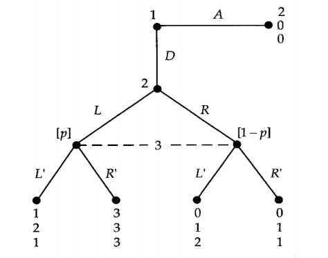
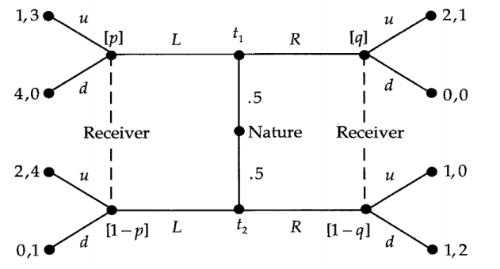

### Game Theory - Lecture 4

---

#### Perfect Bayesian Equilibrium

Now make a review for static Bayesian game and dynamic game under complete information. Based on the theorem of Harsanyi, we can transfer the incomplete information Bayesian game into those extensive form game with imperfect information. The method is to add the nature to give the distribution about players' types.

This chapter we will focus on the dynamic games under incomplete information. And the solution is Perfect Bayesian (Nash) Equilibrium (PBE). 

A Perfect Bayesian Equilibrium is a strategy profile $s=(s_1,\cdots, s_n)$ and a belief assessment profile $\beta=(\beta_1,\cdots,\beta_n)$. Note that the belief $\beta_i$ specifies player $i$'s belief at each of information sets.

**Three Requirements**:

- **[Sequential Rationality]** At each information set, $s_i$ is best response to $s_{-i}$, given her belief at that information set.
- **[Belief Consistency]** At information set on NE path, her belief $\beta_i$ is derived from Bayes' rule using the strategy profile $s$.
- **[Belief Consistency$^+$]** At information set off NE path, her belief $\beta_i$ is derived from Bayes' rule using the strategy profile $s$ whenever it is possible.

**Sequential Rationality implies that no player uses strictly dominated actions at an information set.**

**Weak Perfect Bayesian Equilibrium only requires the first two conditions**.

**[Example 1]** First we talked about one three persons game which is a dynamic game with imperfect information.

**Q1:** How can we calculate NEs in this game?

**A1:** Look back to lecture-2, we will find that directly transfer this game into a static norm form game with three players. Consider all players' information sets and actions, thus we can get their strategy space. Each person has two strategies. List all the payoffs and it not hard to calculate the NEs here: $(A,L,L')\&(A,R,L')\&(D,L,R')\& (A,R,R')$.

By backward induction we can easily find there are two sub-games here and we can get the unique SPNE: $(D,L,R')$.

Next how can we get all the PBEs, procedures are as follows, firstly we should know the PBEs belong to NEs. So that we can check all NEs who satisfying these three requirements.

1. First consider the $(A,L,L')$, the decision node of p1: 2>1; The decision node of p2, keeps zero; The decision node of p3, since she chooses $L'$, we should have $1\cdot p+2\cdot(1-p)\geq 3\cdot p+1\cdot (1-p)$. we can get $p\leq \frac{1}{3}$. Next consider the belief consistency. It is obvious that p2 and p3's strategy is off NE. However, we will find that $(A,L,L')$ does not satisfy the belief consistency$^+$ condition, so this strategy does not provide a perfect Bayesian equilibrium. 
2. Second we consider the $(A,R,R')$, we will find that for p2, $R$ will not be a best response. So this violate the sequential rationality. This is also can not be a PBE.
3. Then we consider the $(A,R,L')$, same as the second type.
4. Finally, we consider the $(D,L,R')$, it is not hard to see that $(D,L,R')\&p=1$ provides a PBE, since it is a SPNE, we can see in each subgame this will be the best response for each player. Also, the information set of p3, her belief is on the NE path, thus according to the Bayes' rule we can get $p=1$. So this is the unique PBE in this game.

**Note that $(A,L,L')\&p\leq\frac{1}{3}$ which does not satisfy the last property, is also a WPBE in this game.**

---

**[Example 2] The famous Signaling Game** 

